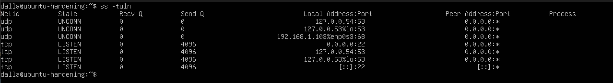
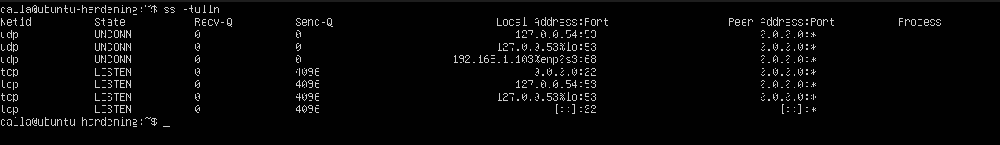
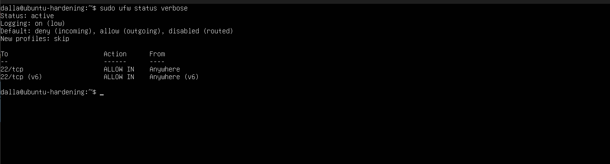
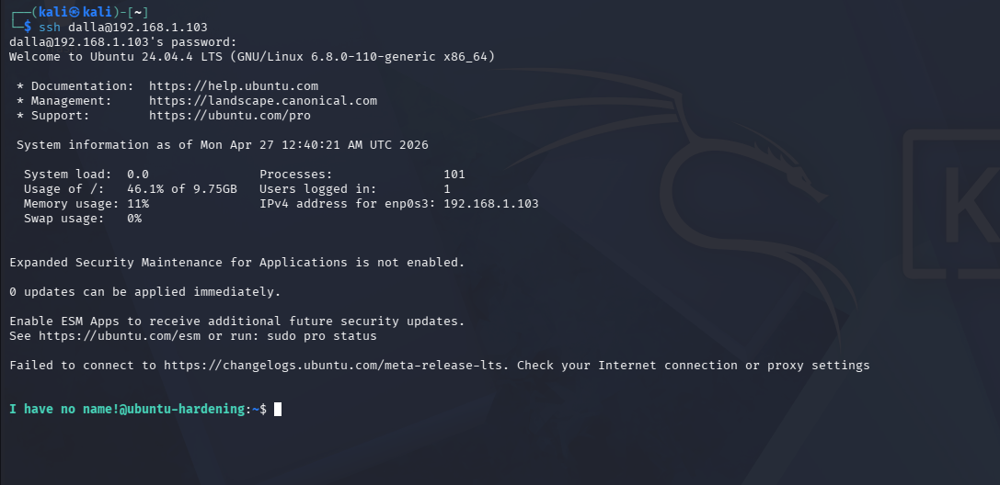
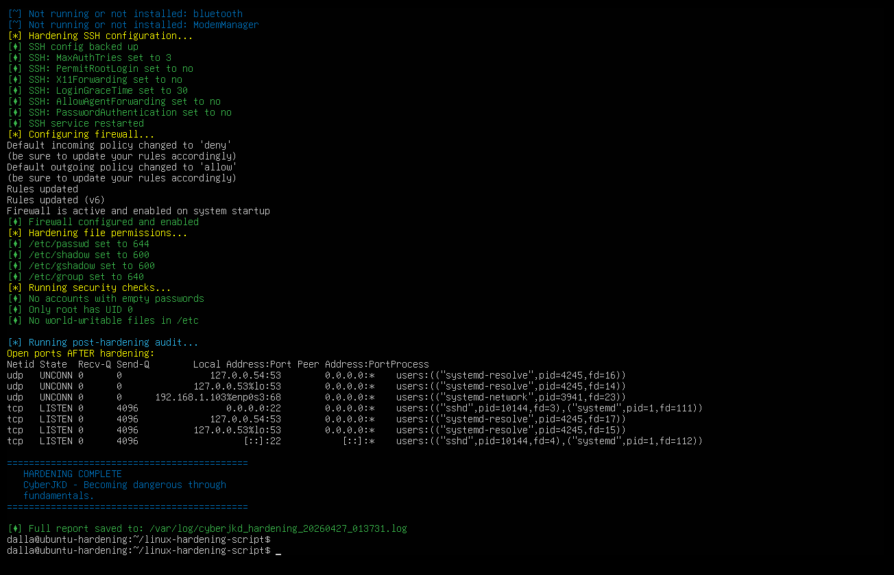

# Linux Hardening Lab (VM)

**Author:** Dalla Samuel (CyberJKD)
**Date:** April 27, 2026
**Platform:** VirtualBox 7.2.6 · Windows 11 · AMD Ryzen 3 PRO 5450U · 32GB RAM

**Roadmap project:** Phase 01 · Project 01 ✅ (VM Redo — Final)

---

## Objective

Manually harden a fresh Ubuntu Server 24.04 VM, applying security
controls step by step. Verify each control works. Document before/after
state as evidence.

---

## VM Specifications

| VM | RAM | Disk | Network |
|---|---|---|---|
| Ubuntu-Hardening | 2048 MB | 15GB | LAN_NET (192.168.1.103) |

---

## Tools & Software

- VirtualBox 7.2.6
- Ubuntu Server 24.04.4 LTS
- UFW (Uncomplicated Firewall)
- OpenSSH Server
- Kali Linux 2026.1 (used to verify SSH access)

---

## Hardening Steps Applied

### 1. System Update
Updated all packages to latest versions before hardening.
Ensures no known vulnerabilities exist before controls are applied.

### 2. SSH Hardening
- `PermitRootLogin` → changed from `prohibit-password` to `no` (full lockdown)
- `MaxAuthTries` → `3` (limits brute force attempts)
- `X11Forwarding` → `no` (disables unnecessary graphical forwarding)

### 3. Firewall Configuration (UFW)
- Default incoming policy → `deny`
- Default outgoing policy → `allow`
- Port 22 (SSH) explicitly allowed
- All other inbound traffic blocked

### 4. File Permissions
- `/etc/shadow` → `640` (password hashes unreadable by non-root)
- `/etc/passwd` → `644` (readable by system, writable only by root)

### 5. Disable Unnecessary Services
- Disabled `ModemManager` — irrelevant on a server with no modem
- All other 16 running services confirmed as legitimate system services

### 6. Empty Password Audit
- Ran `awk` check against `/etc/shadow`
- No accounts with empty passwords found ✅

### 7. Root Account Locked
- Root login disabled via `passwd -l root`
- Root cannot be logged into directly even with correct password

---

## Verification Tests

### Before Hardening — Open Ports

*Baseline scan showing port 22 (SSH) and port 53 (DNS) only*

### After Hardening — Open Ports

*Post-hardening scan — identical, confirming no new attack surface introduced*

### Firewall Status

*UFW active — default deny incoming, only port 22 allowed*

### SSH Verification from Kali

*Successful SSH from Kali (192.168.1.102) to Ubuntu-Hardening (192.168.1.103)
confirming SSH still works correctly after hardening*

---

## Automation Script

After completing the manual hardening, the automation script from
[linux-hardening-script](https://github.com/DallaSamuel/linux-hardening-script)
was deployed and tested on the same VM.

The script performed all hardening steps in a single run:
- Disabled unnecessary services automatically
- Hardened SSH configuration
- Configured UFW firewall
- Set correct file permissions
- Ran security checks — empty passwords, UID 0 audit, world-writable files
- Generated a timestamped report saved to `/var/log/`

### Script Output

*Full automated hardening run — "HARDENING COMPLETE — CyberJKD —
Becoming dangerous through fundamentals."*

---

## What Threat Does This Defend Against?

A default Ubuntu Server install has misconfigured SSH, no firewall,
and loose file permissions. An attacker who gains network access can
brute force root login, read password hashes from /etc/shadow, or
exploit unnecessary open services.

These hardening controls eliminate those entry points:
- Root login blocked completely
- Brute force limited to 3 attempts before lockout
- Firewall denies all unexpected inbound traffic
- Sensitive files locked down to root-only access

---

## Lessons Learned

- Always patch first before hardening — reduces known vulnerabilities immediately
- SSH must be explicitly allowed in UFW before enabling firewall or you lock yourself out
- `prohibit-password` restricts root SSH login but `no` fully disables it — always use `no`
- Restart SSH service after config changes or new settings don't apply
- `passwd -l` locks root — use letter l not number 1
- Clean Ubuntu Server 24.04 install has minimal unnecessary services by default

---

## References

- [CyberJKD Roadmap](https://dallasamuel.github.io/CyberJKD-Roadmap/)
- [Ubuntu Server Security](https://ubuntu.com/security)
- [UFW Documentation](https://help.ubuntu.com/community/UFW)
