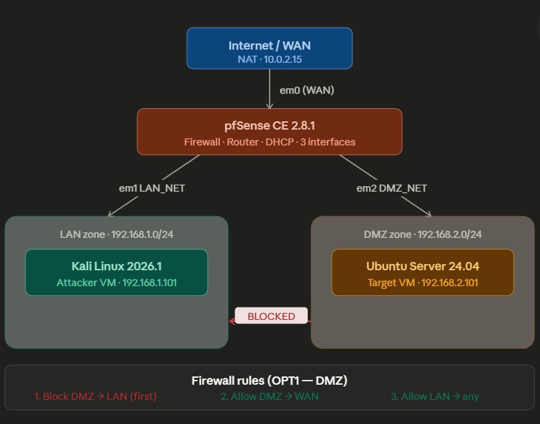
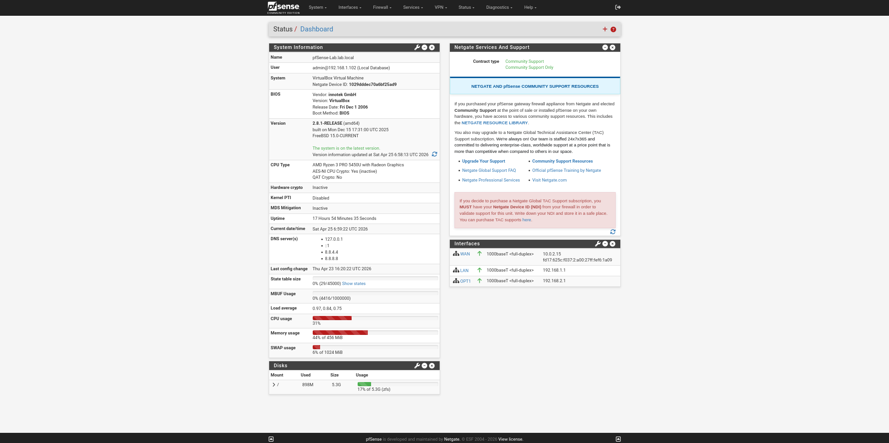
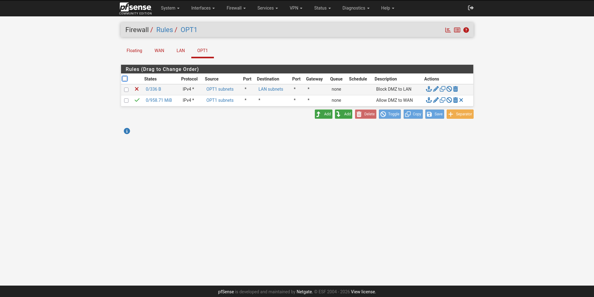
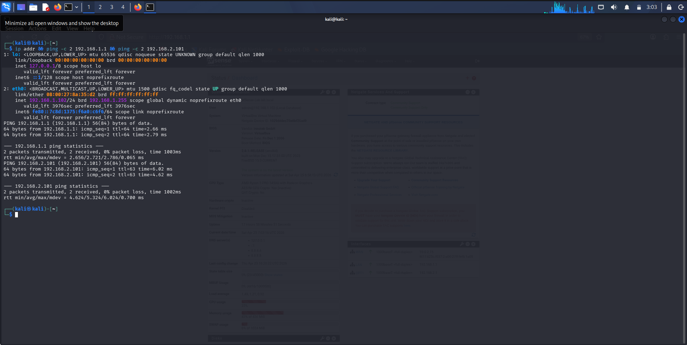
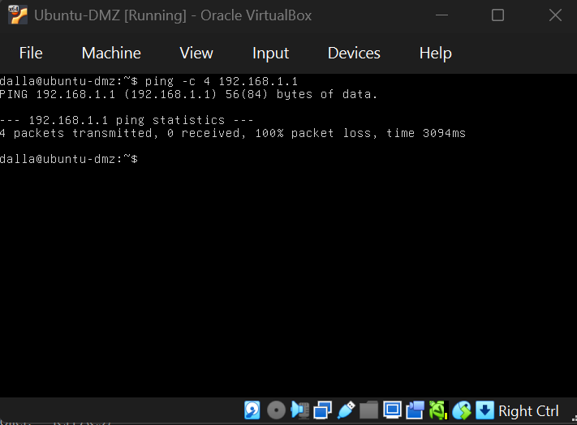

# Network Segmentation Lab

**Author:** Dalla Samuel (CyberJKD)  
**Date:** April 25, 2026  
**Platform:** VirtualBox 7.2.6 · Windows 11 · AMD Ryzen 3 PRO 5450U · 32GB RAM  
**Roadmap project:** Phase 01 · Project 02

---

## Objective

Design and implement a segmented network using pfSense as a firewall/router,
with a LAN zone for an attacker VM (Kali) and an isolated DMZ zone for a
target server (Ubuntu). Verify that firewall rules prevent lateral movement
from DMZ to LAN.

---

## Architecture

| Component | Role | IP |
|---|---|---|
| pfSense (WAN) | Internet gateway via NAT | 10.0.2.15 |
| pfSense (LAN) | LAN gateway | 192.168.1.1 |
| pfSense (DMZ) | DMZ gateway | 192.168.2.1 |
| Kali Linux | Attacker VM — LAN zone | 192.168.1.101 |
| Ubuntu Server | Target VM — DMZ zone | 192.168.2.101 |

---

## VM Specifications

| VM | RAM | Disk | Network |
|---|---|---|---|
| pfSense-Firewall | 1024 MB | 8GB | NAT + LAN_NET + DMZ_NET |
| Kali Linux 2026.1 | 2048 MB | Pre-built | LAN_NET |
| Ubuntu-DMZ | 2048 MB | 15GB | DMZ_NET |

---

## Tools & Software

- VirtualBox 7.2.6
- pfSense CE 2.8.1
- Kali Linux 2026.1
- Ubuntu Server 24.04.4 LTS

---

## Network Topology

*Three-zone architecture: WAN (internet), LAN (Kali), DMZ (Ubuntu Server),
all routed through pfSense.*

---

## Firewall Rules

**OPT1 (DMZ) — in order of processing:**

| Priority | Action | Source | Destination | Protocol |
|---|---|---|---|---|
| 1 | Block | OPT1 subnets | LAN subnets | Any |
| 2 | Pass | OPT1 subnets | Any | Any |

Rule order is critical — pfSense processes top to bottom, first match wins.
The Block rule must sit above the Pass rule or DMZ traffic reaches LAN before
being stopped.

---

## Verification Tests

**From Kali (LAN):**

ping -c 4 192.168.1.1     → 0% packet loss ✅ (pfSense LAN reachable)
ping -c 4 192.168.2.101   → 0% packet loss ✅ (DMZ reachable from LAN)
ping -c 4 8.8.8.8         → 0% packet loss ✅ (internet reachable)

**From Ubuntu (DMZ):**

ping -c 4 192.168.2.1     → 0% packet loss ✅ (pfSense DMZ reachable)
ping -c 4 192.168.1.1     → 100% packet loss ✅ (LAN blocked — rule working)

---

## What Threat Does This Defend Against?

If Ubuntu Server is compromised — through a web vulnerability,
misconfiguration, or malware — the attacker gains a foothold in the DMZ.
Without segmentation, they could pivot laterally into the LAN and attack
Kali or any other internal machine.

The firewall rule blocking DMZ → LAN ensures that even a fully compromised
DMZ server cannot reach the internal network. This is the core principle
behind DMZ architecture used in real enterprise environments to isolate
public-facing services from internal systems.

---

## Lessons Learned

- pfSense interface assignment must be done before first boot config
- Rule order matters — Block DMZ→LAN must sit above Allow DMZ→WAN
- Static IP assignment via console is required before WebGUI is reachable
- VirtualBox boot order does not persist while VM is running — power off first
- Always save VM state before shutting down to preserve lab progress
- pfSense must always start first — it is the gateway for all other VMs

---

## Screenshots

*pfSense WebGUI dashboard — all 3 interfaces up*

*Firewall rules — Block DMZ to LAN (first), Allow DMZ to WAN (second)*

*Kali ping tests — LAN to DMZ to internet all working*

*Ubuntu DMZ to LAN — 100% packet loss, segmentation confirmed*

## References

- [CyberJKD Roadmap](https://dallasamuel.github.io/CyberJKD-Roadmap/)
- [pfSense CE Documentation](https://docs.netgate.com/pfsense/en/latest/)
- [Ubuntu Server 24.04 LTS](https://ubuntu.com/server)
