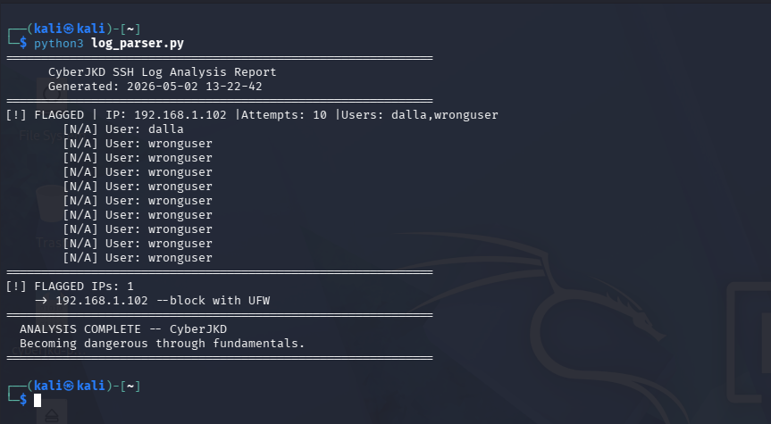

# Python Log Parser Lab

**Author:** Dalla Samuel (CyberJKD)
**Date:** May 2nd, 2026
**Platform:** VirtualBox 7.2.6 · Windows 11 · AMD Ryzen 3 PRO 5450U · 32GB RAM

**Roadmap Project:** Phase 01 · Project 04

---

## Objective

Build a Python script that parses Ubuntu Server auth.log, detects
failed SSH login attempts, flags suspicious IPs that exceed a
threshold, and outputs a clean analysis report.

---

## Lab Environment

| VM | IP Address | Role |
|---|---|---|
| Kali Linux | 192.168.1.102 | Attacker / Analyst |
| Ubuntu-Hardening | 192.168.1.103 | Target Server |
| pfSense | 192.168.1.1 | Gateway / Firewall |

---

## Tools Used

- Python 3
- auth.log from Ubuntu-Hardening
- OpenSSH

---

## What the Script Does

- Reads auth.log and searches for failed SSH login attempts
- Extracts the IP address and username from each failed attempt
- Counts attempts per IP address
- Flags any IP exceeding 3 failed attempts
- Outputs a clean report with recommended UFW block action

---

## Results

| IP Address | Attempts | Users Tried | Status |
|---|---|---|---|
| 192.168.1.102 | 10 | wronguser, dalla | FLAGGED |

---

## Key Findings

- 192.168.1.102 (Kali) was flagged with 10 failed attempts
- Both valid user dalla and invalid user wronguser were attempted
- Script correctly identified and flagged the brute force pattern
- Recommended action: block 192.168.1.102 with UFW

---

## What This Demonstrates

- Python scripting for security automation
- Log parsing and pattern matching with regex
- Automated threat detection logic
- Same analysis SOC analysts perform on SSH logs daily

---

## Lessons Learned

- auth.log format varies by Linux distro and version
- Regex patterns must match the exact log format
- Threshold-based flagging is the foundation of SIEM alerting
- Automating log analysis removes human error from detection

---

## References

- [CyberJKD Roadmap](https://dallasamuel.github.io/CyberJKD-Roadmap/)
- [Python re module](https://docs.python.org/3/library/re.html)
- [Ubuntu auth.log documentation](https://help.ubuntu.com/community/LinuxLogFiles)
