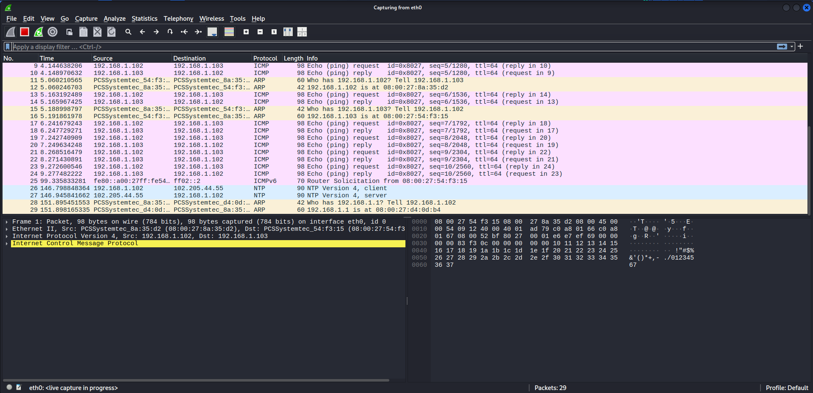
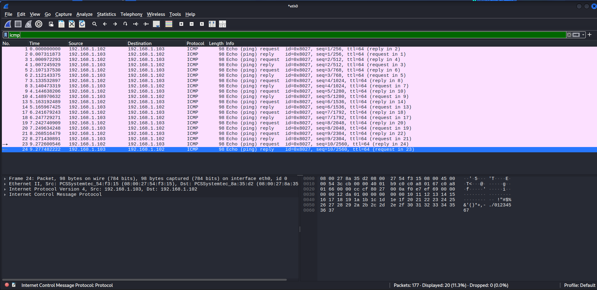
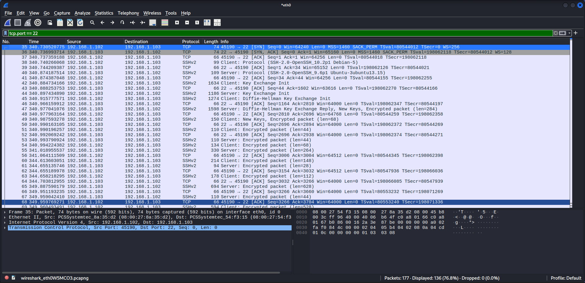
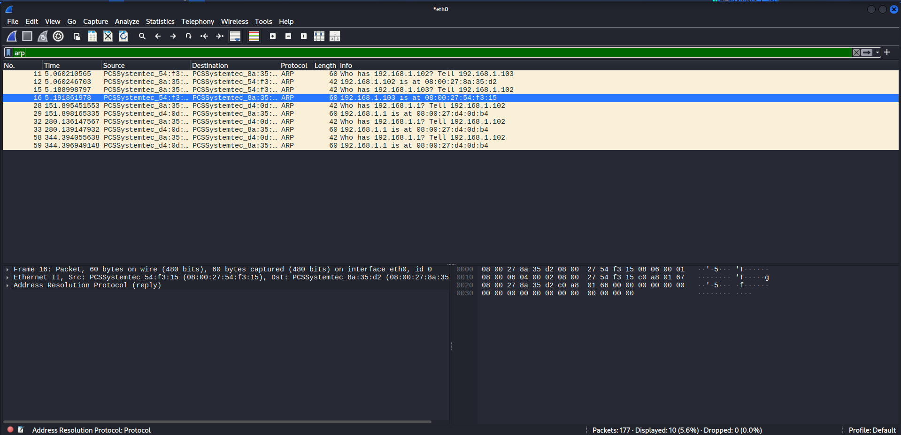

# Wireshark Packet Analysis Lab

**Author:** Dalla Samuel (CyberJKD)
**Date:** April 28, 2026
**Platform:** VirtualBox 7.2.6 · Windows 11 · AMD Ryzen 3 PRO 5450U · 32GB RAM

**Roadmap project:** Phase 01 · Project 03

---

## Objective

Capture and analyse live network traffic between Kali Linux and
Ubuntu-Hardening using Wireshark. Identify protocols, understand
packet structure, and document findings as evidence of network
analysis skills.

---

## Lab Environment

| VM | IP Address | Role |
|---|---|---|
| Kali Linux | 192.168.1.102 | Attacker / Analyst |
| Ubuntu-Hardening | 192.168.1.103 | Target Server |
| pfSense | 192.168.1.1 | Gateway / Firewall |

---

## Tools Used

- Wireshark 4.6.4 (on Kali)
- OpenSSH
- ICMP (ping)

---

## Traffic Captured

### 1. ICMP Traffic (Ping)
Generated 10 ping packets from Kali to Ubuntu-Hardening.

**What was observed:**
- 10 Echo requests from 192.168.1.102 → 192.168.1.103
- 10 Echo replies from 192.168.1.103 → 192.168.1.102
- 0% packet loss — clean network communication
- TTL: 64 on all packets

---

### 2. SSH Traffic (Port 22)
Initiated an SSH session from Kali into Ubuntu-Hardening.

**What was observed:**
- TCP SYN → SYN-ACK → ACK handshake on port 22
- SSHv2 protocol negotiation
- Diffie-Hellman key exchange visible
- All session data fully encrypted after handshake
- No credentials visible in packets — encryption working correctly

---

### 3. ARP Traffic
ARP packets captured during communication between machines.

**What was observed:**
- "Who has 192.168.1.102? Tell 192.168.1.103" — Ubuntu resolving Kali's MAC
- "192.168.1.102 is at 08:00:27:8a:35:d2" — Kali responding
- "Who has 192.168.1.1?" — machines checking for pfSense gateway

---

## Key Findings

| Protocol | Purpose | Security Notes |
|---|---|---|
| ICMP | Connectivity testing | Can be used for reconnaissance — monitor in production |
| SSH | Remote access | Fully encrypted — credentials not visible in capture |
| ARP | MAC address resolution | No spoofing detected — clean lab environment |

---

## What This Demonstrates

- ICMP can reveal live hosts on a network — useful for recon, reason to restrict ping in production
- SSH traffic is encrypted end-to-end — Wireshark shows handshake but not credentials
- ARP operates at Layer 2 — resolves IPs to MACs before communication begins
- Wireshark filters (icmp, tcp.port == 22, arp) isolate specific traffic quickly

---

## Capture File

The full packet capture is saved as `cyberjkd-packet-capture.pcapng`
and available in this directory for inspection.

---

## Lessons Learned

- Always capture on the correct interface — eth0 for LAN traffic
- Filter after capture, not before — capture everything, analyse selectively
- SSH encryption means Wireshark cannot read session content — this is correct behaviour
- ARP packets reveal MAC addresses — useful for network mapping
- ICMP TTL value of 64 confirms Linux target (Windows uses 128)

---

## References

- [CyberJKD Roadmap](https://dallasamuel.github.io/CyberJKD-Roadmap/)
- [Wireshark Documentation](https://www.wireshark.org/docs/)
- [Wireshark Display Filters](https://wiki.wireshark.org/DisplayFilters)
