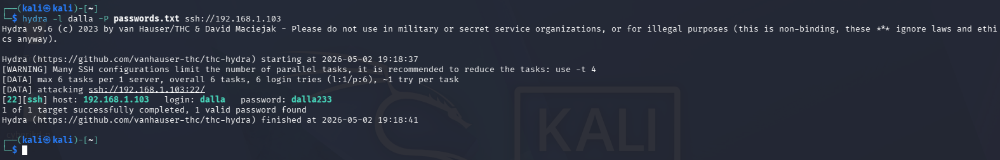
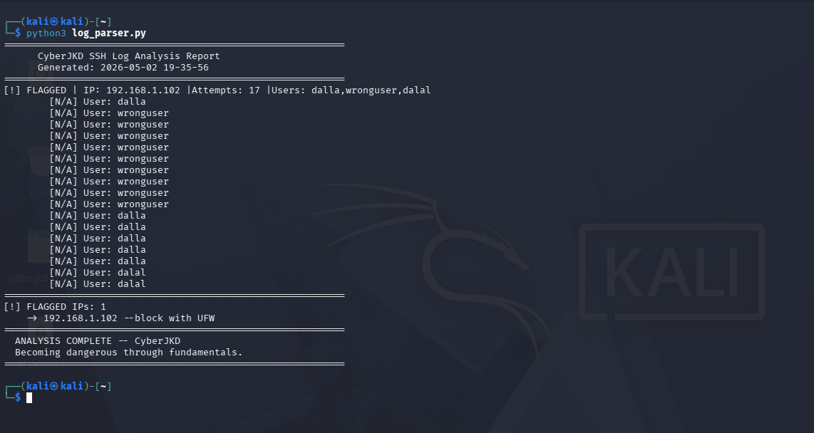
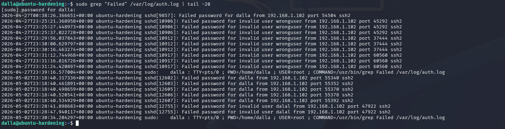
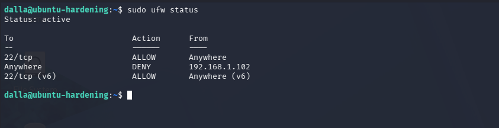
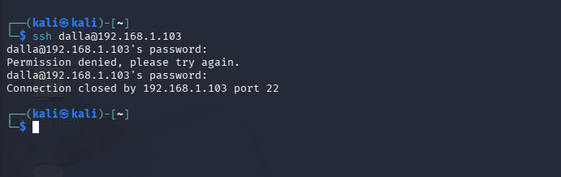

# Brute Force Simulation + Log Analysis Lab

**Author:** Dalla Samuel (CyberJKD)

**Date:** May 2, 2026

**Platform:** VirtualBox 7.2.6 · Windows 11 · AMD Ryzen 3 PRO 5450U · 32GB RAM

**Roadmap Project:** Phase 01 · Project 05

---

## Objective

Simulate a real SSH brute force attack from Kali Linux against
Ubuntu-Hardening using Hydra, capture the attack in auth.log,
detect it using the Python log parser, and block the attacker
using UFW. Full attack and defence cycle documented.

---

## Lab Environment

| VM | IP Address | Role |
|---|---|---|
| Kali Linux | 192.168.1.102 | Attacker |
| Ubuntu-Hardening | 192.168.1.103 | Target Server |
| pfSense | 192.168.1.1 | Gateway / Firewall |

---

## Tools Used

- Hydra 9.6 (on Kali) — brute force tool
- OpenSSH — target service
- Python log parser (Project 04) — detection
- UFW — blocking

---

## Attack Phase

Generated a password wordlist on Kali:

wrongpass, 123456, password, dalla233, kali, root123

Ran Hydra against Ubuntu-Hardening SSH:

hydra -l dalla -P passwords.txt ssh://192.168.1.103

**Result:**

[22][ssh] host: 192.168.1.103  login: dalla  password: dalla233
1 of 1 target successfully completed, 1 valid password found

---

## Detection Phase

Copied fresh auth.log from Ubuntu-Hardening to Kali and ran
the log parser:

python3 log_parser.py

**Result:**

[!] FLAGGED | IP: 192.168.1.102 | Attempts: 17 | Users: dalla, wronguser, dalal
[!] Flagged IPs: 1
-> 192.168.1.102 -- block with UFW
ANALYSIS COMPLETE -- CyberJKD

---

## Log Evidence

Auth.log confirmed multiple failed attempts from 192.168.1.102
during the Hydra attack at 2026-05-02 19:18.

---

## Response Phase

Blocked the attacker IP using UFW on Ubuntu-Hardening:

sudo ufw deny from 192.168.1.102 to any

Verified block — Kali SSH attempt refused:

Permission denied, please try again.
Connection closed by 192.168.1.103 port 22

---

## Key Findings

| Stage | Tool | Result |
|---|---|---|
| Attack | Hydra 9.6 | Password cracked in 3 seconds |
| Logging | auth.log | 17 failed attempts recorded |
| Detection | Python log parser | IP flagged automatically |
| Response | UFW | Attacker blocked immediately |

---

## What This Demonstrates

- Real brute force attacks can crack weak passwords in seconds
- Linux auth.log captures every failed attempt automatically
- Automated log parsing detects attacks faster than manual review
- UFW can block attackers at the firewall level instantly
- This is the full SOC incident response cycle in a lab environment

---

## Lessons Learned

- Hydra cracked dalla233 because it was in the wordlist
- MaxAuthTries 3 limited attempts per connection but Hydra
  rotated connections to bypass it
- Automated detection is essential — manual log review is too slow
- Block by IP immediately after detection — don't wait
- Strong unique passwords not in common wordlists defeat Hydra

---

## References

- [CyberJKD Roadmap](https://dallasamuel.github.io/CyberJKD-Roadmap/)
- [Hydra Documentation](https://github.com/vanhauser-thc/thc-hydra)
- [UFW Documentation](https://help.ubuntu.com/community/UFW)
