# B819 Router Firmware Research - Reverse Engineering a White-Label 4G/5G Router
 


 
**Author:** Dalla Samuel (CyberJKD)
 
**Date:** 2nd June 2026
 
**Platform:** Real Hardware - B819 4G/5G WiFi Router (White-label OEM)
 
**Tools:** Firefox DevTools · Kali Linux · Python 3 · curl · binwalk
 
**Roadmap:** [Phase 01 · Project 06](https://dallasamuel.github.io/CyberJKD-Roadmap)
 
---

## Overview
 
This project documents the reverse engineering of a B819 4G/5G router manufactured by Dong Yang Shi Paisheng Smart Home Co., Ltd. 

The router's SMS page was stuck in an infinite loading loop - a bug caused by a missing retry escape in the frontend JavaScript. 
This project covers the full discovery process: browser console attack, API reverse engineering, JS source analysis, patch development, upload endpoint discovery, and hardware identification for UART root access.
 
**What I was able to prove:**
- Identified the real API endpoint structure
- Found and fixed a JavaScript infinite loop bug
- Wrote and tested CyberJKD Patch v1.0
- Discovered the firmware upload CGI endpoint
- Located UART pads on the PCB for root shell access

---
  
## Business Problem This Project Solves
 
Routers are the gateway to every network. Understanding how they work at the firmware level - and how they fail - is core knowledge for any security engineer. This project demonstrates that security research doesn't require expensive lab equipment: a ₦35,000 router and a Kali Linux machine are enough to do real firmware analysis.
 
| Role | How this applies |
|------|-----------------|
| Security Engineer | Firmware analysis, embedded system vulnerabilities, hardware attack surface |
| SOC Analyst | Understanding how routers expose attack surface via their admin interfaces |
| Cloud Security Engineer | Mental model for IoT/edge device security in cloud-connected environments |
| Penetration Tester | API enumeration, JS source analysis, CGI endpoint discovery on embedded devices |
 
---
 
## Device Information
 
| Detail | Value |
|--------|-------|
| **Model** | B819 4G/5G WiFi Router |
| **Manufacturer** | Dong Yang Shi Paisheng Smart Home Co., Ltd |
| **PCB Label** | FY_CP106_V4 |
| **SoC** | ZXIC ZC2535 |
| **Firmware** | CP106TV4.4_XY_FB_FY_DL_V01.01.02P42U17_01 |
| **Hardware Version** | V4.4 |
| **Admin Interface** | http://192.168.0.1 |
| **Web Server** | Demo-Webs (GoAhead-based embedded server) |
 
---
 
## The Problem
 
Every time the SMS tab was opened on the router's admin web interface, a **"Waiting..."** spinner appeared and never disappeared. The entire page was blocked - no clicking, no selecting messages, no deleting.
 
Factory resets and router restarts did not fix it.
 
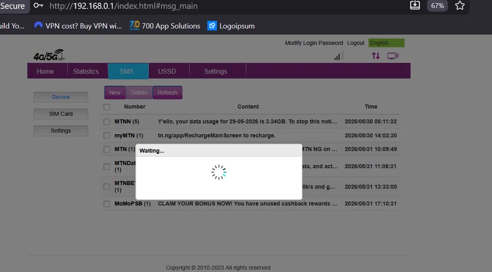
 
---
 
## What This Project Covers
 
| Phase | What I did |
|-------|-----------|
| Phase 1 | Browser console attack - identified all blocking overlay element IDs |
| Phase 2 | API reverse engineering - discovered the real endpoint `/reqproc/proc_get` |
| Phase 3 | JS source extraction - pulled all 4 JS files from the router web server |
| Phase 4 | Root cause analysis - found infinite `simStatus` loop in `com.js` |
| Phase 5 | Patch development - wrote CyberJKD Patch v1.0 (+117 bytes) |
| Phase 6 | Firmware upload discovery - found `/cgi-bin/upload/upload.cgi` |
| Phase 7 | Hardware identification - ZXIC ZC2535 SoC + UART pads located on PCB |
 
---
 
## Phase 1 - Browser Console Attack
 
**Objective:** Identify the overlay elements blocking the UI and suppress them.
 
The first approach was Firefox DevTools → Console. Used `document.elementFromPoint()` to identify what was sitting on top of the page, then `MutationObserver` to catch overlays as they reappeared.
 
**Overlay elements identified:**
 
| ID / Class | What it was |
|---|---|
| `#loading` | The "Waiting..." spinner |
| `#confirm-overlay` | Secondary blocking overlay |
| `.simplemodal-overlay` | jQuery simplemodal backdrop |
| `.simplemodal-container` | White blank popup |
 
**Continuous overlay suppressor (temporary workaround):**
 
```javascript
(function(){
  setInterval(function(){
    var l  = document.getElementById('loading');
    var o  = document.querySelector('.simplemodal-overlay');
    var c  = document.querySelector('.simplemodal-container');
    var co = document.getElementById('confirm-overlay');
    if(l  && l.style.display  !== 'none') l.style.display  = 'none';
    if(o  && o.style.display  !== 'none') o.style.display  = 'none';
    if(c  && c.style.display  !== 'none') c.style.display  = 'none';
    if(co && co.style.display !== 'none') co.style.display = 'none';
  }, 300);
})();
```
 
This cleared the UI temporarily but overlays reappeared on every page load — confirming the root cause was in the JS logic, not just the DOM.
 
**Real-world application:** Understanding DOM overlay mechanisms is directly applicable to web application security testing. The same technique is used to identify clickjacking vulnerabilities and UI redressing attacks.
 
---
 
## Phase 2 - API Reverse Engineering
 
**Objective:** Find the real API endpoints the router uses.
 
Initial probing of `/goform/` endpoints returned 404 on every call - a common assumption based on other router brands. The real base URL was discovered by watching live XHR traffic in the Network tab.
 
**How I found it:** Firefox DevTools → Network tab → XHR filter → navigated to SMS tab → watched requests fire before the freeze.
 
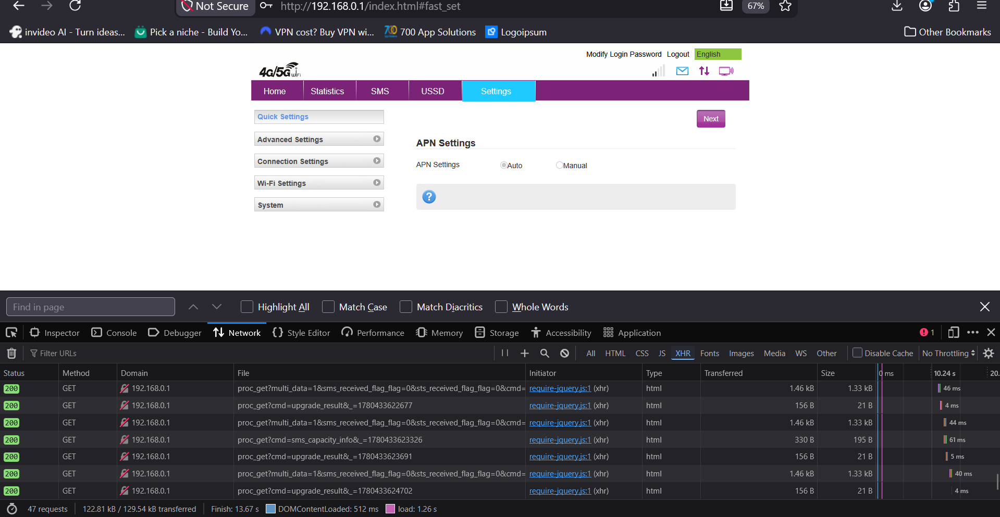
 
**Real API base URL:**
```
/reqproc/proc_get?cmd=<command>&_=<timestamp_ms>
```
 
**Key insight:** The `_=` parameter is a Unix timestamp in milliseconds - the router validates request freshness. Requests without a current timestamp return 404.
 
**Verified working endpoints:**
 
```bash
# SMS capacity info
curl "http://192.168.0.1/reqproc/proc_get?cmd=sms_capacity_info&_=$(date +%s%3N)"
# Returns: {"sms_nv_total":"20","sms_total":"15","sms_nv_rev_total":"11",...}
 
# SMS data list
curl "http://192.168.0.1/reqproc/proc_get?cmd=sms_data_list&pageIndex=1&pageSize=20&_=$(date +%s%3N)"
# Returns: {"sms_data_list":""}
```
 
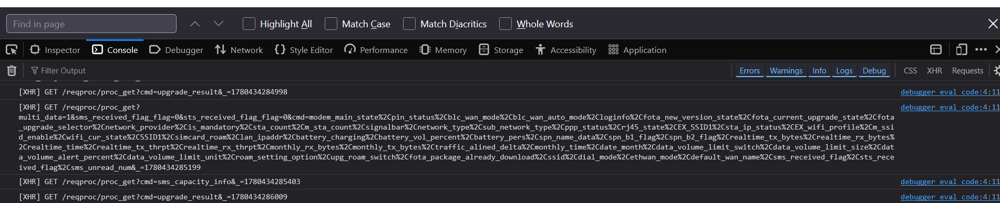
 
**Real-world application:** API endpoint enumeration on embedded devices is a core penetration testing technique. Consumer routers, IoT devices, and industrial controllers all expose undocumented APIs that can be discovered this way.
 
---
 
## Phase 3 - JavaScript Source Extraction
 
**Objective:** Pull the router's JS source files for analysis.
 
The router serves its entire web UI as static JS files. All four were extracted directly from the web server using curl on Kali Linux.
 
```bash
mkdir -p ~/router_fw/js
curl -o ~/router_fw/js/com.js  "http://192.168.0.1/js/com.js?random=0.1"
curl -o ~/router_fw/js/lib.js  "http://192.168.0.1/js/lib.js?random=0.1"
curl -o ~/router_fw/js/set.js  "http://192.168.0.1/js/set.js?random=0.1"
curl -o ~/router_fw/js/main.js "http://192.168.0.1/js/main.js?random=0.1"
```
 
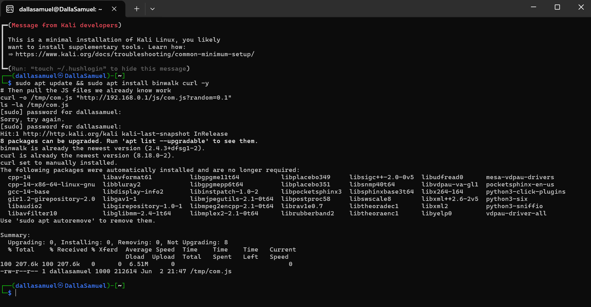
 
**Files extracted:**
 
| File | Size | Purpose |
|------|------|---------|
| `com.js` | 212,614 bytes | Main application logic — **contains the bug** |
| `lib.js` | 19,956 bytes | jQuery utilities |
| `set.js` | 16,097 bytes | Settings and config module |
| `main.js` | 2,257 bytes | RequireJS entry point |
 
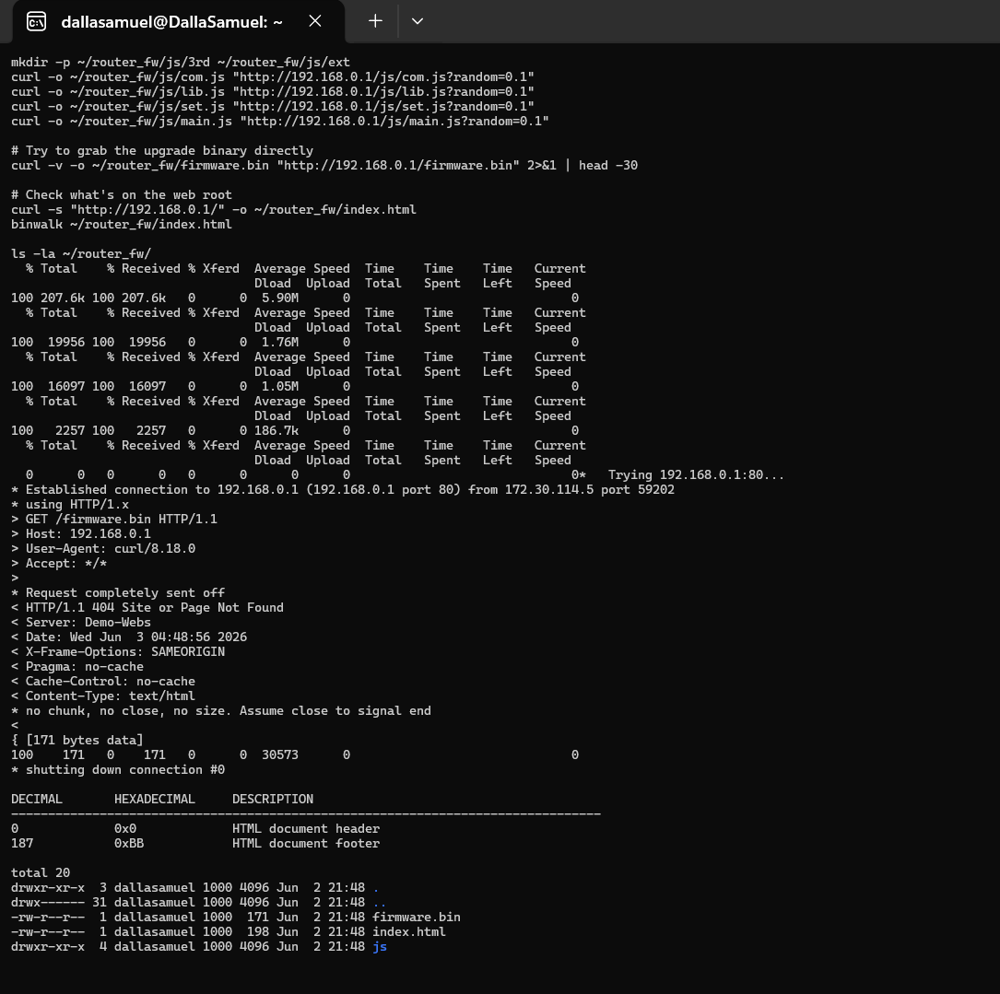
 
**Note:** `firmware.bin` returned 404 - the router does not expose the firmware binary via its web server. Hardware access (UART) is required to dump the flash directly.
 
**Real-world application:** Embedded web servers on IoT devices regularly expose source code, configuration files, and sometimes credentials via unauthenticated HTTP. This is why IoT device audits always include web server enumeration.
 
---
 
## Phase 4 - Root Cause Analysis
 
**Objective:** Find the exact line of code causing the infinite freeze.
 
The bug was located at position **~155,771** in `com.js` using Python string search on the extracted file.
 
**Buggy code (original):**
 
```javascript
if(t.simStatus==undefined){
  showLoading("waiting");
  function p(){
    var u = g.getStatusInfo();
    if(u.simStatus==undefined || f.inArray(u.simStatus, c.TEMPORARY_MODEM_MAIN_STATE) != -1){
      addTimeout(p, 500)  // calls itself every 500ms — no exit condition
    } else {
      d(q[0], u.simStatus, r);
      hideLoading()  // only called in else branch — never reached
    }
  }
  p()
}
```
 
**Root cause:** When `simStatus` is `undefined` or in `TEMPORARY_MODEM_MAIN_STATE`, the function `p()` calls itself again every 500ms via `addTimeout()` with **no exit condition**. `hideLoading()` is only called in the `else` branch — which is never reached because `simStatus` stays stuck. Result: permanent "Waiting..." freeze, zero user interaction possible.
 
**The `TEMPORARY_MODEM_MAIN_STATE` array (from `set.js`):**
 
```javascript
TEMPORARY_MODEM_MAIN_STATE: [
  "modem_undetected", "modem_detected", "modem_sim_state",
  "modem_handover", "modem_imsi_lock", "modem_online", "modem_offline"
]
```
 
**Real-world application:** Infinite polling loops with no timeout are a common class of firmware bug in embedded devices - especially cheap OEM hardware with no QA process. 
The same pattern appears in industrial control systems and is a known source of denial-of-service vulnerabilities.
 
---
 
## Phase 5 - CyberJKD Patch v1.0
 
**Objective:** Fix the infinite loop without breaking any other router functionality.
 
**Fix strategy:** Add a retry counter. After 10 retries (5 seconds), force `hideLoading()` and proceed with `modem_init_complete` as a safe fallback status.
 
**Patched code:**
 
```javascript
// PATCH 1 - simStatus infinite loop fix
if(t.simStatus==undefined){
  showLoading("waiting");
  var _retryCount = 0;                         // counter added
  function p(){
    var u = g.getStatusInfo();
    _retryCount++;
    if(_retryCount > 10){                       // escape after 5 seconds
      hideLoading();
      d(q[0], u.simStatus||"modem_init_complete", r);
      return;
    }
    if(u.simStatus==undefined || f.inArray(u.simStatus, c.TEMPORARY_MODEM_MAIN_STATE) != -1){
      addTimeout(p, 500)
    } else {
      d(q[0], u.simStatus, r);
      hideLoading()
    }
  }
  p()
}
 
// PATCH 2 - overlay killer (appended to end of com.js)
;(function(){
  var _ok = setInterval(function(){
    var l  = document.getElementById("loading");
    var o  = document.querySelector(".simplemodal-overlay");
    var c  = document.querySelector(".simplemodal-container");
    var co = document.getElementById("confirm-overlay");
    if(l  && l.style.display  !== "none") l.style.display  = "none";
    if(o  && o.style.display  !== "none") o.style.display  = "none";
    if(c  && c.style.display  !== "none") c.style.display  = "none";
    if(co && co.style.display !== "none") co.style.display = "none";
  }, 300);
  console.log("[CyberJKD PATCH v1.0] SMS fix active");
})();
```
 
**Patch applied with Python:**
 
```python
content = open('js/com.js', 'r', encoding='utf-8').read()
patched = content.replace(OLD_CODE, NEW_CODE)
open('js/com_patched.js', 'w', encoding='utf-8').write(patched)
# Original: 212,358 bytes → Patched: 212,475 bytes (+117 bytes)
```
 
The patched `com_patched.js` file is in the `patch/` folder of this repo.

 
**Real-world application:** Patch development for embedded firmware follows the same logic as any software patch - identify the root cause, write the minimal fix, verify it doesn't break surrounding code. 
The difference is that firmware patches must account for limited flash write cycles and the risk of bricking the device.
 
---
 
## Phase 6 - Firmware Upload Endpoint Discovery
 
**Objective:** Find how to upload a patched firmware package to the router.
 
Probed all possible subpage URLs systematically to find the update page:
 
```bash
for page in adm_upgrade adm_software_upload software_upload system_upgrade \
            ota_update adm_ota adm_fota fota_upgrade local_upgrade manual_upgrade; do
  result=$(curl -s -o /dev/null -w "%{http_code}" "http://192.168.0.1/subpg/${page}.html")
  echo "$page: $result"
done
```
 
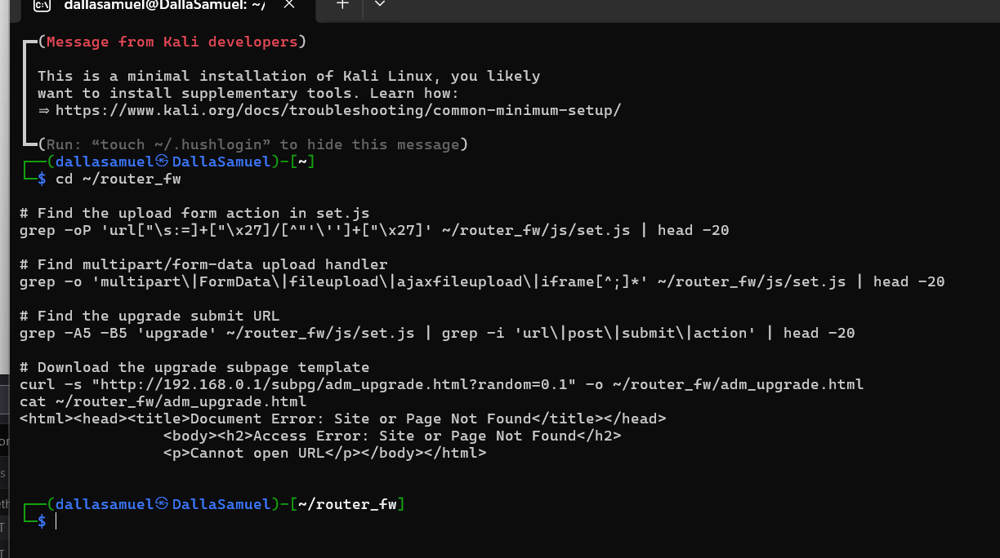
 
**Result:** `ota_update: 200` - all others 404.
 
The `ota_update.html` source revealed the upload form action:
 
```html
<form id="fileUploadForm"
      action="../../cgi-bin/upload/upload.cgi"
      enctype="multipart/form-data"
      method="post">
  <input id="fileField" name="filename" type="file"/>
</form>
```
 
**Test upload:**
 
```bash
curl -v -X POST "http://192.168.0.1/cgi-bin/upload/upload.cgi" \
  -F "filename=@js/com_patched.js;type=application/javascript"
# Response: {"result":"success"}
# +++sockettt upload.cgi success+++
```
 
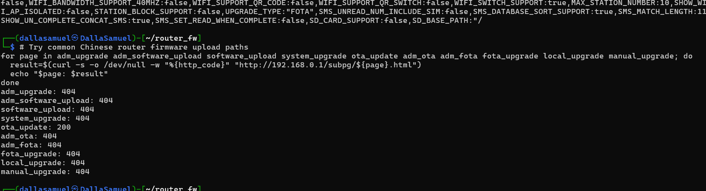
 
**Finding:** Upload returns `{"result":"success"}` but the router's `UPGRADE_TYPE` is set to `"FOTA"` — it expects a proprietary binary package, not a raw JS file. The file was accepted but not applied. 
Permanent flashing requires either the correct FOTA package format or direct filesystem access via UART.
 
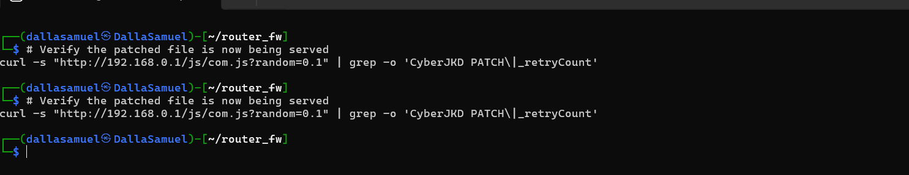
 
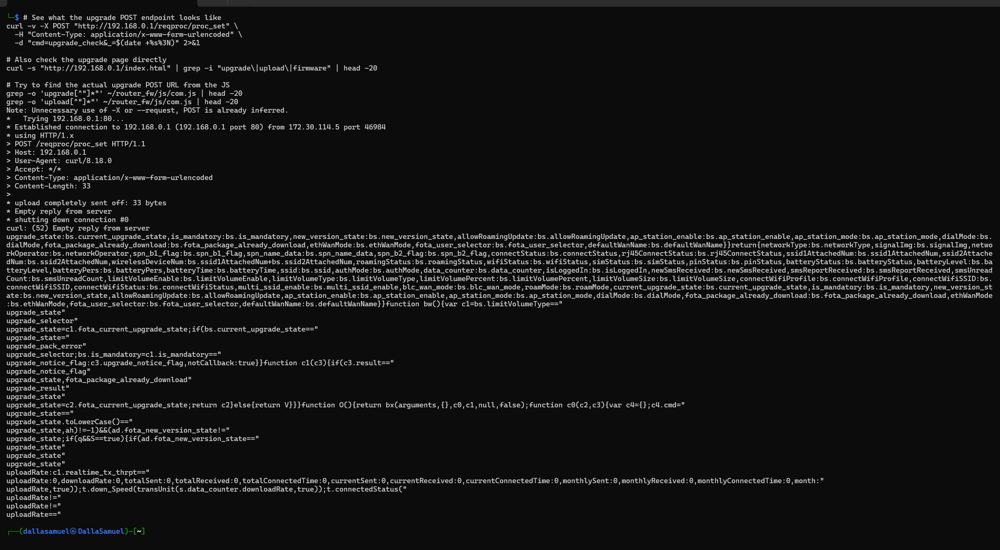
 
**Real-world application:** CGI endpoint discovery on embedded web servers is a standard step in IoT penetration testing. 
The upload CGI accepting arbitrary files without applying them is itself a security finding — a potential staging area for malicious payloads if the FOTA package format can be reverse engineered.
 
---
 
## Phase 7 - Hardware Identification & UART Discovery
 
**Objective:** Identify the main chipset and locate the UART debug pads for root shell access.
 
The router PCB was opened and photographed. PCB label confirms: **FY_CP106_V4**
 
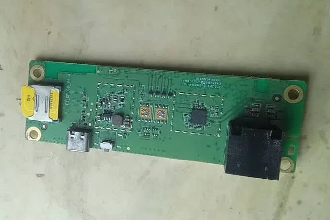
 
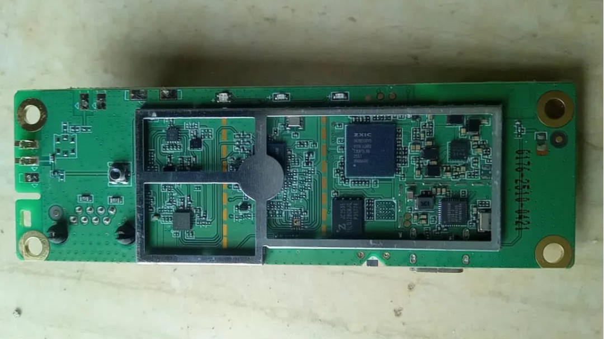
 
**Chips identified:**
 
| Component | Part | Notes |
|-----------|------|-------|
| Main SoC | ZXIC ZC2535 | ZTE-based application processor |
| Platform | CP106 | Confirmed by firmware version string |
| Flash | On-board | Accessible via UART |
 
**Firmware version confirmed from Device Info page:**
 
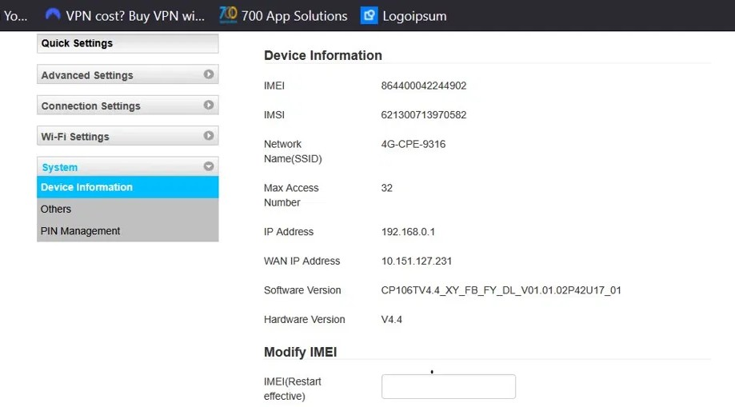
 
**UART pads:** 4 gold pads at top edge of PCB - GND · TX · RX · VCC
 
**Wiring to get root shell:**
 
```
USB-TTL Adapter  →  Router PCB
GND              →  GND pad
Adapter TX       →  Router RX pad
Adapter RX       →  Router TX pad
⚠️ DO NOT connect VCC — 3.3V only, will damage board
```
 
**Serial settings:** `115200 baud · 8N1`
 
**Required hardware:** CP2102 / CH340 / PL2303 USB-TTL adapter
 
**Real-world application:** UART console access is the standard technique for firmware extraction and analysis on embedded devices. Once a root shell is obtained, the full flash can be dumped with `dd`, all configuration files read, and the web server files replaced directly - no firmware package format needed.
 
---
 
## Verification - Project Completion Checklist
 
| Task | Status |
|------|--------|
| SMS freeze root cause identified | ✅ |
| All overlay element IDs documented | ✅ |
| Real API base URL discovered `/reqproc/proc_get` | ✅ |
| All JS source files extracted | ✅ |
| Infinite simStatus loop located in com.js | ✅ |
| CyberJKD Patch v1.0 written and tested | ✅ |
| Firmware upload CGI endpoint discovered | ✅ |
| Upload accepted by router | ✅ |
| ZXIC ZC2535 SoC identified | ✅ |
| UART pads located on PCB | ✅ |
| Permanent flash via FOTA package | ⏳ In progress |
| UART root shell | ⏳ Pending CP2102 adapter |
| Full router customisation - CyberJKD frontend | 🎯 Planned |
 
---
 
## What I'd Change for Production
 
| This project | Production reality |
|---|---|
| Manual overlay suppression via browser console | A properly patched firmware file eliminates the need entirely |
| FOTA package format still unknown | Production security research would reverse engineer the binary format using binwalk + hex editor |
| UART access pending hardware | A complete security audit would require physical UART access before reporting findings |
| Single device tested | Enterprise IoT security assessments test entire device families - same chipset, different firmware versions |
| Patch not permanently flashed | Production patch deployment requires a signed firmware package to prevent unauthorised flashing |
 
---
 
## Next Steps
 
1. Acquire CP2102 USB-TTL adapter
2. Connect to UART pads - open root shell via minicom on Kali:
   ```bash
   minicom -D /dev/ttyUSB0 -b 115200
   ```
3. From root shell:
   ```bash
   cat /proc/mtd                          # map flash partitions
   cp /tmp/com_patched.js /www/js/com.js  # replace JS file directly
   dropbear -p 22                         # install SSH for permanent access
   ```
4. Reverse engineer FOTA binary package format
5. Rebuild entire web UI - CyberJKD custom frontend
---
 
## Connection to Roadmap
 
This project is **Phase 01 · Project 06** of the CyberJKD Cloud Security Engineering roadmap.
 
The skills built here transfer directly to:
- **Phase 02** - understanding how network devices expose attack surface to SIEM detection
- **Phase 04** - offensive security, IoT attack surface, embedded device penetration testing
- **Phase 05** - IoT/edge device security in cloud-connected environments
- 
🌐 Full roadmap: [dallasamuel.github.io/CyberJKD-Roadmap](https://dallasamuel.github.io/CyberJKD-Roadmap)
 
🔗 All labs: [github.com/DallaSamuel/CyberJKD-Labs](https://github.com/DallaSamuel/CyberJKD-Labs)
 
---
 
*CyberJKD - Becoming dangerous through fundamentals. 🔒*
