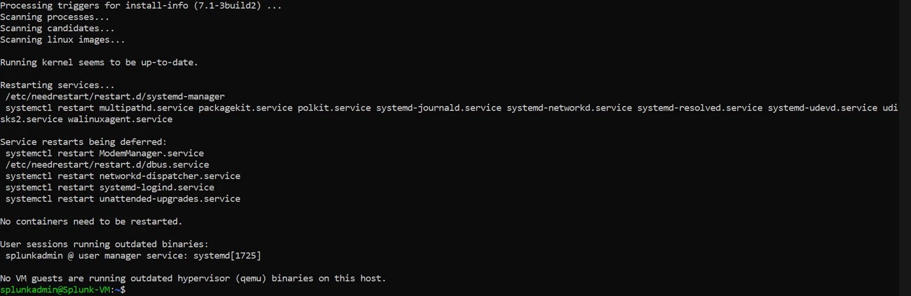
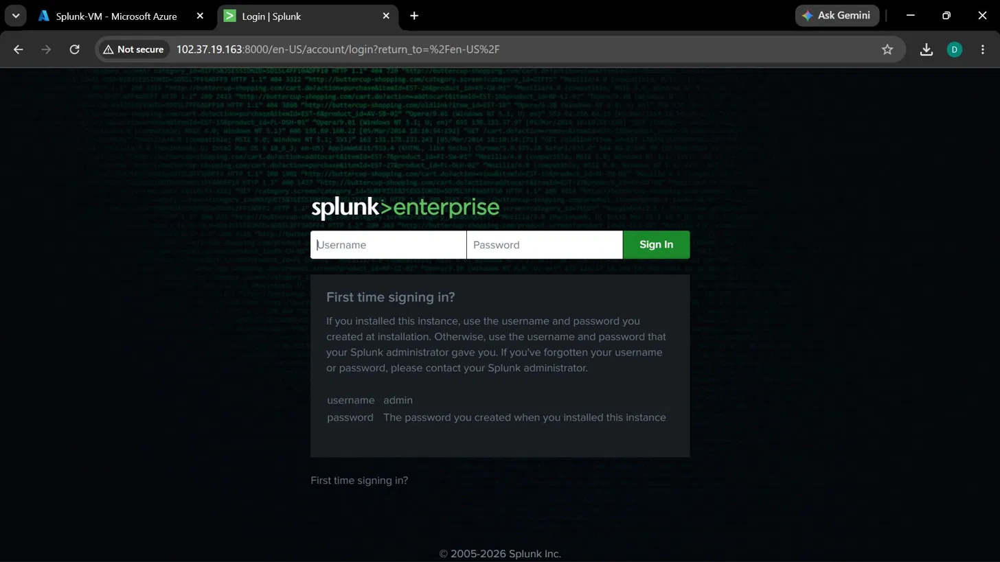
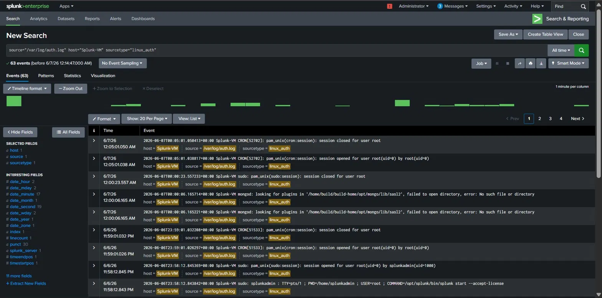
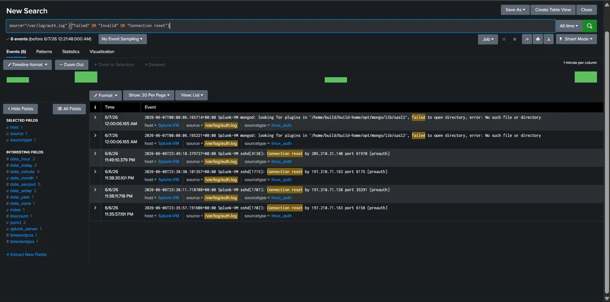
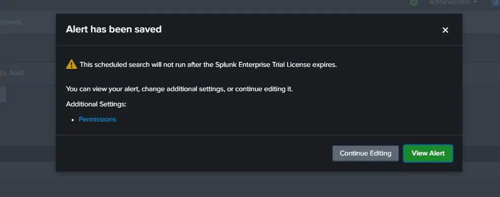
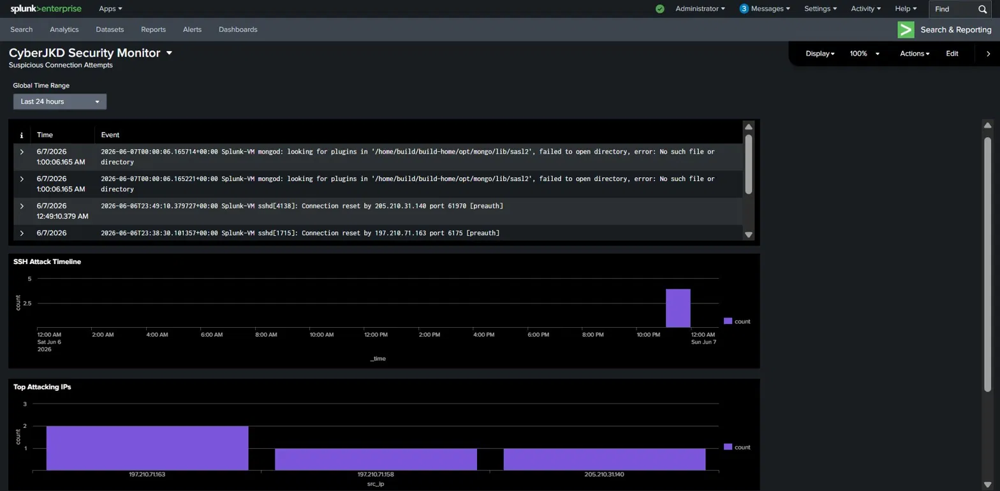

# Splunk Enterprise SIEM Lab - Detecting Real Attacks on a Cloud VM


**Author:** Dalla Samuel (CyberJKD)

**Date:** 7th June 2026

**Platform:** Azure Free Account VM · Ubuntu Server 24.04 LTS

**Lab Source:** CloudTechExec - 5 Labs To Get You Hired · Lab 3

**Roadmap:** [Phase 02 · Lab 01](https://dallasamuel.github.io/CyberJKD-Roadmap)

---

## Objective

Deploy Splunk Enterprise 9.4.1 on an Azure VM, ingest live Linux authentication logs, write SPL detection queries, build a scheduled brute force alert, 
and create the CyberJKD Security Monitor dashboard - visualizing real external attack activity detected within hours of deployment.

---

## Business Problem This Lab Solves

Every security team needs visibility. Without a SIEM, attacks happen silently - no alerts, no timeline, no evidence. This lab builds the core skill that 
SOC analysts use every day: ingesting logs, writing detection logic, and turning raw events into actionable intelligence.

| Role | How this applies |
|------|-----------------|
| SOC Analyst | Core daily tool — ingest logs, write SPL queries, build detection rules, respond to alerts |
| Cloud Security Engineer | Splunk on Azure is a real enterprise deployment pattern - same architecture used at scale |
| Junior Security Engineer | SIEM experience is the #1 differentiator at entry level - most candidates have never touched it |
| Incident Responder | Dashboard and alert workflow mirrors real IR triage process |

---

## What This Lab Covers

| Skill | Detail |
|-------|--------|
| Azure VM deployment | Ubuntu Server 24.04 on Azure with NSG configuration |
| Splunk installation | Enterprise 9.4.1 installed via .deb package on Linux |
| Log ingestion | /var/log/auth.log continuously monitored as a data source |
| SPL queries | Three detection queries written from scratch |
| Alert creation | Scheduled brute force detection rule - High severity |
| Dashboard build | 3-panel CyberJKD Security Monitor in Dashboard Studio |
| Real threat detection | 3 external IPs detected probing the VM within hours of deployment |

---

## Environment

| Component | Detail |
|-----------|--------|
| Cloud Platform | Microsoft Azure Free Account |
| VM Size | Standard D2s v3 (2 vCPUs, 8GB RAM) |
| OS | Ubuntu Server 24.04 LTS |
| SIEM | Splunk Enterprise 9.4.1 |
| Log Source | /var/log/auth.log |
| NSG Rules | Port 22 (SSH) · Port 8000 (Splunk Web) |
| Cost | $0 — covered by Azure free credits |

---

## Key Concepts

### What is a SIEM?
A Security Information and Event Management system collects logs from across an environment - servers, firewalls, applications - and centralises them for search, 
correlation, and alerting. Splunk is the industry standard. Being able to deploy it, ingest data, and write detection logic is a core SOC skill.

### What is SPL?
Splunk Processing Language - the query language used to search, filter, and transform log data inside Splunk. Similar in concept to SQL but purpose-built for security log analysis. 
Every SOC analyst writes SPL daily.

### What is auth.log?
The Linux authentication log. Every SSH connection attempt, login success, login failure, sudo command, and user creation gets recorded here. 
It is the primary source for detecting brute force attacks, unauthorised access, and privilege escalation on Linux systems.

### Why do external IPs appear immediately after deployment?
Internet-facing VMs are scanned continuously by automated bots within minutes of receiving a public IP. These are not targeted attacks - 
they are mass scanners probing every IP on the internet for open ports. This lab captured exactly that activity in real time.

---

## Lab Walkthrough

### Stage 1 - Deploy Azure VM

- Created Resource Group: CyberJKD-Lab (East US)
- Deployed Ubuntu Server 24.04 LTS VM: Splunk-VM
- Configured SSH key authentication - downloaded .pem private key
- Connected via PowerShell: `ssh -i Splunk-VM-001_key.pem splunkadmin@102.37.19.163`
- Ran system update: `sudo apt-get update && sudo apt-get upgrade -y`

**Screenshot:**



---

### Stage 2 - Install Splunk Enterprise

```bash
# Download Splunk 9.4.1
wget -O splunk.deb "https://download.splunk.com/products/splunk/releases/9.4.1/linux/splunk-9.4.1-e3bdab203ac8-linux-amd64.deb"

# Install
sudo dpkg -i splunk.deb

# Start Splunk and accept license - create admin credentials on first run
sudo /opt/splunk/bin/splunk start --accept-license

# Configure Splunk to start automatically on VM boot
sudo /opt/splunk/bin/splunk enable boot-start
```

Added NSG inbound rule: Port 8000 TCP - Allow (Splunk Web UI)

Accessed Splunk at: `http://102.37.19.163:8000`

**Screenshot:**



---

### Stage 3 - Ingest Auth Logs

- Add Data → Monitor → Files & Directories
- File path: `/var/log/auth.log`
- Monitoring type: Continuously Monitor
- Source type: `linux_auth` (custom, created during setup)
- Host: Splunk-VM
- Index: default

Splunk immediately began indexing 63 events - including user creation, sudo commands, SSH sessions, and external connection attempts.

**Screenshot:**



---

### Stage 4 - SPL Detection Queries

**Query 1 - All SSH events:**


source="/var/log/auth.log" "sshd"


Returned 11 events - successful logins, session opens/closes, and external connection resets.

**Query 2 - Suspicious connection attempts:**


source="/var/log/auth.log" ("Failed" OR "Invalid" OR "Connection reset")


Returned 6 events - including 4 external IP connection resets flagged as pre-authentication failures.

**Query 3 - Top attacking IPs (threat intelligence):**


source="/var/log/auth.log" "Connection reset" | rex "by (?P<src_ip>\d+.\d+.\d+.\d+)" | stats count by src_ip | sort -count


Extracted and ranked all source IPs from connection reset events.

**Screenshot:**



---

### Stage 5 - Brute Force SSH Detection Alert

- Saved Query 2 as a scheduled alert
- Alert name: **Brute Force SSH Detection**
- Description: Detects repeated SSH connection resets indicating brute force activity
- Alert type: Scheduled - runs every hour
- Trigger condition: Number of Results is greater than 3
- Severity: **High**
- Action: Add to Triggered Alerts

**Screenshot:**



---

### Stage 6 - CyberJKD Security Monitor Dashboard

Built in Dashboard Studio with 3 panels:

**Panel 1 - Suspicious Connection Attempts**
Live events table showing all failed/invalid/reset connection events with timestamps.

**Panel 2 - SSH Attack Timeline**
Timechart showing connection reset events per hour - spike clearly visible at 11PM on deployment night.

**Panel 3 - Top Attacking IPs**
Bar chart ranking source IPs by number of connection attempts.

**Screenshot:**



---

## Findings - Real Attack Activity Detected

Within hours of the VM being deployed with a public IP, Splunk detected connection reset attempts from 3 external IPs:

| IP Address | Attempts | Classification |
|---|---|---|
| 197.210.71.163 | 2 | Automated scanner - pre-auth SSH probe |
| 197.210.71.158 | 1 | Automated scanner - pre-auth SSH probe |
| 205.210.31.140 | 1 | Automated scanner - pre-auth SSH probe |

All blocked at pre-authentication stage - NSG and SSH key auth prevented any access. Documented as expected internet background noise, not a targeted attack.

---

## SPL Reference - Queries Used in This Lab

| Query | Purpose |
|-------|---------|
| `source="/var/log/auth.log" "sshd"` | All SSH-related events |
| `source="/var/log/auth.log" ("Failed" OR "Invalid" OR "Connection reset")` | Suspicious auth events |
| `\| stats count by src_ip` | Count events grouped by source IP |
| `\| timechart count span=1h` | Plot event count over time |
| `\| rex "by (?P<src_ip>...)"` | Extract IP address from raw log text |
| `\| sort -count` | Sort results highest to lowest |

---

## Verification - Lab Completion Checklist

| Skill | Verified |
|-------|---------|
| Azure VM deployed and hardened with NSG rules | ✅ |
| Splunk Enterprise 9.4.1 installed on Ubuntu via CLI | ✅ |
| Auth log ingested as continuous monitor data source | ✅ |
| SPL queries written - SSH events, suspicious attempts, top IPs | ✅ |
| Brute Force SSH Detection alert created - High severity, hourly | ✅ |
| CyberJKD Security Monitor dashboard built - 3 panels | ✅ |
| Real external attack activity detected and documented | ✅ |
| Splunk configured for boot-start on VM restart | ✅ |

---

## What I'd Change for Production

| Lab setup | Production reality |
|-----------|-------------------|
| Single VM auth log source | Production SIEMs ingest from hundreds of sources - firewalls, endpoints, cloud APIs |
| Manual SPL queries | Production uses saved searches, correlation rules, and automated playbooks |
| Free trial Splunk license | Enterprise license with full scheduling and alerting capabilities |
| Public IP on VM | Production VMs sit behind private endpoints - no direct internet exposure |
| Manual alert review | SOC teams use ticketing integration (ServiceNow) to auto-create incidents from Splunk alerts |

---

## Connection to Roadmap

This lab is **Phase 02 · Lab 01** of the CyberJKD Cloud Security Engineering roadmap.

The Splunk SIEM foundation built here transfers directly to:
- **Phase 02 · Lab 02** - Custom detection rule using Sigma/SPL for a real-world attack pattern
- **Phase 02 · Lab 05** - ServiceNow integration - logging Splunk alerts as ITSM tickets
- **Phase 03** - Microsoft Sentinel + KQL (same SIEM concepts, Azure-native tool)
- **Phase 05** - Automated incident detection and response with Sentinel + Logic Apps

🌐 Full roadmap: [dallasamuel.github.io/CyberJKD-Roadmap](https://dallasamuel.github.io/CyberJKD-Roadmap)

🔗 All labs: [github.com/DallaSamuel/CyberJKD-Labs](https://github.com/DallaSamuel/CyberJKD-Labs)

---


*CyberJKD - Becoming dangerous through fundamentals. 🔒*
