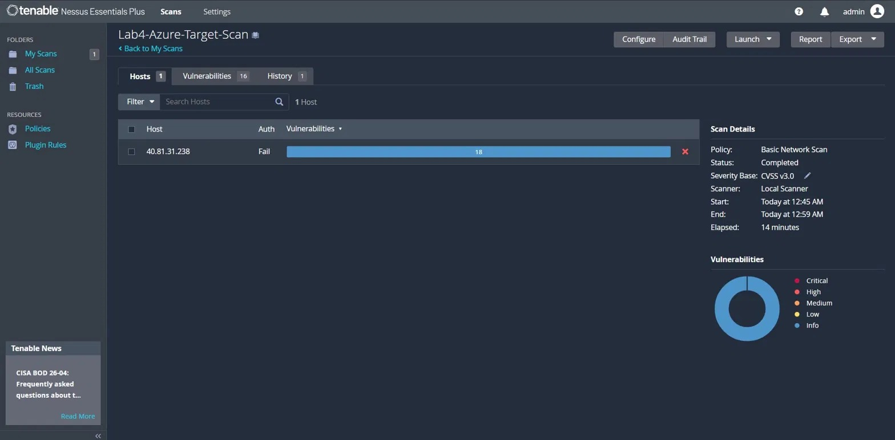
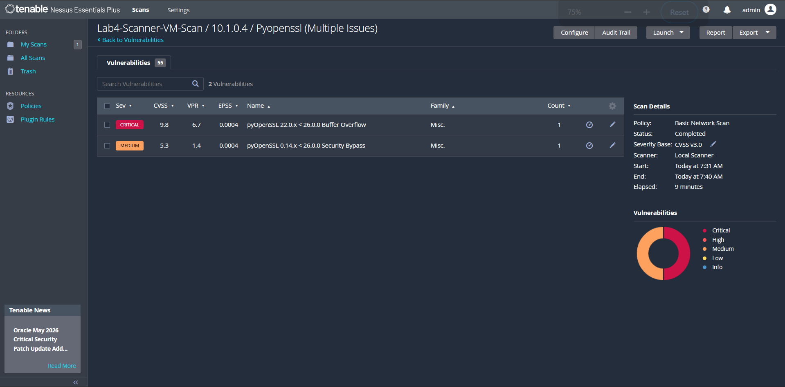
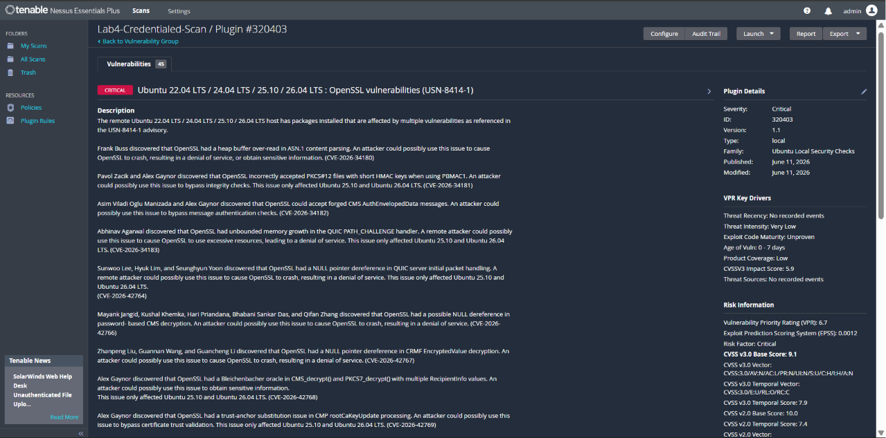
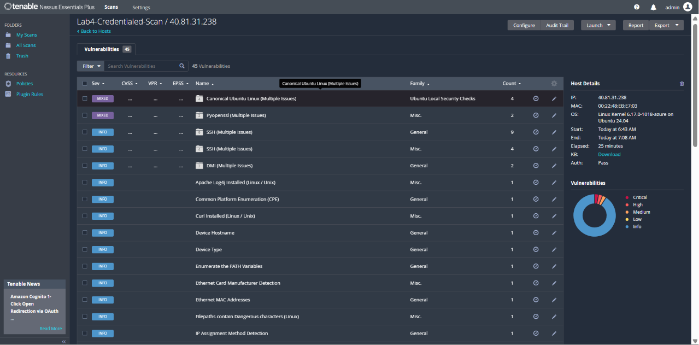
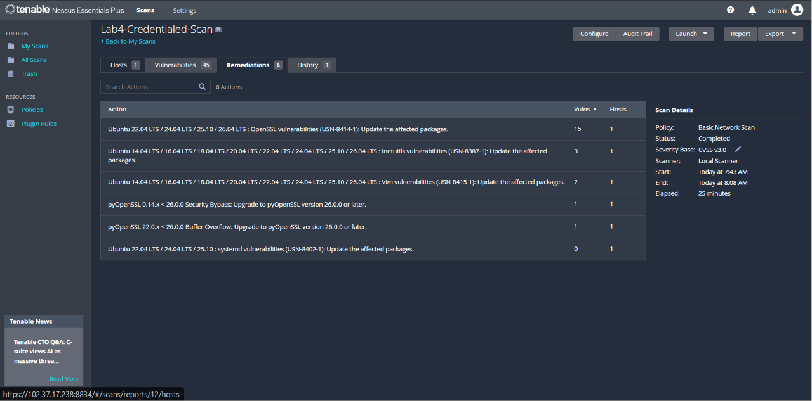

# Nessus Vulnerability Scanning Lab - Finding Real CVEs on a Cloud VM
 


 
**Author:** Dalla Samuel (CyberJKD)
 
**Date:** 12th June 2026
 
**Platform:** Azure Free Account · 2x Ubuntu 24.04 LTS VMs
 
**Lab Source:** CloudTechExec - 5 Labs To Get You Hired · Vulnerability Management
 
**Roadmap:** [Phase 02 · Project 02](https://dallasamuel.github.io/CyberJKD-Roadmap)
 
---
 
## Objective
 
Deploy Nessus Essentials Plus on an Azure Ubuntu VM, scan a second VM as the target, and compare unauthenticated vs credentialed scan results 
- identifying real CVEs, interpreting CVSS scores, and producing a remediation plan.
 
---
 
## Business Problem This Lab Solves
 
Every organisation running infrastructure eventually has to answer the same question: **what is actually vulnerable on this network right now?**
 
A server can look fine from the outside while running software with known, published, exploitable vulnerabilities. 
The only way to know is to scan it and scan it properly, with credentials, not just from the outside looking in.
 
| Role | How this applies |
|------|-----------------|
| Vulnerability Management Analyst | Run scheduled scans, triage findings by CVSS, track remediation SLAs |
| Cloud Security Engineer | Same scan logic applies directly to Azure Defender for Cloud and AWS Inspector |
| SOC Analyst | Cross-reference active CVEs against threat intel to prioritise alerts |
| IT Operations | Patch management - knowing exactly which package version fixes which CVE |
 
---
 
## What This Lab Added Beyond Phase 02 Project 01 (Splunk)
 
Project 01 covered log ingestion and detection - watching attacks happen and alerting on them after the fact.
 
This lab added:
 
| Skill | What's new |
|-------|-----------|
| Proactive vs reactive security | Splunk detects attacks in progress; Nessus finds weaknesses before they're exploited |
| CVE / CVSS interpretation | Reading a vulnerability scanner's output and scoring real-world risk (0-10 scale) |
| Authenticated vs unauthenticated scanning | SSH credential-based scanning vs external-only enumeration |
| Multi-VM lab topology | Deploying a scanner VM and a separate target VM across Azure regions |
| Remediation mapping | Translating findings into actual patch commands (apt, pip) |
 
---
 
## Environment
 
| Component | Detail |
|-----------|--------|
| Platform | Microsoft Azure Free Account |
| Scanner VM | nessus-scanner · Ubuntu 24.04 LTS · Standard_D2s_v3 · South Africa North |
| Target VM | nessus-target · Ubuntu 24.04 LTS · Standard_D2s_v3 · East Asia |
| Tool | Nessus Essentials Plus v10.12.0 (free, Tenable activation code) |
| Web UI | https://[scanner-public-ip]:8834 |
| Cost | $0 - Nessus Essentials is permanently free for up to 20 IPs |
 
---
 
## Key Concepts
 
### CVE and CVSS
A **CVE** (Common Vulnerabilities and Exposures) is a unique ID assigned to a publicly disclosed vulnerability - e.g. `CVE-2026-27459`. 
A **CVSS** score (0-10) measures how severe it is: 9.0-10.0 is Critical, 7.0-8.9 is High, 4.0-6.9 is Medium, below 4.0 is Low. 
The score reflects how easy the vulnerability is to exploit and how much damage it can do.
 
### Unauthenticated vs credentialed scanning
- **Unauthenticated** - Nessus probes the target from the outside only: open ports, service banners, protocol versions. It cannot see what software is actually installed or how patched the system is.
- **Credentialed** - Nessus logs in over SSH and inspects the system from the inside: installed packages, exact versions, kernel patch level. This is how real vulnerabilities are found.
The gap between these two scan types is the single most important lesson of this lab.
 
### Auth status: Pass vs Fail
Every Nessus scan reports an **Auth** column per host. `Fail` means no credentials were used or they didn't work - findings are limited to INFO severity. 
`Pass` means Nessus successfully authenticated and ran local checks - this is when Critical and High findings appear.
 
### USN - Ubuntu Security Notices
Canonical publishes USNs (e.g. `USN-8414-1`) bundling multiple related CVEs into a single patch advisory. One `apt upgrade` can resolve dozens of CVEs covered by a single USN.
 
---
 
## Exercise A - Unauthenticated Scan (Lab4-Azure-Target-Scan)
 
**Objective:** Run a Basic Network Scan against the target VM's public IP with no credentials, and observe the limits of external-only scanning.
 
**Scan configuration:**
- Policy: Basic Network Scan
- Target: nessus-target public IP
- Credentials: none
**What I found:**
 
| Detail | Value |
|--------|-------|
| Auth status | Fail |
| Duration | 14 minutes |
| Total findings | 16 |
| Critical / High / Medium | 0 / 0 / 0 |
| Info | 16 |
 
All 16 findings were INFO severity - SSH protocol versions, OS fingerprinting, post-quantum cipher support, and an explicit "Target Credential Status: No Credentials Provided" flag confirming the scan type.
 
**Screenshot:**
 

 
**Real-world application:** This is what an external attacker sees with zero access - port and service fingerprinting only. 
It's also what a perimeter-only vulnerability scan looks like, which is why compliance frameworks increasingly require credentialed scanning.
 
---
 
## Exercise B - Scanner VM Self-Scan (Lab4-Scanner-VM-Scan)
 
**Objective:** Scan the Nessus scanner VM itself via its private IP, where Nessus has local-host access by default.
 
**Scan configuration:**
- Policy: Basic Network Scan
- Target: nessus-scanner private IP (10.1.0.4)
- Credentials: local (self-scan)
**What I found:**
 
| Detail | Value |
|--------|-------|
| Auth status | Pass |
| Duration | 9 minutes |
| Total findings | 71 |
| Critical | CVE-2026-27459 - pyOpenSSL Buffer Overflow |
 
**Headline finding:**
 
| CVE | CVSS | Description | Fix |
|-----|------|-------------|-----|
| CVE-2026-27459 | 9.8 (Critical) | pyOpenSSL 22.0.x < 26.0.0 - buffer overflow via oversized cookie callback | Upgrade pyOpenSSL to 26.0.0+ |
 
Also detected: 12 installations of Apache Log4j across the system (JndiLookup.class not present - Log4Shell exploit chain not applicable, but version unconfirmed and flagged for review).
 
**Screenshot:**
 

 
**Real-world application:** This is the scanner finding a vulnerability in its *own* host - a reminder that no system is exempt from scanning, including the security tooling itself.
 
---
 
## Exercise C - Credentialed Scan (Lab4-Credentialed-Scan)
 
**Objective:** Re-scan the target VM with SSH credentials and sudo privilege escalation, and compare results directly against Exercise A.
 
**Scan configuration:**
- Policy: Basic Network Scan
- Target: nessus-target public IP
- Credentials: SSH public key (azureuser) · Elevate privileges with sudo
**What I found:**
 
| Detail | Value |
|--------|-------|
| Auth status | Pass |
| Duration | 25 minutes |
| Total findings | 45 |
| Critical | 2 |
| High | 2 |
| Medium | 2 |
| Remediation actions generated | 6 |
 
**Critical findings:**
 
| CVE / Advisory | CVSS | Description | Fix |
|----------------|------|-------------|-----|
| USN-8414-1 (8 CVEs) | 9.1 | Ubuntu OpenSSL - heap buffer over-read, PKCS#12 integrity bypass, CMS auth bypass, QUIC NULL pointer derefs | `sudo apt upgrade openssl` |
| CVE-2026-27459 | 9.8 | pyOpenSSL Buffer Overflow (same as Exercise B, also present on target) | `pip install --upgrade pyopenssl` |
 
**High findings:**
 
| Advisory | CVSS | Description | Fix |
|----------|------|-------------|-----|
| USN-8387-1 | 7.8 | Ubuntu inetutils vulnerabilities | `sudo apt upgrade inetutils-*` |
| USN-8415-1 | 7.0 | Ubuntu Vim vulnerabilities | `sudo apt upgrade vim` |
 
**Screenshot:**
 

 
**Real-world application:** Same VM, same day - zero Critical findings without credentials, two Critical findings with them. 
This is the exact reason compliance frameworks (PCI-DSS, ISO 27001) mandate credentialed scanning, not just perimeter scanning.
 
---
 
## Unauthenticated vs Credentialed - Side by Side
 
| Metric | Unauthenticated (Exercise A) | Credentialed (Exercise C) |
|--------|------------------------------|----------------------------|
| Auth status | Fail | Pass |
| Total findings | 16 | 45 |
| Critical | 0 | 2 |
| High | 0 | 2 |
| Medium | 0 | 2 |
| CVEs identified | 0 | Multiple (USN-8414-1, USN-8387-1, USN-8415-1, CVE-2026-27459) |
| Remediation actions | 0 | 6 |
| Duration | 14 min | 25 min |
 
**Screenshot:**
 

 
---
 
## Remediation Plan
 
| # | Action | Vulns fixed | Command |
|---|--------|-------------|---------|
| 1 | Update OpenSSL (USN-8414-1) | 15 | `sudo apt upgrade openssl` |
| 2 | Update inetutils (USN-8387-1) | 3 | `sudo apt upgrade inetutils-*` |
| 3 | Update Vim (USN-8415-1) | 2 | `sudo apt upgrade vim` |
| 4 | Upgrade pyOpenSSL - security bypass | 1 | `pip install --upgrade pyopenssl` |
| 5 | Upgrade pyOpenSSL - buffer overflow | 1 | `pip install --upgrade pyopenssl` |
| 6 | Update systemd (USN-8402-1) | 0 | `sudo apt upgrade systemd` |
 
**One-line fix for the target VM:**
```bash
sudo apt update && sudo apt upgrade -y
pip install --upgrade pyopenssl
```
 
**Screenshot:**
 

 
---
 
## Verification - Lab Completion Checklist
 
| Skill | Verified |
|-------|---------|
| Registered for Nessus Essentials and activated with code | ✅ |
| Deployed two Azure VMs (scanner + target) across regions | ✅ |
| Installed and started nessusd via systemd on Ubuntu 24.04 | ✅ |
| Opened required NSG ports (22, 443, 8834) | ✅ |
| Ran unauthenticated Basic Network Scan | ✅ |
| Ran self-scan on scanner VM (local Pass) | ✅ |
| Configured SSH key + sudo credentials for credentialed scan | ✅ |
| Identified and interpreted Critical/High CVEs with CVSS scores | ✅ |
| Compared unauthenticated vs credentialed results | ✅ |
| Generated and reviewed Nessus remediation actions | ✅ |
| Logged remediation ticket in ServiceNow | ⬜ TODO |
 
---
 
## What I'd Change for Production
 
| Lab setup | Production reality |
|-----------|-------------------|
| Two standalone VMs, manually scanned | Production uses scheduled scans across asset groups via Nessus Manager / Tenable.io |
| Scanner and target on separate VNets, scanned via public IP | Production scanners sit inside the VNet and scan private ranges - no public exposure needed |
| SSH key uploaded manually per scan | Production stores credentials centrally in a credential vault (Azure Key Vault, CyberArk) |
| Findings reviewed manually in the UI | SOC teams export findings to a vulnerability management platform (Qualys, Tenable.io) with SLA tracking |
| No ticketing | Production remediation work is tracked in ServiceNow/Jira with assigned owners and due dates |
| One-off credentialed scan | Production runs continuous/scheduled scans to catch newly disclosed CVEs (like USN-8414-1, published the same week as this scan) |
 
---
 
## Connection to Roadmap
 
This lab is **Phase 02 · Project 02** of the CyberJKD Cloud Security Engineering roadmap - completing the Vulnerability Management mission objective.
 
The scanning and triage workflow built here transfers directly to:
- **Microsoft Defender for Cloud** - recommendation-based vulnerability assessment for Azure resources
- **Phase 02 Project 01** - Splunk SIEM (this lab finds the weaknesses; Splunk detects when they're exploited)
- **ServiceNow ITSM** - logging and tracking the remediation ticket for the findings above (outstanding)
- **Phase 04** - offensive security, where these same CVEs become exploitation targets in a controlled environment

##

🌐 Full roadmap: [dallasamuel.github.io/CyberJKD-Roadmap](https://dallasamuel.github.io/CyberJKD-Roadmap)
 
🔗 All labs: [github.com/DallaSamuel/CyberJKD-Labs](https://github.com/DallaSamuel/CyberJKD-Labs)
 
---
 
*CyberJKD - Becoming dangerous through fundamentals. 🔒*
   
