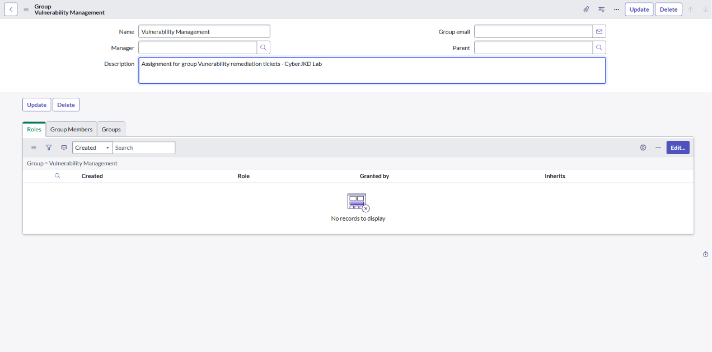
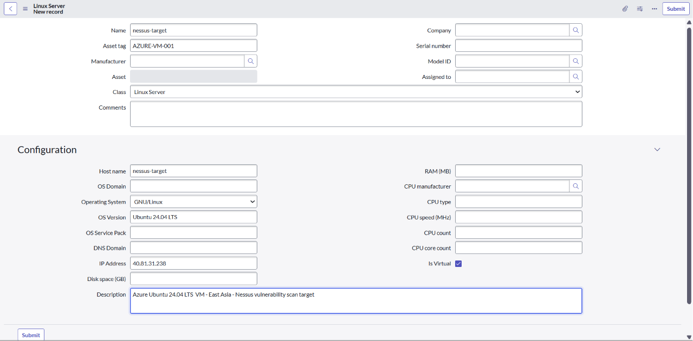
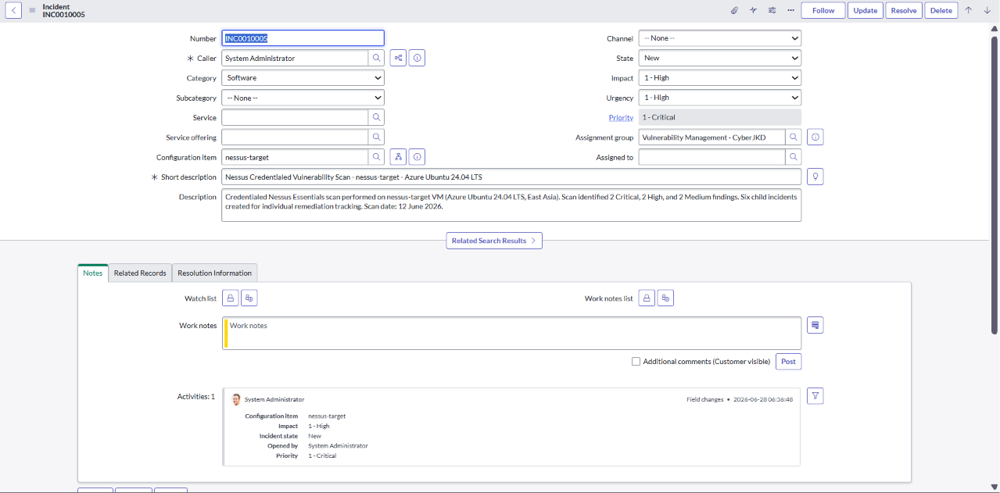
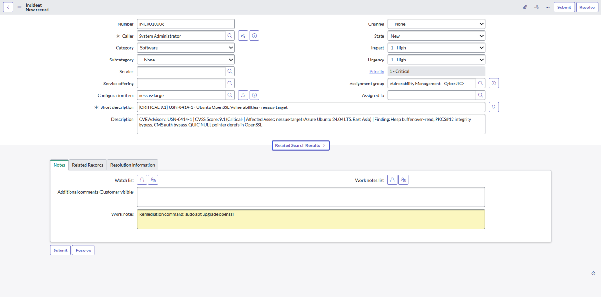
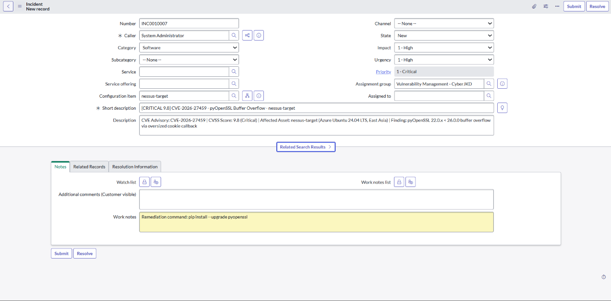
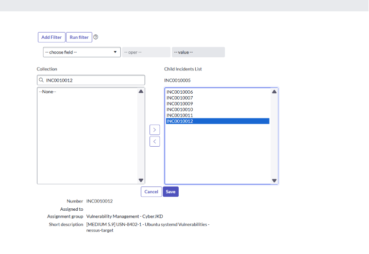
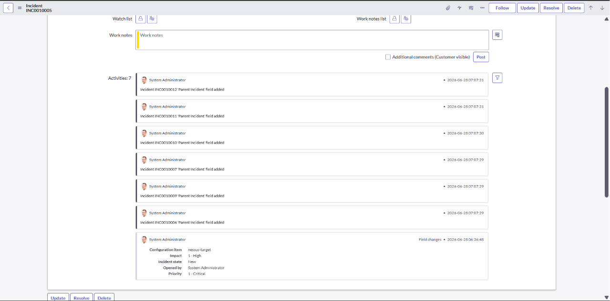
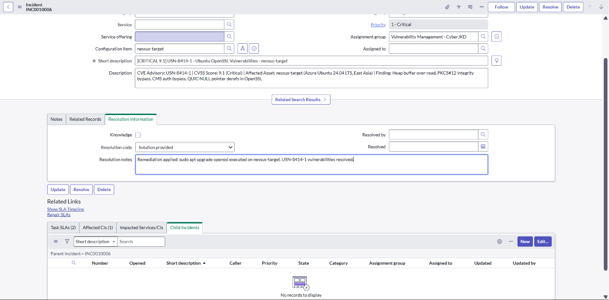
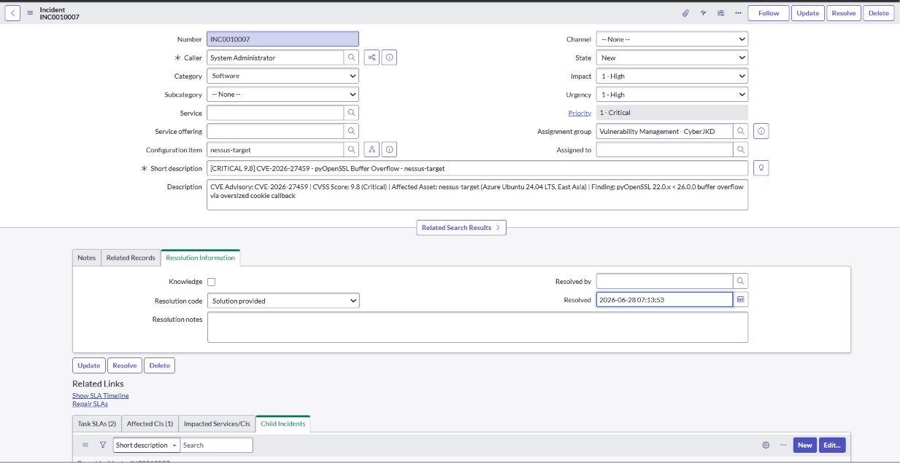

# ServiceNow Vulnerability Ticketing Lab
 


 
**Author:** Dalla Samuel (CyberJKD)
 
**Date:** 28th June 2026
 
**Platform:** ServiceNow Personal Developer Instance (PDI) - dev218480.service-now.com
 
**Lab Source:** CloudTechExec - 5 Labs To Get You Hired · Vulnerability Management
 
**Roadmap:** [Phase 02 · Project 03](https://dallasamuel.github.io/CyberJKD-Roadmap)
 
---
 
## Objective
 
Log, triage, and track remediation of 6 real vulnerabilities discovered during a Nessus credentialed scan (Phase 02 · Project 02) using ServiceNow ITSM 
- following enterprise-grade incident management practices with a parent/child ticket structure, CMDB CI registration, and CVSS-to-priority mapping.
 
---
 
## Business Problem This Lab Solves
 
Finding vulnerabilities is only half the job. The other half is tracking them to resolution.
 
Without a ticketing system, vulnerability findings get lost - no owner, no due date, no audit trail. 
This lab bridges the gap between a scanner output and an enterprise remediation workflow, which is exactly what a Cloud Security Engineer or Vulnerability Management Analyst does in production.
 
| Role | How this applies |
|---|---|
| Vulnerability Management Analyst | Log findings, assign priority, track SLA to resolution |
| Cloud Security Engineer | Same workflow applies to Azure Defender for Cloud recommendations |
| SOC Analyst | Escalate active CVEs as incidents with structured triage |
| IT Operations | Receive assigned tickets with remediation commands and execute |
 
---
 
## Environment
 
| Component | Detail |
|---|---|
| Platform | ServiceNow Personal Developer Instance (PDI) |
| Instance | dev218480.service-now.com |
| Version | Yokohama |
| Role | Admin |
| Source data | Nessus credentialed scan - nessus-target (Azure Ubuntu 24.04 LTS, East Asia) |
 
---
 
## CVSS Priority Mapping Framework
 
| CVSS Score | Severity | Impact | Urgency | ServiceNow Priority |
|---|---|---|---|---|
| 9.0 - 10.0 | Critical | 1 - High | 1 - High | 1 - Critical |
| 7.0 - 8.9 | High | 2 - Medium | 1 - High | 2 - High |
| 4.0 - 6.9 | Medium | 2 - Medium | 2 - Medium | 3 - Moderate |
 
---
                                     
## Findings Logged
 
| INC Number | CVSS | Severity | Advisory / CVE | Package | Remediation |
|------------|------|----------|----------------|---------|-------------|
| INC0010006 | 9.1 | Critical | USN-8414-1 | Ubuntu OpenSSL | `sudo apt upgrade openssl` |
| INC0010007 | 9.8 | Critical | CVE-2026-27459 | pyOpenSSL Buffer Overflow | `pip install --upgrade pyopenssl` |
| INC0010009 | 7.8 | High | USN-8387-1 | Ubuntu inetutils | `sudo apt upgrade inetutils-*` |
| INC0010010 | 7.0 | High | USN-8415-1 | Ubuntu Vim | `sudo apt upgrade vim` |
| INC0010011 | 5.3 | Medium | N/A | pyOpenSSL Security Bypass | `pip install --upgrade pyopenssl` |
| INC0010012 | 5.9 | Medium | USN-8402-1 | Ubuntu systemd | `sudo apt upgrade systemd` |
 
---
 
## Ticket Structure
 
```
INC0010005 - Parent Incident (Nessus Scan Campaign)
├── INC0010006 - [CRITICAL 9.1] USN-8414-1 Ubuntu OpenSSL
├── INC0010007 - [CRITICAL 9.8] CVE-2026-27459 pyOpenSSL Buffer Overflow
├── INC0010009 - [HIGH 7.8] USN-8387-1 Ubuntu inetutils
├── INC0010010 - [HIGH 7.0] USN-8415-1 Ubuntu Vim
├── INC0010011 - [MEDIUM 5.3] pyOpenSSL Security Bypass
└── INC0010012 - [MEDIUM 5.9] USN-8402-1 Ubuntu systemd
```
 
---
 
## Lab Walkthrough
 
### Stage 1 - Assignment Group
 
Created assignment group: **Vulnerability Management - CyberJKD**
 
`User Administration → Groups → New`
 

 
---
 
### Stage 2 - CMDB CI Registration
 
Registered nessus-target VM as a Linux Server CI:
 
| Field | Value |
|---|---|
| Name | nessus-target |
| OS | GNU/Linux · Ubuntu 24.04 LTS |
| IP Address | 40.81.31.238 |
| Is Virtual | ✅ |
| Asset Tag | AZURE-VM-001 |
| Description | Azure Ubuntu 24.04 LTS VM - East Asia - Nessus vulnerability scan target |
 

 
---
 
### Stage 3 - Parent Incident
 
Created parent incident **INC0010005** to represent the overall scan campaign:
 
| Field | Value |
|---|---|
| Short description | Nessus Credentialed Vulnerability Scan - nessus-target - Azure Ubuntu 24.04 LTS |
| Category | Software |
| Impact | 1 - High |
| Urgency | 1 - High |
| Priority | 1 - Critical |
| Assignment group | Vulnerability Management - CyberJKD |
| Configuration Item | nessus-target |
 

 
---
 
### Stage 4 - 6 Child Incidents
 
Created one incident per finding with CVSS-mapped priority, CVE details in Description, and remediation command in Work Notes.
 

 

 
---
 
### Stage 5 - Parent/Child Linking
 
Linked all 6 child incidents to INC0010005 via the Child Incidents related list.
 

 

 
---
 
### Stage 6 - Resolve 2 Tickets
 
Resolved INC0010006 and INC0010007 with resolution code **Solution provided** and remediation notes.
 

 

 
---
 
## Verification Checklist
 
| Task | Status |
|---|---|
| Assignment group created - Vulnerability Management - CyberJKD | ✅ |
| nessus-target CI registered in CMDB | ✅ |
| Parent incident created (INC0010005) | ✅ |
| 6 child incidents created with CVSS-mapped priority | ✅ |
| All 6 children linked to parent via Child Incidents tab | ✅ |
| 2 tickets resolved with resolution code and notes | ✅ |
| Screenshots captured | ✅ |
| YouTube silent walkthrough | ✅ |
| Viewer guide (.docx) | ✅ |
 
---
 
## What I'd Change for Production
 
| Lab setup | Production reality |
|---|---|
| Manually created tickets | Auto-ingestion from Tenable.io / Defender for Cloud via integration |
| Admin resolving own tickets | Tickets assigned to patching team with SLA enforcement |
| PDI with demo data | Production ServiceNow with CMDB populated via Service Graph Connector |
| Manual CI entry | CI auto-discovered via Azure Arc or ServiceNow Discovery |
| No change management | Critical patches go through CAB approval before deployment |
 
---
 
## Connection to Roadmap
 
This lab is **Phase 02 · Project 03** of the CyberJKD Cloud Security Engineering roadmap - completing the ITSM/ticketing layer of the Vulnerability Management mission.
 
The workflow built here transfers directly to:
- **Microsoft Defender for Cloud** - recommendations become tickets with owners and SLAs
- **Phase 02 · Project 02 (Nessus)** - this lab tracks what Nessus found to resolution
- **Phase 04** - offensive labs, where these same CVEs become exploitation targets

🌐 Full roadmap: [dallasamuel.github.io/CyberJKD-Roadmap](https://dallasamuel.github.io/CyberJKD-Roadmap)
 
🔗 All labs: [github.com/DallaSamuel/CyberJKD-Labs](https://github.com/DallaSamuel/CyberJKD-Labs)
                                                    
🎥 Full walkthrough: https://youtu.be/82MuDTjKlh0

📄 Viewer Guide (follow along): https://tinyurl.com/ServiceNow-Ticketing-Lab
 
---
 
*CyberJKD - Becoming dangerous through fundamentals. 🔒*
