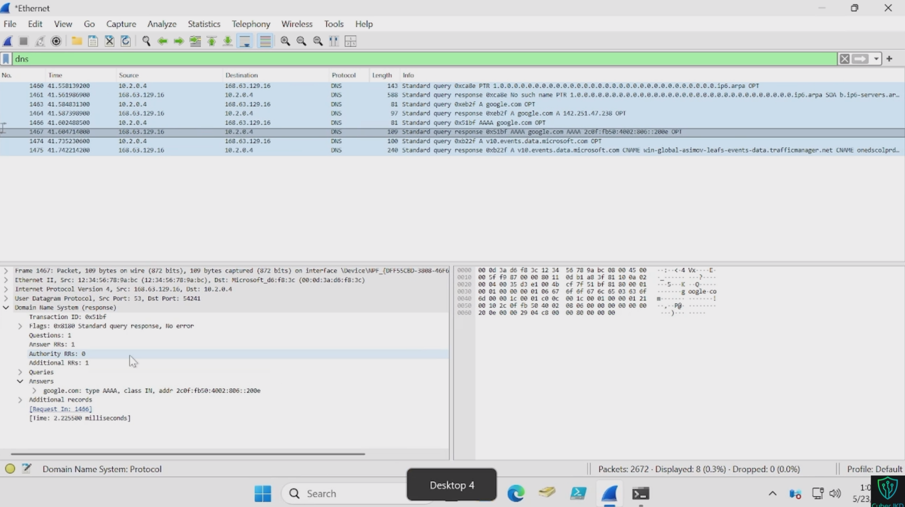
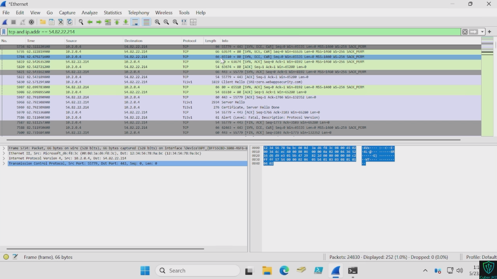
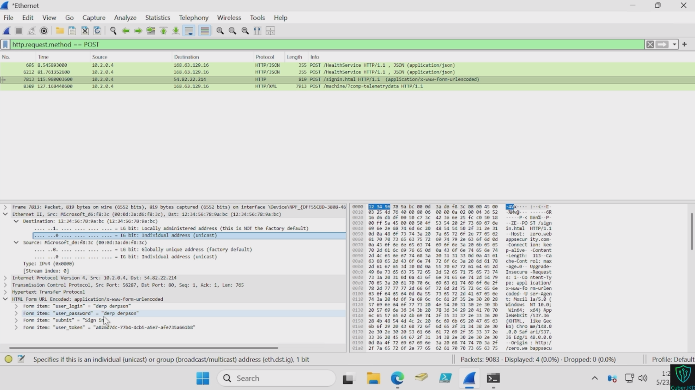
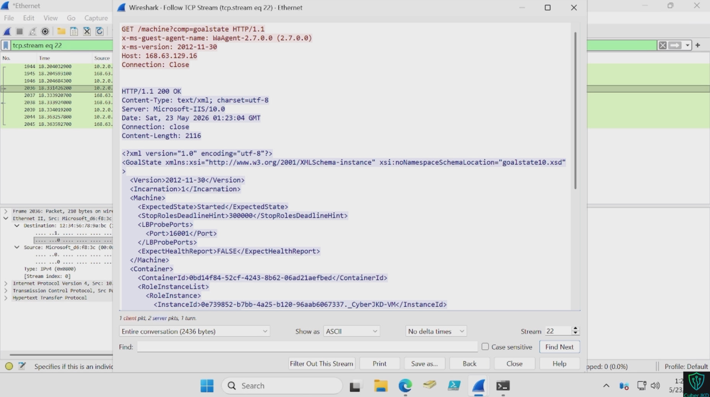

# Wireshark & Network Analysis Lab - Reading Network Traffic Like an Analyst
 


 
**Author:** Dalla Samuel (CyberJKD)

**Date:** 23rd May 2026

**Platform:** Azure Free Account VM · Windows 11

**Lab Source:** CloudTechExec - 5 Labs To Get You Hired · Lab 2

**Roadmap:** [Phase 03 · Lab 02](https://dallasamuel.github.io/CyberJKD-Roadmap)
 
---
 
## Objective
 
Capture and analyse live network traffic on an Azure VM using Wireshark - identifying DNS queries, TCP handshakes, cleartext HTTP credentials, and reconstructing full TCP streams using the Follow Stream technique.
 
---
 
## Business Problem This Lab Solves
 
Every IT and security role eventually faces the same question: **what is actually happening on this network?**
 
When a service goes down, a security alert fires, or a user reports slow performance - the network is almost always involved. The only way to know what is actually happening is to look at the packets.
 
| Role | How this applies |
|------|-----------------|
| SOC Analyst | Identify malicious traffic patterns, extract IOCs from packet captures |
| Cloud Security Engineer | Mental model transfers directly to Azure Network Watcher and Sentinel flow logs |
| Network Engineer | Diagnose connectivity issues by seeing exactly where packets drop |
| Help Desk | Prove a reported network issue is real and identify if it's client or server side |
 
---
 
## What This Lab Added Beyond Phase 01
 
Phase 01 Project 03 covered live traffic capture between lab VMs — protocol identification, anomaly flagging, structured analysis report.
 
This lab added:
 
| Skill | What's new |
|-------|-----------|
| Display vs capture filters | Phase 01 used basic filters — this lab covers the full filter syntax used in production |
| TCP stream reconstruction | Follow → TCP Stream — reassembling full conversations from individual packets |
| HTTP cleartext credential extraction | Extracting actual credentials from an unencrypted POST request |
| DNS A record anatomy | Query/response matching by transaction ID — the invisible step before every connection |
| tshark CLI | Command-line capture for remote servers — no GUI required |
 
---
 
## Environment
 
| Component | Detail |
|-----------|--------|
| Platform | Microsoft Azure Free Account |
| VM | Windows 11 Azure VM |
| Tool | Wireshark (free, open source) |
| Interface captured | Azure VM Ethernet adapter |
| Cost | $0 - Wireshark is permanently free |
 
---
 
## Key Concepts
 
### What is a packet?
A packet is a small unit of data travelling across a network. Every email, web page, and API call gets broken into hundreds or thousands of packets — each with a header (source IP, destination IP, port) and a payload (the actual data). Wireshark captures and shows each individual packet.
 
### Display filters vs capture filters
- **Capture filters** - applied before capturing, limits what gets recorded
- **Display filters** - applied after capturing, limits what you see without discarding anything
Always use display filters in analysis. They let you view the same capture through different lenses without re-capturing.
 
### TCP three-way handshake
Before two machines exchange data over TCP they perform a 3-step connection setup:
1. **SYN** - your machine: "I want to connect"
2. **SYN-ACK** - server: "I got your request, connection accepted"
3. **ACK** - your machine: "Connection confirmed, ready to send data"
SYN with no SYN-ACK = connection refused or server unreachable.
 
### Why HTTP credentials are visible in plaintext
HTTP has no encryption. Anyone on the network path between you and the server can read every packet - including usernames and passwords submitted in login forms. This exercise demonstrates exactly why HTTPS is mandatory for any system handling credentials.
 
---
 
## Exercise A - DNS Capture
 
**Objective:** Capture a DNS query and response, identify the A record returned.
 
```powershell
# Run in terminal while Wireshark is capturing
nslookup google.com
```
 
**Display filter applied:**
```
dns
```
 
**What I captured:**
- DNS query packet _ "Standard query A google.com" - my VM asking for the IPv4 address
- DNS response packet _ "Standard query response A google.com" - DNS server returning the IP
- Matched transaction IDs between query and response _ confirmed they're the same lookup
- Expanded the Answers section in the packet detail pane _ confirmed A record IP matched nslookup terminal output
**Screenshot:**
 

 
**Real-world application:** Unexpected DNS queries in a capture — especially to unusual or newly registered domains — are often the first sign of malware calling home to a command and control server. This is exactly what SOC analysts look for in DNS logs.
 
---
 
## Exercise B — TCP Three-Way Handshake
 
**Objective:** Capture and identify the SYN → SYN-ACK → ACK connection setup sequence.
 
**Display filter applied:**
```
tcp and ip.addr == [example.com IP from nslookup]
```
 
**What I captured:**
 
| Packet | Flags | Meaning |
|--------|-------|---------|
| 1st | SYN | My VM: I want to connect. Here is my sequence number. |
| 2nd | SYN, ACK | Server: Request received. Connection accepted. Here is my sequence number. |
| 3rd | ACK | My VM: Confirmed. Connection open. Ready to send data. |
 
**Screenshot:**
 

 
**Real-world application:** SYN with no SYN-ACK = server unreachable or port blocked. RST packet = connection forcibly closed. These two patterns are the first things network engineers look for when diagnosing connectivity failures.
 
---
 
## Exercise C — Cleartext Credentials in HTTP
 
> ⚠️ **Educational exercise only.** Performed on a test environment I own. Never use this technique against systems you do not own or have explicit permission to analyse.
 
**Objective:** Demonstrate why HTTPS is mandatory by extracting credentials from an unencrypted HTTP POST request.
 
**Display filter applied:**
```
http.request.method == POST
```
 
**What I captured:**
- Located the POST packet in the capture list
- Expanded the HTML Form URL Encoded layer in the packet detail pane
- Username and password visible in plaintext - exactly as typed into the login form
**Screenshot:**
 

 
**Real-world application:** Without TLS encryption, anyone on the network path — your ISP, a coffee shop router, anyone performing a man-in-the-middle attack - can read credentials exactly as typed. This is how security teams prove the vulnerability exists and demonstrate it to developers who resist adding HTTPS.
 
---
 
## Exercise D — Follow TCP Stream
 
**Objective:** Reconstruct a full HTTP conversation from individual packets using Follow → TCP Stream.
 
**Steps:**
1. Captured HTTP traffic by navigating to an HTTP site
2. Located an HTTP packet in the capture list
3. Right-click → Follow → TCP Stream
4. Wireshark reassembled all packets from that connection into a readable conversation
**What I saw:**
- **Red text** - my browser's request (GET/POST)
- **Blue text** - server's response (HTML content)
- Full HTTP headers visible - User-Agent, Host, Content-Type, cookies
**Screenshot:**
 

 
**Real-world application:** Individual packets are fragments. The stream view shows the complete conversation - what data was transferred, what commands were sent, what the server responded with. This is the core technique in incident investigation and forensic analysis.
 
---
 
## Display Filters Reference - Used in This Lab
 
| Filter | What it shows |
|--------|--------------|
| `dns` | All DNS queries and responses |
| `http` | Unencrypted HTTP traffic only |
| `tcp` | All TCP traffic |
| `tcp.flags.syn == 1` | TCP SYN packets - connection attempts only |
| `tcp.flags.reset == 1` | TCP RST packets - refused or forcibly closed connections |
| `icmp` | All ICMP including ping |
| `ip.addr == 192.168.x.x` | All traffic to or from a specific IP |
| `http.request.method == POST` | HTTP POST requests — form submissions |
| `tcp.port == 443` | All HTTPS traffic by port |
 
---
 
## Verification - Lab Completion Checklist
 
| Skill | Verified |
|-------|---------|
| Captured live traffic on Azure VM interface | ✅ |
| Applied display filters - dns, http, tcp, ip.addr | ✅ |
| Identified DNS query and response - matched transaction IDs | ✅ |
| Located TCP three-way handshake - SYN → SYN-ACK → ACK | ✅ |
| Extracted cleartext credentials from HTTP POST packet | ✅ |
| Reconstructed full TCP stream - read complete HTTP conversation | ✅ |
| Saved captures in .pcapng format | ✅ |
 
---
 
## What I'd Change for Production
 
| Lab setup | Production reality |
|-----------|-------------------|
| Captured on a single Azure VM | Production uses port mirroring or network TAPs to capture traffic at scale |
| Manual filter application | SOC environments use automated detection rules in Sentinel or Splunk that trigger on suspicious traffic patterns |
| HTTP cleartext demo on test site | All production systems enforce HTTPS - HTTP is blocked at the perimeter |
| Single interface capture | Enterprise deployments use distributed packet capture across multiple network segments |
| Manual stream analysis | Production IR uses tools like Zeek and Suricata to automatically parse and alert on stream content |
 
---
 
## Connection to Roadmap
 
This lab is **Phase 03 · Lab 02** of the CyberJKD Cloud Security Engineering roadmap.
 
The Wireshark mental model built here transfers directly to:
- **Azure Network Watcher** — flow logs, packet capture, connection troubleshoot
- **Microsoft Sentinel** — network-based detection rules and KQL queries
- **Phase 02** — Splunk SIEM log analysis (same analytical thinking, different tool)
- **Phase 04** — offensive security network reconnaissance

  
🌐 Full roadmap: [dallasamuel.github.io/CyberJKD-Roadmap](https://dallasamuel.github.io/CyberJKD-Roadmap)

🔗 All labs: [github.com/DallaSamuel/CyberJKD-Labs](https://github.com/DallaSamuel/CyberJKD-Labs)
 
---
 
*CyberJKD — Becoming dangerous through fundamentals. 🔒*
