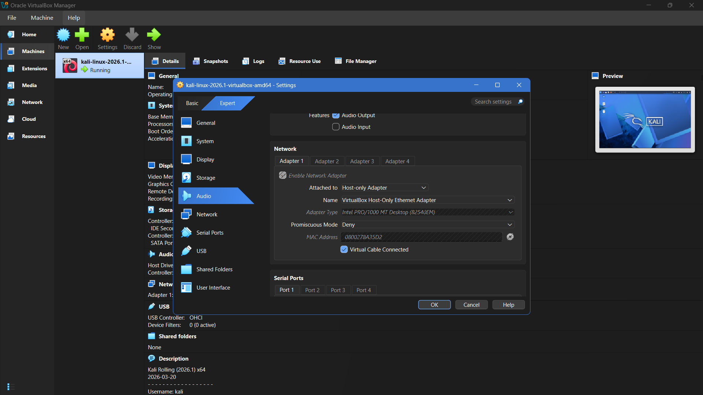
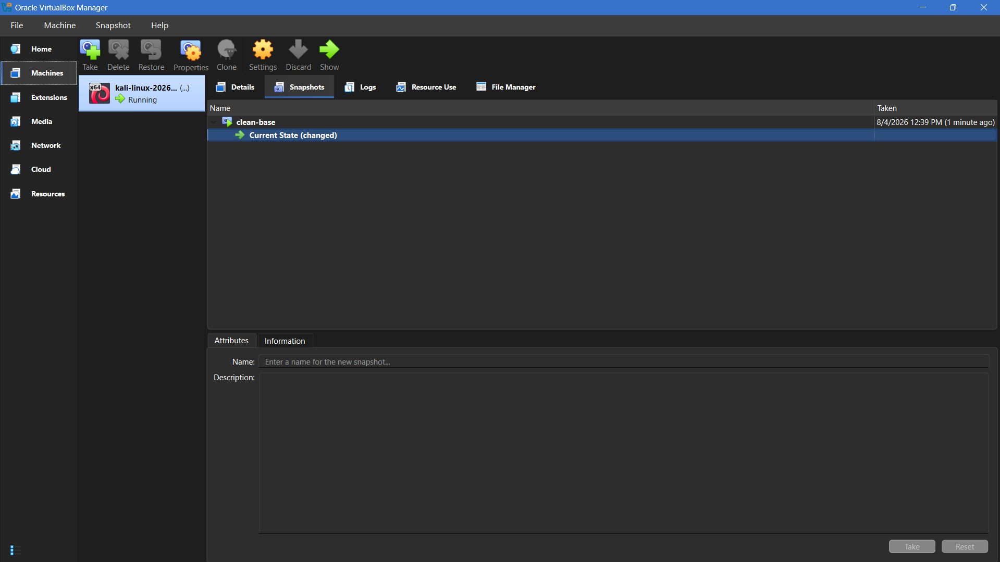
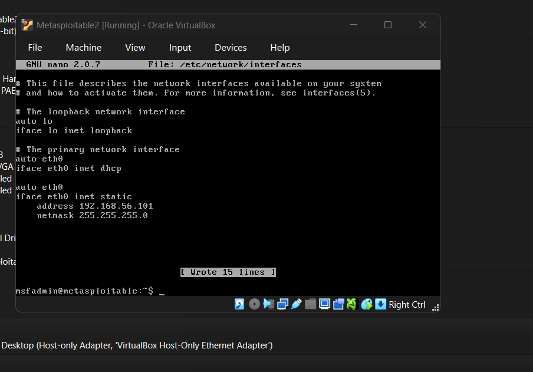
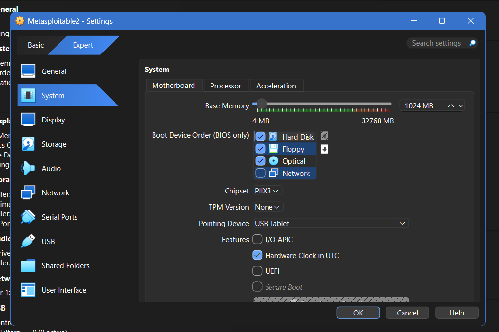

# CYB 405 Lab 1 - Building an Isolated Ethical Hacking Environment in VirtualBox
 


 
**Author:** Dalla Samuel (CyberJKD)
 
**Date:** 4th - 5th August 2026
 
**Platform:** VirtualBox 7.x · Local Host Machine
 
**Course:** CYB 405 - Introduction to Ethical Hacking · Miva Open University (Mid-Semester Lab 1 of 8, + 2 Bonus)
 
**Roadmap:** [Phase 04 · CYB 405 Lab 01](https://dallasamuel.github.io/CyberJKD-Roadmap)
 
**YouTube Walkthrough:** [YT Video Walkthrough](https://youtu.be/MrgIUkOs6mE)
 
**Viewer Guide:** [CYB-405-lab1-viewer-guide](https://tinyurl.com/CYB-405-lab1-viewer-guide)
 
---
 
## Objective
 
Build a secure, fully isolated penetration-testing environment across three virtual machines - a Kali Linux attacker, 
a deliberately vulnerable Metasploitable2 target, and a hardened Windows Server 2022 defensive system - validate connectivity between them, 
capture a baseline network scan, and automate part of the setup for repeatability.
 
---
 
## Business Problem This Lab Solves
 
Before any offensive security work - reconnaissance, exploitation, privilege escalation - can happen safely, the environment it happens in has to be trustworthy. 
An improperly isolated lab risks leaking scan traffic, exploit payloads, or live attack tooling onto a production network or the open internet.
 
| Role | How this applies |
|------|-----------------|
| SOC Analyst | Understanding air-gapped lab design mirrors how real malware sandboxes and detonation chambers are isolated |
| Cloud Security Engineer | Host-Only networking concepts map directly to Azure/AWS private VNets and security groups |
| Penetration Tester | Every engagement starts with a scoped, isolated test environment before touching a client's live systems |
| SysAdmin | Snapshot-based rollback is the same discipline used before any production change window |
 
---
 
## Environment
 
| Component | Detail |
|-----------|--------|
| Hypervisor | Oracle VirtualBox 7.x |
| Host machine | HP EliteBook 835 G8 - AMD Ryzen 3 PRO 5450U, 32GB RAM |
| Attacker VM | Kali Linux Rolling (2026.1) - 2048MB RAM, 2 vCPU |
| Victim VM | Metasploitable2 - 1024MB RAM |
| Defensive VM | Windows Server 2022 Standard (Desktop Experience) - 8192MB RAM, 2 vCPU |
| Network mode | Host-Only Adapter - VirtualBox Host-Only Ethernet Adapter |
| Subnet | 192.168.56.0/24 - DHCP disabled, static addressing |
| Addressing | Kali `.102` · Metasploitable2 `.101` · Windows Server `.103` · Host `.1` |
| Cost | $0 - all tooling free/evaluation-licensed |
 
---
 
## Key Concepts
 
### Why Host-Only, not NAT or Bridged?
NAT lets a VM reach the internet through the host but hides it from other VMs on the same subnet by default. 
Bridged puts a VM directly on the physical LAN - the opposite of isolation. 
Host-Only creates a private virtual switch that VMs can join and talk to each other on, with zero path out to the internet or the host's real network. 
For a lab meant to run exploits and scans safely, Host-Only is the only correct choice.
 
### Why disable DHCP and go static?
With DHCP on, IP addresses can shift between reboots, breaking any hardcoded command or script. 
Static addressing means every command in this lab - and every future lab in the series - stays copy-pasteable without adjustment.
 
### Why snapshot before doing anything else?
Later labs in this series (privilege escalation, evasion/DDoS simulation) deliberately damage or destabilize these VMs. 
A clean-baseline snapshot taken immediately after a healthy, networked build is the rollback point that makes repeated experimentation safe.
 
---
 
## Exercise A - Isolated Network Configuration
 
**Objective:** Create a Host-Only network and confirm no DHCP interference before attaching any VM to it.
 
**Steps:**
1. VirtualBox → File → Tools → Network Manager → Host-Only Networks
2. Confirmed the default adapter already sat on `192.168.56.1/24` - matching the subnet used throughout the course's own sample commands
3. Left DHCP Server disabled deliberately, in favor of manual static addressing per VM
**Screenshot:**
 

 
**Real-world application:** This is functionally identical to standing up a private subnet with no internet gateway - 
the same pattern used for isolated malware analysis sandboxes and pre-production security testing environments.
 
---
 
## Exercise B - Static IP Addressing Across Three Operating Systems
 
**Objective:** Assign a fixed IP to each VM, using the correct tool for each OS.
 
**Commands used (Kali, via NetworkManager):**
```bash
sudo nmcli con modify "Wired connection 1" ipv4.addresses 192.168.56.102/24
sudo nmcli con modify "Wired connection 1" ipv4.method manual
sudo nmcli con up "Wired connection 1"
```
 
Metasploitable2 (no NetworkManager - predates it) was configured directly via `/etc/network/interfaces`, and Windows Server via the standard TCP/IPv4 Properties dialog.
 
**Screenshot:**
 

 
**Real-world application:** Recognizing that not every system manages networking the same way - NetworkManager vs. 
legacy interfaces files vs. Windows GUI — is a basic but essential skill when working across mixed-OS infrastructure.
 
---
 
## Exercise C - Cross-VM Connectivity Verification
 
**Objective:** Prove connectivity from the attacker's perspective, not a self-ping.
 
**Command used:**
```bash
ping -c 3 192.168.56.101
ping -c 3 192.168.56.103
```
 
**What I observed:**
- 0% packet loss to both Metasploitable2 and Windows Server
- TTL=64 from the Linux target vs. TTL=128 from the Windows target - a genuine,
- low-effort OS-fingerprinting signal, since each OS family ships a different default TTL
**Screenshot:**
 

 
**Real-world application:** TTL-based OS fingerprinting is a real (if basic) reconnaissance technique - the same logic underpins more advanced fingerprinting tools like `nmap -O`.
 
---
 
## Exercise D - Full Subnet Baseline Scan
 
**Objective:** Capture baseline traffic and confirm every host on the subnet, port state included.
 
**Command used:**
```bash
nmap -sS -p- -T4 -oA baseline_scan 192.168.56.0/24
```
 
**What I captured:**
- All four expected hosts confirmed up: host machine (`.1`), Metasploitable2 (`.101`), Kali (`.102`), Windows Server (`.103`)
- Metasploitable2 returned a wide-open legacy service footprint (FTP, Telnet, rlogin, distccd, IRC, and more) —
  by design, since it exists purely to be exploited in later labs
- Windows Server returned a single filtered port (`5985/wsman`) - a visibly harder target by comparison
**Screenshot:**
 

 
**Real-world application:** This is the exact reconnaissance step a real penetration test begins with - mapping what's alive and what's listening before any exploitation is attempted.
 
---
 
## Exercise E - Setup Automation
 
**Objective:** Automate network verification and baseline snapshotting so the environment can be rebuilt or re-verified in one command rather than manually.
 
**Script (`lab1_setup.ps1`) - run from the host machine via PowerShell:**
```powershell
$VBoxManage = "C:\Program Files\Oracle\VirtualBox\VBoxManage.exe"
$VMs = @("kali-linux-2026.1-virtualbox-amd64", "Metasploitable2", "WindowsServer")
 
Write-Host "=== Checking host-only network ===" -ForegroundColor Cyan
& $VBoxManage list hostonlyifs
 
Write-Host "`n=== Taking clean-base-auto snapshots ===" -ForegroundColor Cyan
foreach ($vm in $VMs) {
    & $VBoxManage snapshot $vm take clean-base-auto --description "Automated baseline snapshot"
}
 
Write-Host "`n=== Done. Current VM states: ===" -ForegroundColor Cyan
& $VBoxManage list vms
```
 
**Screenshot:**
 

 
**Real-world application:** Infrastructure-as-code thinking at the smallest possible scale - this is the same instinct behind Terraform/Ansible playbooks in production environments, just applied to a local lab.
 
---
 
## Command Reference - Used in This Lab
 
| Command | What it does |
|---------|--------------|
| `VBoxManage hostonlyif create` | Creates a new Host-Only virtual network adapter |
| `nmcli con modify ... ipv4.addresses` | Assigns a static IP on NetworkManager-based Linux |
| `sudo /etc/init.d/networking restart` | Applies interface changes on legacy Debian-based systems |
| `ping -c 3 <ip>` | Sends 3 ICMP echo requests to test reachability |
| `nmap -sS -p- -T4 -oA <name> <subnet>` | Full-port SYN stealth scan across a subnet, saved in all output formats |
| `VBoxManage snapshot <vm> take <name>` | Creates a named, timestamped VM snapshot |
| `Set-ExecutionPolicy -Scope Process -ExecutionPolicy Bypass` | Session-scoped PowerShell script execution override |
 
---
 
## Verification - Lab Completion Checklist
 
| Requirement | Verified |
|-------|---------|
| All 3 VMs exist and boot | ✅ |
| All 3 VMs on the same Host-Only network | ✅ |
| Kali pings both Metasploitable2 and Windows Server | ✅ |
| Baseline scan shows all 3 lab hosts (+ host machine) | ✅ |
| Clean-baseline snapshot exists for all 3 VMs | ✅ |
| Setup automation script written and tested | ✅ |
| Full PDF report, logs, and script packaged for submission | ✅ |
 
---
 
## Troubleshooting Log
 
Real infrastructure work involves real errors - documented here rather than edited out, since reproducibility is part of the grading criteria for this course.
 
| Issue | Root Cause | Resolution |
|-------|-----------|------------|
| Kali VM registration failed (`VERR_FILE_NOT_FOUND`) | Re-extracted archive created a nested duplicate folder, breaking the `.vdi` path | Removed broken VM entry, re-extracted cleanly, re-registered |
| PXE boot failure on Kali and Metasploitable2 | Boot order allowed Network boot ahead of Hard Disk | Reordered boot devices - Hard Disk first, Network unchecked |
| Metasploitable.vmdk not visible in file picker | Dialog defaulted to an ISO-only file filter | Used the correct "Existing Virtual Hard Disk" browse control |
| Networking restart failed on Metasploitable2 | Duplicate `auto eth0` declarations — old DHCP stanza left in place | Removed the obsolete DHCP block, kept only the static one |
| Automation script not recognized initially | Text editor silently appended `.txt` to the filename | Renamed with file extensions made visible in Explorer |
| PowerShell blocked script execution | Default execution policy disallows unsigned local scripts | `Set-ExecutionPolicy -Scope Process -ExecutionPolicy Bypass` (session-scoped) |
 
---
 
## What I'd Change for Production
 
| Lab setup | Production reality |
|-----------|-------------------|
| Manual VBoxManage snapshotting | Production environments use automated, scheduled snapshot/backup policies |
| Static IP assigned per-VM manually | Enterprise labs typically use a proper DHCP reservation scheme or IaC-managed addressing |
| Single-host VirtualBox lab | Real red-team ranges run on dedicated hypervisor clusters (ESXi, Proxmox) or cloud-based cyber ranges |
| Manual full-port nmap scan | Production recon pipelines automate and schedule scans, feeding results into a SIEM |
| PowerShell execution policy bypassed per-session | Enterprise environments manage script execution via signed scripts and Group Policy, not ad-hoc bypass |
 
---
 
## Connection to Roadmap
 
This lab is part of **CYB 405 - Introduction to Ethical Hacking**, Miva Open University's mid-semester laboratory assessment series (8 core labs + 2 bonus challenges), 
tracked as a dedicated sub-block inside **Phase 04 — Controlled Offensive + Multi-Cloud** on the CyberJKD Cloud Security Engineering roadmap - 
sitting alongside the self-directed offensive work in that same phase, since this is formally graded coursework reinforcing the same Precision Striker skill set.
 
The environment built here - isolated networking, static addressing, snapshot discipline - is the foundation every subsequent lab in this series builds on:
- **Lab 2** - Footprinting & Reconnaissance
- **Lab 3** - Network Scanning & Enumeration
- **Lab 4** - System Hacking & Privilege Escalation (this is where the Metasploitable2 clean-baseline snapshot gets used for the first time)
- **Lab 8** - Evasion, IDS/Firewall Bypass & DDoS Simulation (this is where Windows Server's hardening gets tested)
  
🌐 Full roadmap: [dallasamuel.github.io/CyberJKD-Roadmap](https://dallasamuel.github.io/CyberJKD-Roadmap)
 
🔗 All labs: [github.com/DallaSamuel/CyberJKD-Labs](https://github.com/DallaSamuel/CyberJKD-Labs)
 
---
 
*CyberJKD - Becoming dangerous through fundamentals. 🔒*


