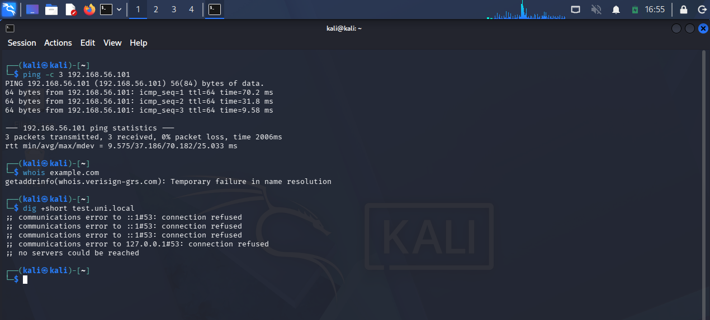
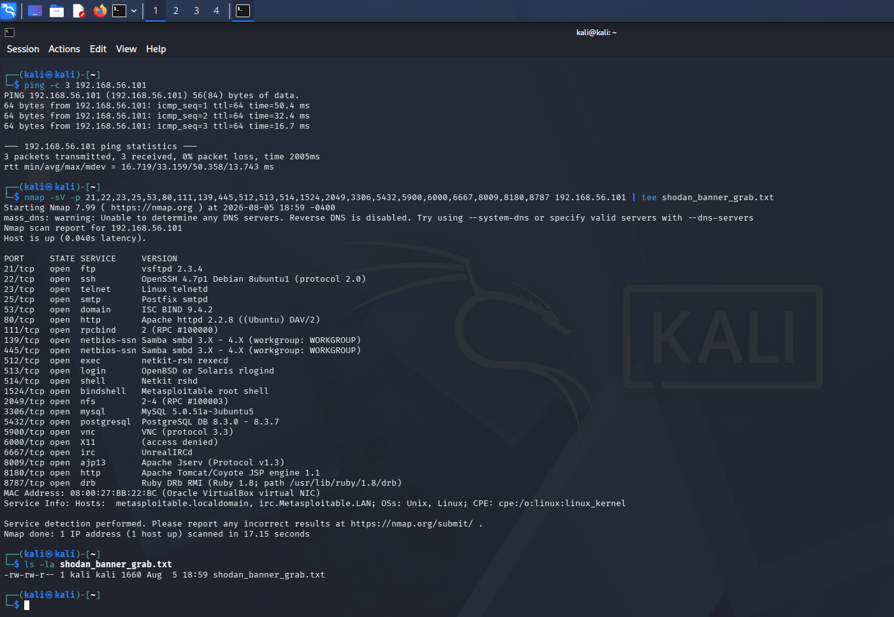
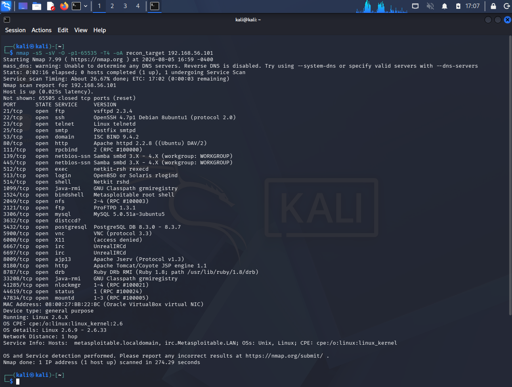
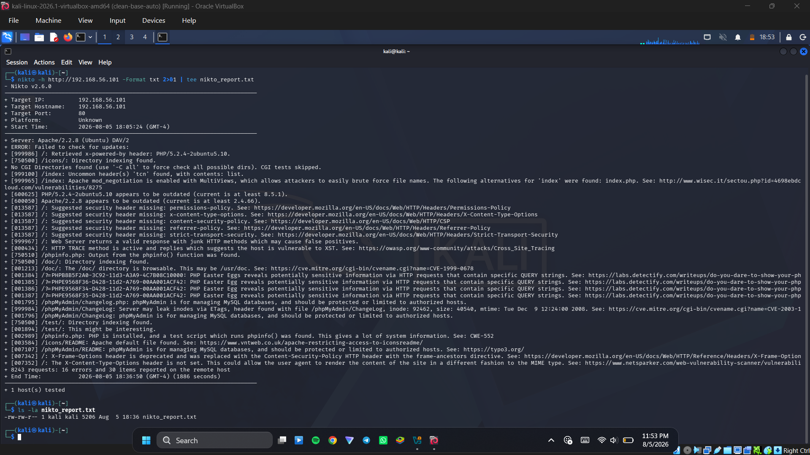
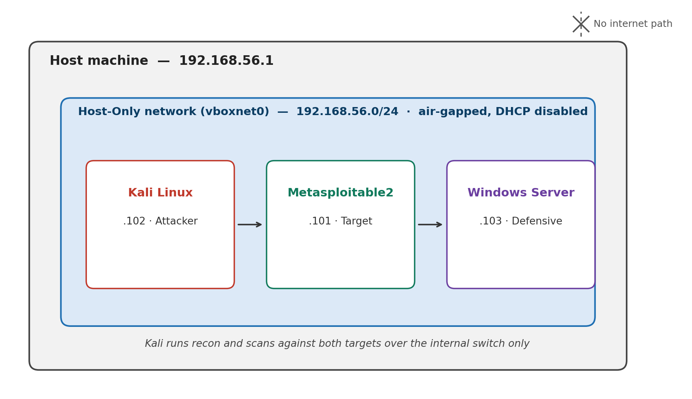
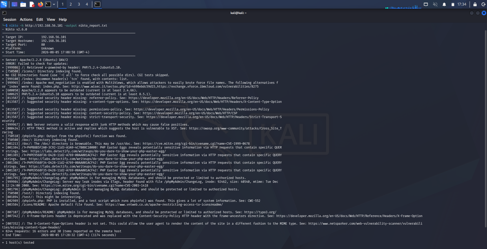
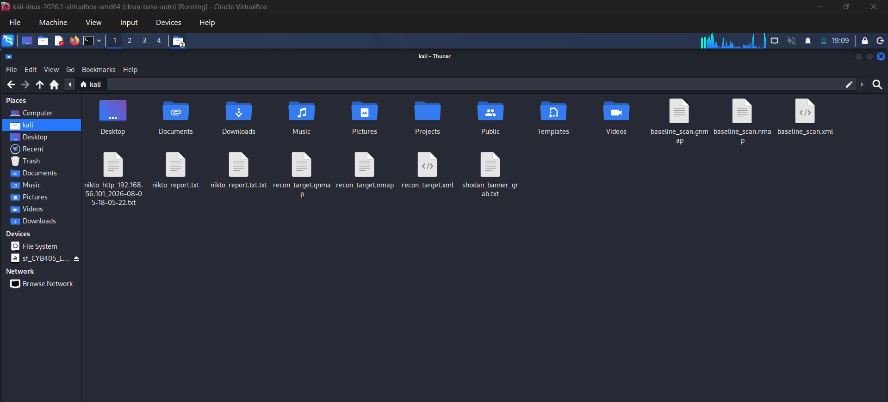

# CYB 405 Lab 2 - Footprinting & Reconnaissance Against an Isolated Ethical Hacking Lab
 


 
**Author:** Dalla Samuel (CyberJKD)
 
**Date:** 5th - 6th August 2026
 
**Platform:** VirtualBox 7.x · Local Host Machine
 
**Course:** CYB 405 - Introduction to Ethical Hacking · Miva Open University (Mid-Semester Lab 2 of 8, + 2 Bonus)
 
**Roadmap:** [Phase 04 · CYB 405 Lab 02](https://dallasamuel.github.io/CyberJKD-Roadmap)
 
**YouTube Walkthrough:** [Youtube Link](https://youtu.be/-hFYRQLPGkE)
 
**Viewer Guide:** [Viewer Guide Link](https://tinyurl.com/CYB-405-Lab-2-Viewer-Guide)
 
---
 
## Objective
 
Establish a repeatable footprinting and reconnaissance baseline against the Lab 1 target (Metasploitable2, `192.168.56.101`) - 
combining passive OSINT, a documented substitute for internet-facing intelligence gathering, full active port/service/OS enumeration, 
and web-server vulnerability scanning - while correctly diagnosing which techniques are physically possible inside an intentionally air-gapped lab network, 
and documenting the ones that aren't rather than treating them as bugs.
 
---
 
## Business Problem This Lab Solves
 
Reconnaissance is the first phase of any real engagement - what you find here shapes every decision made in Labs 3 through 8. 
Getting it wrong (or skipping the "why did this fail" step) means building a later attack plan on an incomplete picture of the target.
 
| Role | How this applies |
|------|-----------------|
| SOC Analyst | Recon findings are the raw signal that becomes correlation rules and alert baselines - knowing what a target exposes is the same discipline as knowing what an attacker sees first |
| Cloud Security Engineer | Distinguishing internet-reachable intel (WHOIS, public DNS, Shodan) from internal-only findings maps directly to public vs. private subnet exposure decisions in Azure/AWS |
| Penetration Tester | Every real engagement starts with footprinting - including the discipline of documenting a negative result correctly instead of guessing |
| SysAdmin | Running Nikto/nmap against your own infrastructure is the same exercise a defender runs to find what needs patching before someone else finds it |
 
---
 
## Environment
 
| Component | Detail |
|-----------|--------|
| Hypervisor | Oracle VirtualBox 7.x |
| Attacker VM | Kali Linux Rolling (2026.1) - 2048MB RAM, 2 vCPU - `192.168.56.102` |
| Target VM | Metasploitable2 - 1024MB RAM - `192.168.56.101` |
| Reference VM | Windows Server 2022 Standard - 8192MB RAM, 2 vCPU - `192.168.56.103` (present for topology completeness; not a Lab 2 target) |
| Network mode | Host-Only Adapter (vboxnet0) - no bridging, no NAT, no path to the internet |
| Subnet | `192.168.56.0/24` - DHCP disabled, static addressing (carried over unchanged from Lab 1) |
| Infrastructure | Fully reused from Lab 1 - no new VM installs or networking changes required |
 
---
 
## Key Concepts
 
### Why WHOIS and public DNS recon can't function inside this lab
Both depend on reaching real internet-hosted authority servers. The Lab 1 network was deliberately built with zero route out - no gateway, no NAT, no DNS forwarder. 
Running these against the lab isn't a bug to fix; it's the isolation working as designed. The right move is documenting *why* it fails, not forcing a workaround.
 
### Why the Shodan requirement needed a documented substitution
The official lab doc calls for a "lab-simulated Shodan exercise" without naming a tool. 
Real Shodan indexes internet-facing hosts by scanning the public internet - it has no path to a private `192.168.56.0/24` subnet, so no version of real Shodan could ever satisfy this against an air-gapped lab. 
The substitute used here: a targeted `nmap -sV` banner grab against the classic Metasploitable2 ports - the same category of data (open port, service, version banner) Shodan itself collects, 
gathered locally instead of via a third-party index.
 
### Why a full 1-65535 port scan matters
A default nmap scan only checks the top 1,000 ports. Several of Metasploitable2's most significant services - 
including the backdoored bindshell on 1524 - sit outside that range and would be missed entirely by a faster scan.
 
---
 
## Exercise A - WHOIS Lookup (Documented Air-Gap Limitation)
 
**Objective:** Attempt WHOIS resolution from the isolated Kali attacker VM and correctly interpret the result.
 
**Command used:**
```bash
whois example.com
```
 
**What happened:**
```
getaddrinfo(whois.verisign-grs.com): Temporary failure in name resolution
```
 
**Screenshot:**
 

 
**Real-world application:** Recognising when a recon technique is architecturally impossible in a given network context - rather than assuming every tool must succeed everywhere - is itself a core reconnaissance skill.
 
---
 
## Exercise B - DNS Reconnaissance (Documented Air-Gap Limitation)
 
**Objective:** Attempt DNS enumeration against a lab hostname from the isolated Kali attacker VM.
 
**Command used:**
```bash
dig +short test.uni.local
```
 
**What happened:**
```
communications error to ::1#53: connection refused
communications error to 127.0.0.1#53: connection refused
no servers could be reached
```
 
**Screenshot:**
 
*(Captured in the same terminal session as Exercise A above - see the WHOIS/DNS screenshot there; both commands were run back-to-back before either failure was diagnosed.)*
 
**Real-world application:** A distinct root cause from Exercise A (no DNS service configured at all, vs. no internet route) - the same triage distinction a defender makes on a real "can't resolve hostname" ticket.
 
---
 
## Exercise C - Lab-Simulated Shodan Exercise (Documented Substitution)
 
**Objective:** Produce a lab-appropriate equivalent of Shodan-style host intelligence against the target.
 
**Command used:**
```bash
nmap -sV -p 21,22,23,25,53,80,111,139,445,512,513,514,1524,2049,3306,5432,5900,6000,6667,8009,8180,8787 192.168.56.101 | tee shodan_banner_grab.txt
```
 
**What I captured:**
- 21 classic Metasploitable2 ports enumerated with full version banners in 17.15 seconds
- vsftpd 2.3.4 (the deliberately backdoored FTP daemon), UnrealIRCd, a live Metasploitable root bindshell on 1524, and Ruby DRb on 8787
- Output verified saved: `shodan_banner_grab.txt` (1,660 bytes)
**Screenshot:**
 

 
**Real-world application:** This is precisely the value proposition Shodan sells commercially - pre-indexed banners so an analyst doesn't have to scan the whole internet themselves - 
reproduced here at the scale of a single lab host.
 
---
 
## Exercise D - Full Active Scan: Port, Service, and OS Enumeration
 
**Objective:** Enumerate the complete port range with version detection and OS fingerprinting.
 
**Command used:**
```bash
nmap -sS -sV -O -p1-65535 -T4 -oA recon_target 192.168.56.101
```
 
**What I captured:**
- 30 open TCP ports in 274.29 seconds, including several outside the default top-1000 range (2121/ftp, 3632/distccd, 5900/vnc, 6697/irc, 33208/java-rmi, 41285/nlockmgr, 44619/status, 47834/mountd)
- OS fingerprint: Linux 2.6.9-2.6.33, general purpose, 1 network hop
- Output verified saved: `recon_target.nmap` / `.gnmap` / `.xml`
**Screenshot:**
 

 
**Real-world application:** A quick scan alone would have missed distccd (3632) and java-rmi (33208) - both carry known critical RCE exposure used in later labs in this series.
 
---
 
## Exercise E - Nikto Web Server Vulnerability Scan
 
**Objective:** Run a full Nikto scan against the target's web service to identify configuration weaknesses and outdated software.
 
**Command used (final, successful run):**
```bash
nikto -h http://192.168.56.101 -Format txt 2>&1 | tee nikto_report.txt
```
 
**What I captured:**
- 8,243 requests, 16 errors, 30 items reported, 1,886 seconds
- Outdated Apache 2.2.8 and PHP 5.2.4; browsable phpMyAdmin ChangeLog; multiple PHP Easter-egg information disclosures; HTTP TRACE enabled (XST-vulnerable);
  directory indexing on `/icons/`, `/doc/`, `/test/`; five missing recommended security headers
- Output verified saved: `nikto_report.txt` (5,206 bytes)
**Screenshot:**
 

 
**Real-world application:** Outdated software versions and missing security headers are consistently among the most common findings in a real web-application security review.
 
---
 
## Exercise F - Network Topology Visualization
 
**Objective:** Document the network context reconnaissance activity took place in.
 
Kali Linux (`192.168.56.102`, attacker) reaches both Metasploitable2 (`192.168.56.101`, this lab's target) and Windows Server (`192.168.56.103`, reference system) 
across a single Host-Only virtual switch (`vboxnet0`, `192.168.56.0/24`) with no path out to the internet - the same topology built in Lab 1, unchanged.
 
**Screenshot:**
 

 
**Real-world application:** A topology diagram is standard practice in any real recon report - it lets a reader instantly see scope, and exactly why Exercises A and B failed the way they did.
 
---
 
## Command Reference - Used in This Lab
 
| Command | What it does |
|---------|--------------|
| `whois <domain>` | Queries public WHOIS registry data for a domain (requires internet) |
| `dig +short <host>` | Resolves a hostname via DNS, returning only the answer (requires a reachable resolver) |
| `nmap -sV -p <ports> <target>` | Targeted version-detection scan of a specific port list - used as the Shodan-substitute banner grab |
| `nmap -sS -sV -O -p1-65535 -T4 -oA <name> <target>` | Full-range SYN stealth scan with service-version and OS detection |
| `nikto -h <url> -Format txt 2>&1 \| tee <file>` | Web vulnerability scan, piped through `tee` to guarantee the report writes to disk |
| `find / -name "<file>" 2>/dev/null` | Filesystem-wide search, used to confirm a missing output file wasn't hiding elsewhere |
| `ls -la <file>` | Confirms a file exists on disk and reports its size/timestamp |
 
---
 
## Verification - Lab Completion Checklist
 
| Requirement | Verified |
|-------|---------|
| WHOIS attempted and air-gap failure correctly diagnosed and documented | ✅ |
| DNS recon attempted and air-gap failure correctly diagnosed and documented | ✅ |
| Shodan-substitute banner grab executed and saved | ✅ |
| Full 1-65535 port/service/OS scan executed and saved | ✅ |
| Nikto scan completed and report file confirmed on disk | ✅ |
| Network topology documented | ✅ |
| All output files verified present via `ls -la` before VM shutdown | ✅ |
 
---
 
## Troubleshooting Log
 
Real infrastructure work involves real errors - documented here rather than edited out, since reproducibility is part of the grading criteria for this course.
 
| Issue | Root Cause | Resolution |
|-------|-----------|------------|
| `whois example.com` failed with a name resolution error | Kali VM has no internet route - Host-Only network by design | Documented as expected air-gap behaviour; not a defect |
| `dig +short test.uni.local` returned "no servers could be reached" | No DNS resolver - local or external - configured anywhere in the topology | Documented as expected air-gap behaviour, distinct root cause from the WHOIS failure |
| Lab document's "lab-simulated Shodan exercise" specified no tool | Real Shodan is architecturally incompatible with an isolated subnet | Substituted a targeted `nmap -sV` banner grab against classic Metasploitable2 ports; reasoning documented in Exercise C rather than silently guessing |
| `nikto -output nikto_report.txt` completed successfully ("1 host(s) tested") but the file didn't exist afterward - reproduced on two separate full runs | Suspected interaction between Nikto's own "Failed to check for updates" error (caused by the air-gapped network) and its file-write routine in v2.6.0 | Re-ran a third time piping stdout directly through `tee`, which forces the write independently of Nikto's internal output handler - confirmed via `ls -la` |
| Shodan-substitute nmap output was never saved to a file initially - only visible in terminal scrollback | `-oA` was used on the full port scan but omitted on the earlier banner-grab command | Re-ran the same banner-grab command piped through `tee` before shutting down the VM, confirmed via `ls -la` (1,660 bytes) |
 
**Screenshot:**
 

 
---
 
## What I'd Change for Production
 
| Lab approach | Production reality |
|-----------|-------------------|
| Manual nmap banner grab as a Shodan substitute | Production recon programs use an actual internet-facing OSINT platform (Shodan, Censys) with API-driven continuous monitoring |
| Nikto run interactively, output captured via manual `tee` workaround | Production pipelines validate tool output automatically (file-existence/size checks) and alert on silent failures |
| Full 65,535-port scan run once, on demand | Enterprise environments schedule recurring full-range scans, feeding results into a SIEM or asset-management platform |
| WHOIS/DNS air-gap limitations discovered by trial and error during recording | A production engagement scopes network reachability requirements up front, before attempting the technique |
 
---
 
## Connection to Roadmap
 
This lab is part of **CYB 405 - Introduction to Ethical Hacking**, Miva Open University's mid-semester laboratory assessment series (8 core labs + 2 bonus challenges), 
tracked as **Phase 04 - CYB 405: Ethical Hacking Foundations** on the CyberJKD Cloud Security Engineering roadmap. 
Per standing preference, this phase is added to the live public roadmap only once all 10 labs/bonus challenges are complete, as a single finished block rather than an in-progress tracker.
 
This lab builds directly on the isolated environment from Lab 1 - no new infrastructure required - and its findings feed directly into:
- **Lab 3** - Network Scanning & Enumeration (SMB, RPC, and vulnerability scan export against the same target)
- **Lab 4** - System Hacking & Privilege Escalation (the vsftpd 2.3.4 backdoor identified in Exercise C is the entry point for this lab)
---
 
## Appendix - All Output Files Verified
 
Final confirmation, captured immediately before VM shutdown, that every deliverable file for this lab was present in the shared folder on the host machine: 
`shodan_banner_grab.txt`, `recon_target.nmap` / `.gnmap` / `.xml`, and `nikto_report.txt`.
 

 
---
 
🌐 Full roadmap: [dallasamuel.github.io/CyberJKD-Roadmap](https://dallasamuel.github.io/CyberJKD-Roadmap)
 
🔗 All labs: [github.com/DallaSamuel/CyberJKD-Labs](https://github.com/DallaSamuel/CyberJKD-Labs)
 
---
 
*CyberJKD - Becoming dangerous through fundamentals. 🔒*
 
