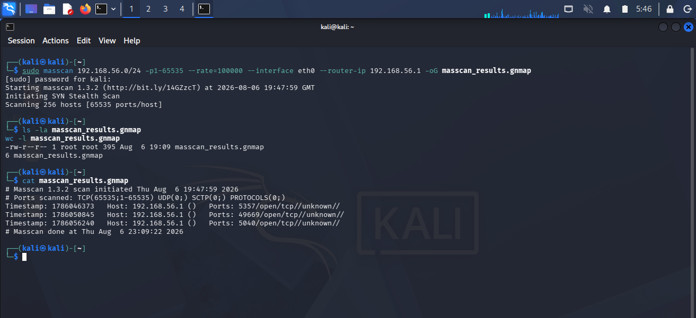
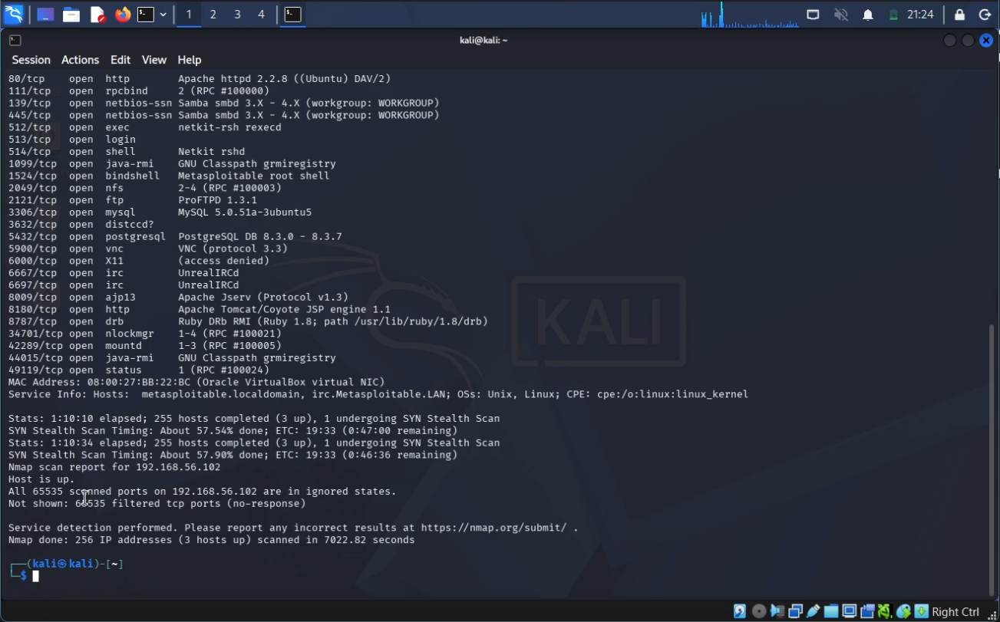
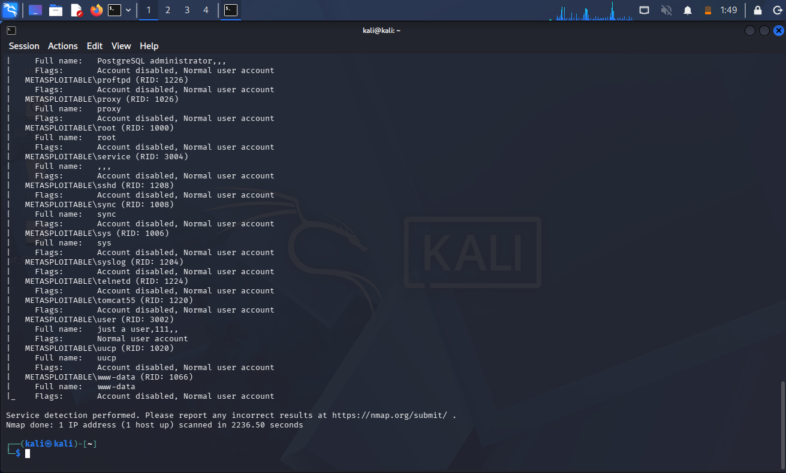
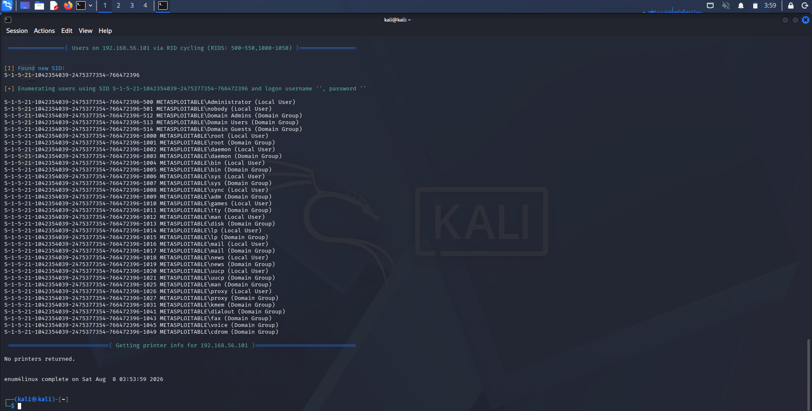
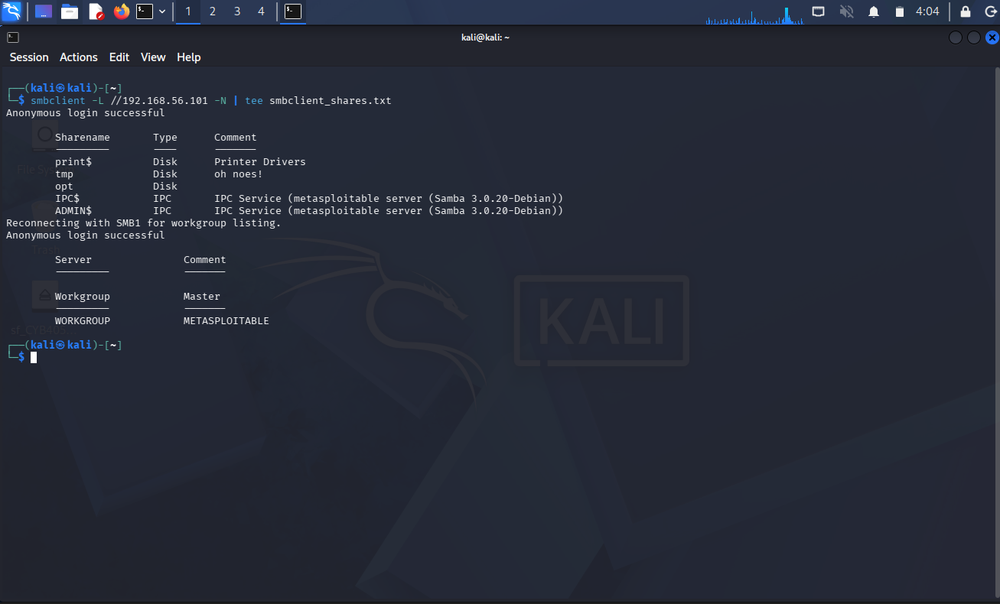
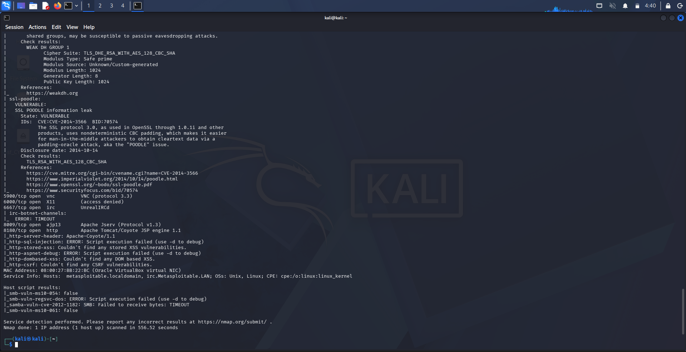
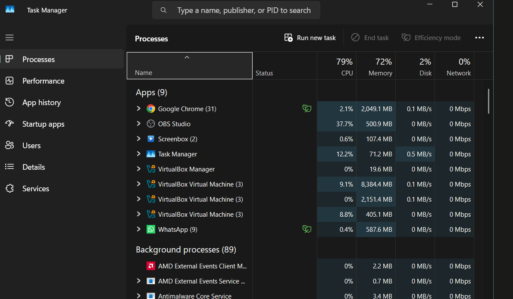
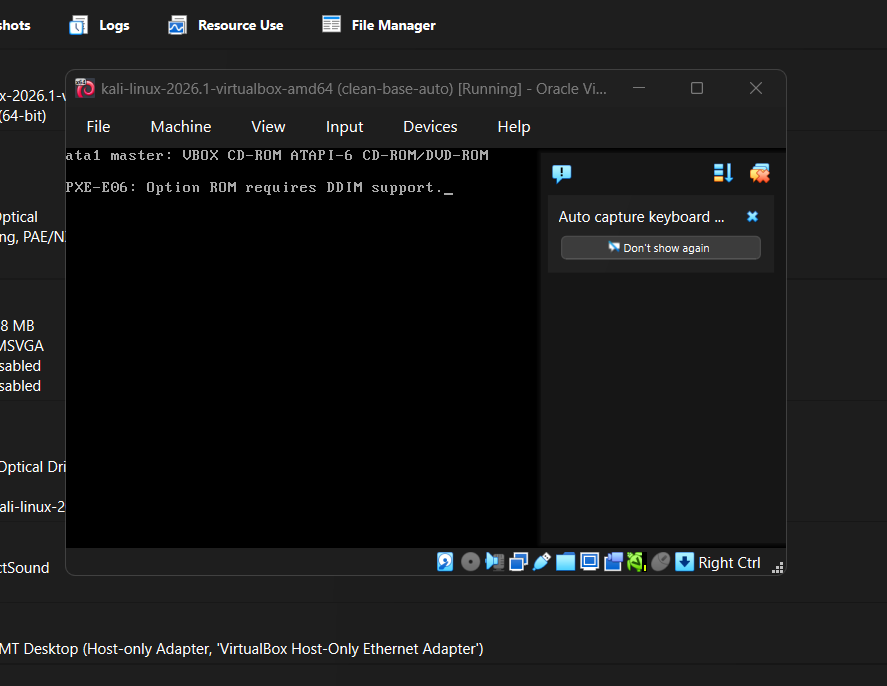
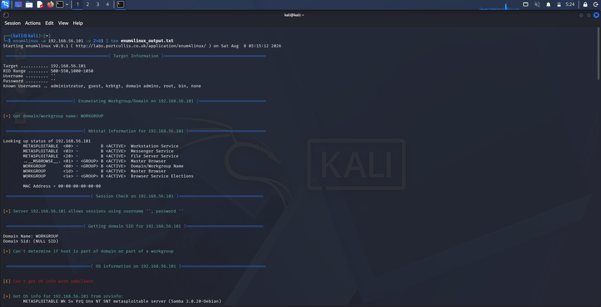

# CYB 405 Lab 3 - Network Scanning & Enumeration Against an Isolated Ethical Hacking Lab
 


 
**Author:** Dalla Samuel (CyberJKD)
 
**Date:** 7th - 8th August 2026
 
**Platform:** VirtualBox 7.x · Local Host Machine
 
**Course:** CYB 405 - Introduction to Ethical Hacking · Miva Open University (Mid-Semester Lab 3 of 8, + 2 Bonus)
 
**Roadmap:** [Phase 04 · CYB 405 Lab 03](https://dallasamuel.github.io/CyberJKD-Roadmap)
 
**YouTube Walkthrough:** [YouTube Link](https://youtu.be/VwOAvTOoHn0)
 
**Viewer Guide:** [Viewer Guide Link](https://tinyurl.com/CYB405-Lab3-Viewer-Guide)
 
---
 
## Objective
 
Establish a full service, SMB share, user, and RPC enumeration baseline against the Lab 1/2 target (Metasploitable2, `192.168.56.101`) -
combining a subnet-wide port sweep, three independent SMB/RPC enumeration tools run in parallel for cross-verification,
and a vulnerability scan export - while correctly documenting a tool-level limitation (masscan on an isolated Host-Only
network) and a likely typo in the official lab document's sample target IP, rather than silently working around either.
 
---
 
## Business Problem This Lab Solves
 
Enumeration is where a recon baseline turns into an actual attack surface map - what's found here (open write access,
weak password policy, a usable credential set) directly shapes Lab 4's privilege escalation path.
 
| Role | How this applies |
|------|-----------------|
| SOC Analyst | Cross-verifying findings across independent tools before raising an alert is the same discipline used to rule out false positives in a real SOC before escalation |
| Cloud Security Engineer | Anonymous READ/WRITE share access and a disabled password-complexity policy map directly to misconfigured storage bucket permissions and weak IAM password policies in Azure/AWS |
| Penetration Tester | SMB null-session enumeration and RID cycling are textbook early-engagement techniques for building a target user list ahead of a credential-stuffing attempt |
| SysAdmin | A vulnerability scan surfacing POODLE, Logjam, and weak DH parameters on your own infrastructure is the patch-prioritization signal a defender needs before an external scan finds it first |
 
---
 
## Environment
 
| Component | Detail |
|-----------|--------|
| Hypervisor | Oracle VirtualBox 7.x |
| Attacker VM | Kali Linux Rolling (2026.1) - 2048MB RAM, 2 vCPU - `192.168.56.102` |
| Target VM | Metasploitable2 - 1024MB RAM - `192.168.56.101` |
| Reference VM | Windows Server 2022 Standard - 8192MB RAM, 2 vCPU - `192.168.56.103` (saved-state for most of this lab to conserve host resources; not a Lab 3 target) |
| Network mode | Host-Only Adapter (vboxnet0) - no bridging, no NAT, no path to the internet |
| Subnet | `192.168.56.0/24` - DHCP disabled, static addressing (carried over unchanged from Lab 1) |
| Infrastructure | Fully reused from Lab 1/2 - no new VM installs or networking changes required |
 
---
 
## Key Concepts
 
### Why masscan couldn't be used as specified
The official lab document's sample command (`masscan 192.168.56.0/24 -p1-65535 --rate=1000 -oG masscan_results.gnmap`)
failed to detect any host beyond the gateway across three separate configurations - default, `--router-mac ff:ff:ff:ff:ff:ff`,
and `--router-ip 192.168.56.1`. This is a documented category of issue with masscan's raw-socket scanning approach on
VirtualBox Host-Only networks, which lack a real gateway for its ARP-resolution logic to work against. Rather than
keep forcing a tool that structurally doesn't fit this topology, this lab substitutes nmap's full-port sweep
(the same command proven working in Lab 1), extended with `-sV` to also capture service versions in the same pass.
 
### Why the SMB enumeration target was corrected from .102 to .101
The official lab document's sample SMB command targets `192.168.56.102` - but that's the Kali attacker VM itself,
not a target. This is almost certainly a copy-paste error in the university document: Metasploitable2 (`.101`) is
the host actually running Samba, confirmed by the `netbios-ssn` service found on ports 139/445 in Lab 2's recon
scan. Every SMB command in this lab targets `.101` instead, corrected openly rather than run against the wrong host.
 
### Why three separate tools enumerated the same SMB target
nmap's `smb-enum*` scripts, enum4linux, and smbclient all query the same SMB service through different code paths
and protocol versions. Running all three and cross-checking their output is standard practice before treating an
SMB finding as reliable - a single tool's parsing quirks can produce a false negative that a second tool catches.
 
---
 
## Exercise A - Masscan Attempt & Documented Substitution
 
**Objective:** Attempt the official lab document's masscan full-subnet sweep, and correctly diagnose and document
the failure rather than force a broken tool to work.
 
**Tooling check performed first:**
```bash
which masscan nmap enum4linux smbclient
```
All four tools confirmed present on Kali.
 
**Commands attempted (4 configurations across two sessions):**
```bash
sudo masscan 192.168.56.0/24 -p1-65535 --rate=1000 -oG masscan_results.gnmap
sudo masscan 192.168.56.0/24 -p1-65535 --rate=1000 --interface eth0 -oG masscan_results.gnmap
sudo masscan 192.168.56.0/24 -p1-65535 --rate=100000 --interface eth0 --router-mac ff:ff:ff:ff:ff:ff -oG masscan_results.gnmap
sudo masscan 192.168.56.0/24 -p1-65535 --rate=100000 --interface eth0 --router-ip 192.168.56.1 -oG masscan_results.gnmap
```
 
**What happened:** attempt 1 failed to determine the default interface; attempt 2 timed out resolving a router MAC
via ARP (no real gateway exists on this Host-Only subnet); attempts 3 and 4 both completed without error but only
ever detected the host machine gateway (`.1`) - Kali and Metasploitable2 never appeared in the results.
 
**Screenshot:**
 

 
**Interpretation:** four separate masscan configurations across two sessions all failed to detect peer hosts on
this Host-Only subnet. Documented as a masscan/Host-Only network limitation, not a misconfiguration to keep chasing.
 
**Real-world application:** recognising when a specific tool is structurally incompatible with a network topology -
rather than assuming every failure is user error - is itself a reconnaissance skill, and the kind of judgment call
a real engagement's time budget requires.
 
---
 
## Exercise B - Full Subnet Sweep (Masscan Substitute)
 
**Objective:** Identify all live hosts and their running services/versions across the subnet, satisfying the actual
intent of the masscan task via a working substitute.
 
**Command used:**
```bash
sudo nmap -sS -sV -p- -T4 -oA masscan_substitute_scan 192.168.56.0/24
```
 
**What I captured:**
- Completed in 7,022.82 seconds (~1h 57m)
- 3 hosts confirmed up: host machine (`.1`), Metasploitable2 (`.101`), Kali itself (`.102`, correctly showing all
  65,535 ports filtered/ignored since it was scanning itself)
- Windows Server (`.103`) didn't appear, consistent with it being in a saved state for this lab
- Output verified saved: `masscan_substitute_scan.nmap` / `.gnmap` / `.xml`
**Screenshot:**
 

 
**Real-world application:** the subnet-discovery step a real engagement's scoping phase depends on before any
host-specific enumeration begins.
 
---
 
## Exercise C - SMB Enumeration Script Scan (nmap)
 
**Objective:** Enumerate SMB shares, users, and RPC service data against the corrected target (`192.168.56.101`).
 
**Command used:**
```bash
nmap -p 1-65535 -sS -sV --script smb-enum* -oA smb_enum 192.168.56.101
```
 
**What I captured:**
- Completed in 2,236.50 seconds
- **Anonymous READ/WRITE access** on both `IPC$` and `tmp` shares - a serious misconfiguration and a realistic
  pivot point for an attacker
- 5 shares total (`print$`, `tmp`, `opt`, `IPC$`, `ADMIN$`)
- 30 user accounts enumerated via RID cycling; `msfadmin` and `user` are the only two NOT flagged "Account disabled"
- Full RPC service map via `rpcinfo` (nfs, mountd, nlockmgr, status)
- Output verified saved: `smb_enum.nmap` / `.gnmap` / `.xml`
**Screenshot:**
 

 
**Real-world application:** anonymous share write access and a fully enumerable user list are exactly the class of
finding that turns a routine SMB scan into a critical remediation item in a real assessment report.
 
---
 
## Exercise D - enum4linux (Independent Cross-Verification)
 
**Objective:** Independently verify the SMB findings from Exercise C using a second tool with a different
underlying implementation.
 
**Command used:**
```bash
enum4linux -a 192.168.56.101 | tee enum4linux_output.txt
```
 
**What I captured:**
- Confirmed the same anonymous NULL-session access and the same ~30 users (cross-verified via both direct SAM
  lookup and RID cycling on RIDs 500-550 and 1000-1050)
- Full password policy recovered: minimum password length 5, password complexity disabled, no account lockout
  threshold set
- Output verified saved: `enum4linux_output.txt` (12,227 bytes, after a re-run - see Troubleshooting Log)
**Screenshot:**
 

 
**Real-world application:** a realistically weak password policy like this would make the target trivial to
brute-force in an unrestricted attack - exactly the kind of finding a password-policy audit exists to catch.
 
---
 
## Exercise E - smbclient Share Listing
 
**Objective:** Confirm anonymous share access and enumerate the share list via a third, lightweight tool.
 
**Command used:**
```bash
smbclient -L //192.168.56.101 -N | tee smbclient_shares.txt
```
 
**What I captured:**
- "Anonymous login successful" confirmed independently a third time
- Same identical 5 shares found by both nmap's smb-enum scripts and enum4linux
- Output verified saved: `smbclient_shares.txt` (606 bytes)
**Screenshot:**
 

 
**Real-world application:** three tools agreeing on the same finding via three different code paths is the level
of confidence a real report needs before an anonymous-write-share finding gets escalated as critical.
 
---
 
## Exercise F - Vulnerability Scan Export (Nessus/OpenVAS Substitute)
 
**Objective:** Export a vulnerability scan report against the target. Nessus and OpenVAS were not installed and
are heavyweight to set up mid-lab, so this exercise substitutes nmap's `vuln` NSE script category - documented
explicitly, following the same substitution pattern established for the Shodan requirement in Lab 2.
 
**Command used:**
```bash
nmap -sV --script vuln -oA vuln_scan 192.168.56.101 | tee vuln_scan_console.txt
```
 
**What I captured (completed in 556.52 seconds):**
- **SSL POODLE** (CVE-2014-3566) - SSLv3 CBC padding weakness enabling MITM plaintext recovery
- **Logjam / weak DH** (CVE-2015-4000) - DHE_EXPORT cipher downgrade to breakable 512-bit crypto, plus separately
  flagged weak 1024-bit Diffie-Hellman parameters
- **RMI registry RCE** - default GNU Classpath RMI registry on port 1099 allows remote class loading
- **SSL/TLS CCS Injection** (CVE-2014-0224) - High risk MITM vulnerability
- **Slowloris DoS** (CVE-2007-6750) - web server likely vulnerable to a low-bandwidth denial-of-service
- **CSRF-vulnerable forms** found via spidering across DVWA, TWiki, and Mutillidae
- Output verified saved: `vuln_scan.nmap` / `.gnmap` / `.xml` and `vuln_scan_console.txt`
**Screenshot:**
 

 
**Real-world application:** a prioritized, CVE-referenced list is exactly the deliverable a vulnerability management
program consumes to feed a patch cycle - the concrete output this exercise asked for even with the tool substituted.
 
---
 
## Command Reference - Used in This Lab
 
| Command | What it does |
|---------|--------------|
| `which masscan nmap enum4linux smbclient` | Confirms required tooling is installed before recording begins |
| `sudo masscan <subnet> -p1-65535 --rate=<n> [--router-mac \| --router-ip] -oG <file>` | Attempted per the official spec; failed across 4 configurations on this Host-Only network |
| `sudo nmap -sS -sV -p- -T4 -oA <name> <subnet>` | Working masscan substitute - full-port, version-detecting subnet sweep |
| `nmap -p 1-65535 -sS -sV --script smb-enum* -oA <name> <target>` | SMB share/user/RPC enumeration via nmap's NSE script family |
| `enum4linux -a <target> \| tee <file>` | Independent SMB/user/password-policy enumeration tool |
| `smbclient -L //<target> -N \| tee <file>` | Anonymous share listing, third cross-check |
| `nmap -sV --script vuln -oA <name> <target> \| tee <file>` | Vulnerability scan substitute for Nessus/OpenVAS |
| `ls -la <file>` | Confirms a file exists on disk and reports its size/timestamp |
 
---
 
## Verification - Lab Completion Checklist
 
| Requirement | Verified |
|-------|---------|
| Running services and versions identified across the subnet | ✅ |
| Masscan failure diagnosed and documented; working substitute used | ✅ |
| SMB target correction (.102 → .101) documented | ✅ |
| SMB shares, users, and RPC data enumerated | ✅ |
| Findings cross-verified across 3 independent tools (nmap, enum4linux, smbclient) | ✅ |
| Vulnerability scan completed and exported (Nessus/OpenVAS substitute) | ✅ |
| All 12 output files verified present via `ls -la` before VM shutdown | ✅ |
 
---
 
## Troubleshooting Log
 
Real infrastructure and tooling work involves real errors - documented here rather than edited out, since
reproducibility and honest reporting are part of the grading criteria for this course. This lab produced the
richest troubleshooting log of the series so far.
 
| Issue | Root Cause | Resolution |
|-------|-----------|------------|
| masscan failed to determine default interface | Command run without specifying which network interface to bind to | Identified `eth0` via `ip a` and re-ran with `--interface eth0` |
| masscan ARP-timed-out resolving router MAC | No real router/gateway exists on the Host-Only virtual subnet for masscan's ARP logic to resolve against | Attempted `--router-mac` and `--router-ip` workarounds; both still failed to detect peer hosts |
| masscan detected only the gateway (.1) across 4 configs | Known masscan limitation scanning peer hosts on VirtualBox Host-Only networks lacking a real router | Documented as a tool/topology limitation; substituted nmap's full-port sweep (proven working in Lab 1) |
| Host battery dropped to 5% mid-scan; VMs auto-saved state | Long-running masscan + heavy scans left the laptop unplugged too long | Plugged in, resumed VMs from saved state, verified connectivity before continuing - no data lost |
| Kali became fully unresponsive (mouse + keyboard) mid-session | Severe host resource contention: 79% CPU / 72% memory with 3 VMs + OBS recording running simultaneously | Saved Windows Server's state to free ~8GB RAM, paused recording; performed Machine → Reset (soft reboot, disk-preserving) when Kali still didn't recover |
| `masscan_results.gnmap` was 0 bytes after the reset | masscan buffers output and had not flushed any results to disk before the freeze/reset | Confirmed via `wc -l`; re-ran the masscan substitute (nmap) rather than masscan again, given the prior 4 failed attempts |
| Kali showed "PXE-E06: Option ROM requires DDIM support" and hung on a later restart | Suspected transient glitch from the earlier freeze/reset cycle - boot order was verified correct (Hard Disk first, Network unchecked) | Fully powered off (not saved state) and started fresh - booted cleanly |
| `enum4linux_output.txt` was 0 bytes despite a full, successful run | Same silent-write failure pattern as Nikto in Lab 2 - output completing on-screen without reliably reaching disk | Re-ran with `enum4linux -a <target> -v 2>&1 \| tee <file>`; confirmed via `ls -la` (12,227 bytes) |
 
**Screenshot:**
 

 

 
---
 
## What I'd Change for Production
 
| Lab approach | Production reality |
|-----------|-------------------|
| masscan abandoned after 4 failed configs, substituted with nmap | Production recon uses masscan on real network hardware with an actual gateway, or accepts nmap's slower full-port sweep as the reliable default on virtualized/Host-Only lab ranges |
| SMB enumeration run via 3 separate manual tool invocations | Production vulnerability management platforms run cross-validated SMB checks automatically as part of a single scheduled scan policy |
| Nessus/OpenVAS substituted with `nmap --script vuln` | Enterprise environments run licensed, continuously-updated vulnerability scanners with CVSS scoring and automated ticket generation |
| Single laptop running 3 VMs + recording software simultaneously | Production lab environments isolate scanning workloads onto dedicated hardware or cloud instances rather than sharing resources with a screen recorder on one machine |
| Battery/power interruption handled reactively mid-scan | Production infrastructure runs on UPS-backed, always-on power with automated scan resumption on failure |
 
---
 
## Connection to Roadmap
 
This lab is part of **CYB 405 - Introduction to Ethical Hacking**, Miva Open University's mid-semester laboratory
assessment series (8 core labs + 2 bonus challenges), tracked as **Phase 04 - CYB 405: Ethical Hacking Foundations**
on the CyberJKD Cloud Security Engineering roadmap. Per standing preference, this phase is added to the live public
roadmap only once all 10 labs/bonus challenges are complete, as a single finished block rather than an
in-progress tracker.
 
This lab builds directly on the environment and findings from Labs 1 and 2 - no new infrastructure was required.
The enumerated user list (particularly the two active accounts, `msfadmin` and `user`, and the weak/no-complexity
password policy) becomes direct input to:
- **Lab 4** - System Hacking & Privilege Escalation (the vsftpd 2.3.4 backdoor identified in Lab 2, plus the
  `msfadmin`/`user` credentials surfaced here, are the entry points for this lab)
- **Lab 8** - Evasion, IDS/Firewall Bypass & DDoS Simulation (the Slowloris DoS vulnerability found here is
  revisited under active exploitation)
---
 
## Appendix - All Output Files Verified
 
Final confirmation, captured immediately before VM shutdown, that every deliverable file for this lab was present
in the shared folder on the host machine: `masscan_substitute_scan.nmap` / `.gnmap` / `.xml`, `smb_enum.nmap` /
`.gnmap` / `.xml`, `enum4linux_output.txt`, `smbclient_shares.txt`, `vuln_scan.nmap` / `.gnmap` / `.xml`, and
`vuln_scan_console.txt`.
 

 
---
 
🌐 Full roadmap: [dallasamuel.github.io/CyberJKD-Roadmap](https://dallasamuel.github.io/CyberJKD-Roadmap)
 
🔗 All labs: [github.com/DallaSamuel/CyberJKD-Labs](https://github.com/DallaSamuel/CyberJKD-Labs)
 
---
 
*CyberJKD - Becoming dangerous through fundamentals. 🔒*
