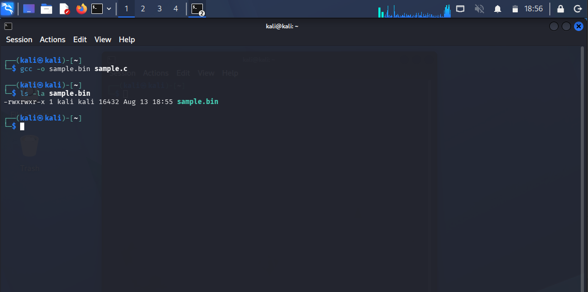
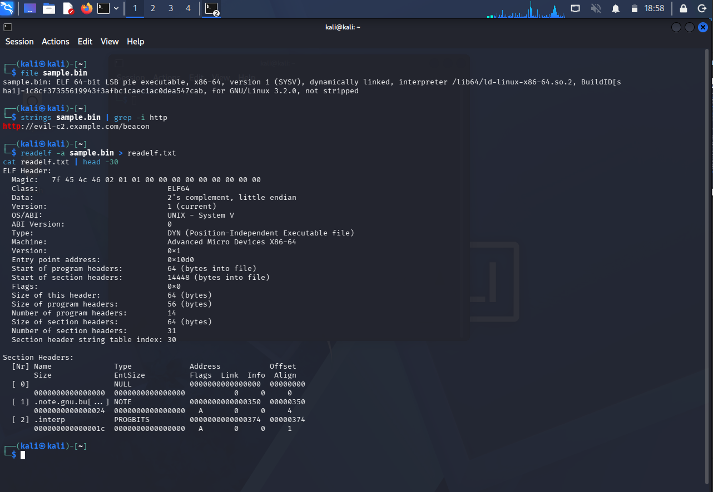
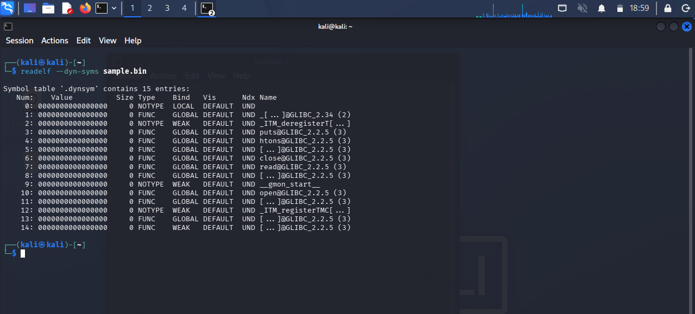
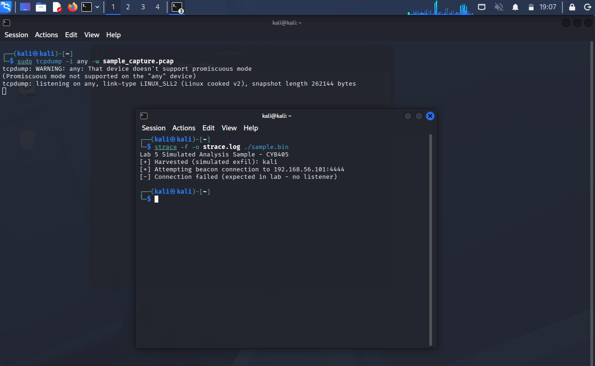
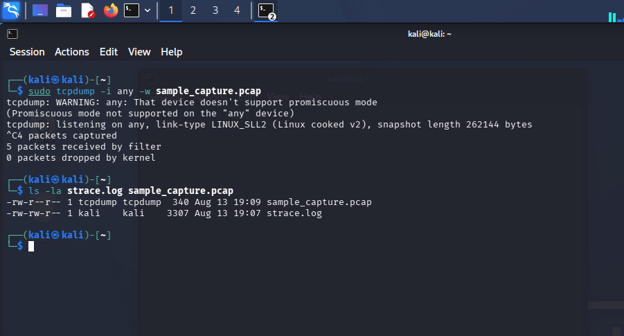
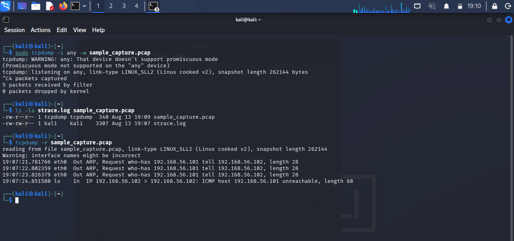
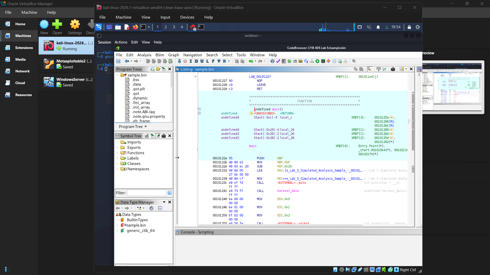
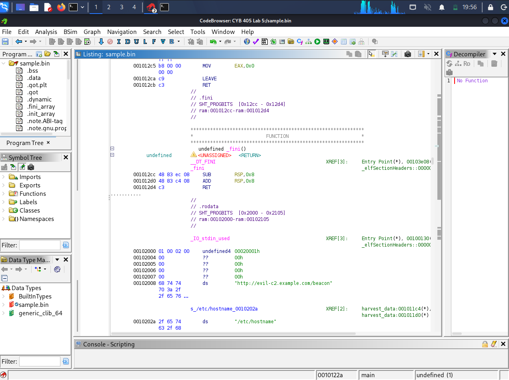
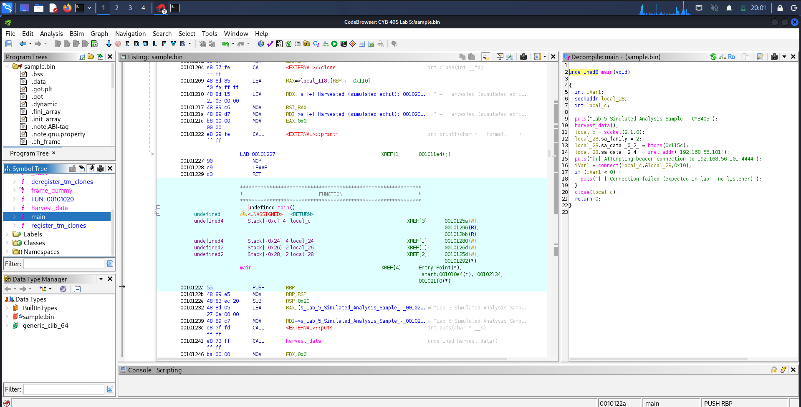
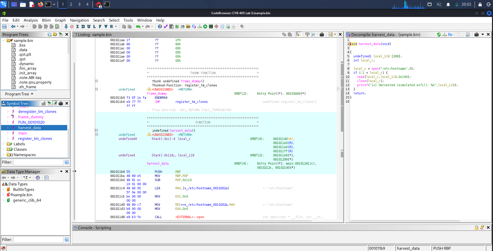

# CYB 405 Lab 5 - Malware Analysis & Reverse Engineering Against a Self-Authored Simulated Sample
 


 
**Author:** Dalla Samuel (CyberJKD)
 
**Date:** 13th - 14th August 2026
 
**Platform:** VirtualBox 7.x · Local Host Machine
 
**Course:** CYB 405 - Introduction to Ethical Hacking · Miva Open University (Mid-Semester Lab 5 of 8, + 2 Bonus)
 
**Roadmap:** [Phase 04 · CYB 405 Lab 05](https://dallasamuel.github.io/CyberJKD-Roadmap)
 
**YouTube Walkthrough:** *pending upload - link added once published*
 
**Viewer Guide:** *pending - link added once published*
 
---
 
## Objective
 
Perform static and dynamic analysis on a sample binary using sandbox and reverse-engineering tools, 
extract strings/imports/sections, debug/analyze the binary in Ghidra, identify IOCs, and write detection rules - 
while correctly substituting an inapplicable Windows-only tool named in the lab spec, 
and closing two evidentiary gaps (an explicit imports step, and a verified-on-disk packet capture) that a first pass at this workflow left open.
 
---
 
## Business Problem This Lab Solves
 
| Role | How this applies |
|------|-----------------|
| SOC Analyst | Recognizing a data-staging-then-beacon pattern at the syscall level, before any alert fires, is the same triage instinct used to catch first-stage malware in a live environment |
| Cloud Security Engineer | Egress-filtering a non-standard outbound port is the same control as restricting outbound rules on a cloud security group or NSG - this lab's remediation maps directly onto that |
| Penetration Tester | Recovering C2 infrastructure (IP, port, domain) from a binary via static analysis alone, before ever executing it, is exactly the discipline a real malware-adjacent engagement requires |
| SysAdmin | A file-read-then-connect pattern is a concrete, host-level behavioral signature a defender can hunt for in EDR telemetry, independent of any specific IOC value |
 
---
 
## Environment
 
| Component | Detail |
|-----------|--------|
| Hypervisor | Oracle VirtualBox 7.x |
| Working VM | Kali Linux Rolling (2026.1) - `192.168.56.102` |
| Network mode | Host-Only Adapter (`vboxnet0`) for all lab work - a second NAT adapter was temporarily enabled twice, off-camera from the exercises themselves, solely to install a missing package and confirm Ghidra was present - disabled again before recording resumed |
| Subnet | `192.168.56.0/24` - DHCP disabled, static addressing (carried over from Lab 1) |
| Target VMs | None. This lab runs entirely local to Kali against a self-compiled binary - Metasploitable2 and Windows Server were both powered off for the duration |
| Toolchain | `gcc`, `strings`, `readelf`, `objdump`, `strace`, `tcpdump`, Ghidra 12.1.2 - confirmed present via a `which` check before recording began, per the tooling-check discipline established in Lab 3 |
 
---
 
## Key Concepts
 
### Why a self-authored simulated binary instead of a real malware sample
The lab spec's task list (extract strings/imports/sections, debug/analyze, identify IOCs, write detection rules) never names a required sample source. 
Downloading or executing real malware inside this lab environment would be inadvisable regardless. 

A small C program was authored and compiled instead - 
it performs no actual malicious payload, but exhibits the same class of behavior a real first-stage sample would: 
a hardcoded C2 URL string sitting in plaintext, a local file read that mimics data-staging/harvesting, and an outbound connection attempt to a fixed, non-standard 
IP:port. This satisfies every task in the spec using the exact same tool stack, with zero handling risk.
 
### Why Process Monitor was substituted with strace
The official lab document's sample commands list Process Monitor as part of the dynamic-analysis toolchain. 
Process Monitor is a Windows/Sysinternals-only tool and has no path to a Linux ELF binary running on Kali - the same category of tool/target mismatch documented for masscan on the Host-Only subnet in Lab 3. 
`strace` serves the equivalent purpose on Linux: it captures every syscall the binary makes in real time, which is the actual analytical value Process Monitor would have provided on a Windows target.
 
### Why tcpdump had to be started and confirmed listening before strace ran
The first attempt at this exercise ran tcpdump in the background with `&` immediately after entering the sudo password, 
then launched strace in the same terminal before tcpdump had actually reached its "listening" state - the process was still suspended on the password prompt. 
The result was a 0-packet capture, since the entire event had already happened before tcpdump was live. The corrected sequence uses two terminal tabs: 
tcpdump is started first and its `listening on any...` confirmation line is explicitly waited for, then strace is run in the second tab.
 
### Why a near-empty packet capture is itself a valid, meaningful finding
Once correctly sequenced, the capture shows only 5 packets: three ARP requests (`who-has 192.168.56.101`) followed by an ICMP host-unreachable response. 
This is not a failed capture - it is the accurate wire-level record of what happens when a process attempts to connect to an address with no live host behind it on an isolated Host-Only subnet (Metasploitable2 was intentionally powered off for this lab). 
strace shows the same event from the application's point of view (a refused `connect()` call). Together, the two tools cross-verify the same root cause from two different layers.
 
---
 
## Exercise A - Sample Preparation
 
**Objective:** Author and compile a benign binary that exhibits malware-like static and dynamic behavior, safely and without any real payload.
 
**Source (`sample.c`) - key logic:**
```c
const char *c2_url = "http://evil-c2.example.com/beacon";
 
void harvest_data() {
    int fd = open("/etc/hostname", O_RDONLY);
    // read + printf a "simulated exfil" message
}
 
int main() {
    harvest_data();
    // connect() to 192.168.56.101:4444 - expected to fail, no listener
}
```
 
**Commands used:**
```bash
gcc -o sample.bin sample.c
ls -la sample.bin
```
 
**Screenshot:**
 

 
**Real-world application:** a controlled, purpose-built sample is a legitimate substitute for a real specimen in a training context - 
it exercises the identical analyst workflow (static triage, then dynamic detonation in a sandbox) without the handling risk of live malicious code.
 
---
 
## Exercise B - Static Analysis (Strings, Imports, Sections)
 
**Objective:** Recover static indicators from the binary - file type, embedded strings, section layout, and imported functions - without executing it.
 
**Commands used:**
```bash
file sample.bin
strings sample.bin | grep -i http
readelf -a sample.bin > readelf.txt
readelf --dyn-syms sample.bin
```
 
**What I captured:**
- `file`: ELF 64-bit LSB pie executable, x86-64, dynamically linked, interpreter `/lib64/ld-linux-x86-64.so.2`, not stripped
- `strings | grep -i http`: `http://evil-c2.example.com/beacon` recovered directly, without execution
- `readelf -a`: full 14 program headers / 31 section headers dumped to `readelf.txt`
- `readelf --dyn-syms`: 15 dynamic symbol entries - the behaviorally relevant imports are `open`, `read`, `close`, `puts`, and `htons`, directly matching the file-read-then-beacon logic in the source
**Screenshots:**
 

 

 
**Real-world application:** a hardcoded, plaintext C2 string and a clean imports list are exactly the kind of static indicators an analyst looks for first, 
before ever running a sample in a sandbox - they can often confirm malicious intent, or at minimum justify further dynamic analysis, on their own.
 
---
 
## Exercise C - Dynamic Analysis (strace + tcpdump)
 
**Objective:** Capture the binary's live syscall behavior and network activity simultaneously, using `strace` as the Process Monitor substitute and `tcpdump` for the network capture named in the lab's own sample command list.
 
**Commands used (two terminal tabs, tcpdump started and confirmed listening first):**
```bash
# Tab 1
sudo tcpdump -i any -w sample_capture.pcap
  -> wait for: tcpdump: listening on any, link-type LINUX_SLL2...
 
# Tab 2 (only after Tab 1 confirms listening)
strace -f -o strace.log ./sample.bin
 
# Back in Tab 1, once sample.bin has finished:
Ctrl+C
ls -la strace.log sample_capture.pcap
tcpdump -r sample_capture.pcap
```
 
**What I captured:**
- `strace.log` (3,307 bytes) - full application-level sequence: `harvest_data()` reads `/etc/hostname`, then `connect()` to `192.168.56.101:4444` returns refused
- `sample_capture.pcap` (340 bytes, 5 packets) - confirmed on disk and non-empty on the corrected, correctly-sequenced attempt
- Wire-level readback: 3x ARP `who-has 192.168.56.101` (Kali resolving a MAC for a host that isn't present, since Metasploitable2 was intentionally off) followed by an ICMP `host 192.168.56.101 unreachable`
**Screenshots:**
 

 

 

 
**Real-world application:** correlating an application-level tool (strace) against a wire-level tool (tcpdump) for the same event is a basic but essential cross-verification step - 
a defender who only had one of the two views would see either "a program tried to open a socket" or "a host generated some ARP noise," and only the combination makes the full beacon-attempt story unambiguous.
 
---
 
## Exercise D - Debug/Analyze in Ghidra
 
**Objective:** Load `sample.bin` into Ghidra, run auto-analysis, and inspect the disassembly and decompiled C reconstruction of `main()` and `harvest_data()`.
 
**Steps performed:**
1. New Project → `CYB 405 Lab 5` → Import File → `sample.bin` → opened in CodeBrowser
2. Accepted the default Analysis Options and ran Analyze
3. Reviewed `main()` in both the Listing (disassembly) and Decompiler panes
4. Reviewed `harvest_data()` in both the Listing and Decompiler panes
**Screenshots:**
 

 

 

 

 
**What I captured:** Ghidra's decompiler cleanly reconstructed both functions with no manual patching needed. The `.rodata` section dump additionally surfaced the two hardcoded strings in raw memory - 
confirming the same static indicators found via `strings` in Exercise B, now correlated against their exact in-binary location and the functions that reference them.
 
**Real-world application:** being able to read a decompiled function and immediately identify the C2 address, the port, and the data being staged - without needing to trace raw assembly by hand - 
is what makes Ghidra's decompiler the standard first stop in a real reverse-engineering workflow, reserving manual disassembly reading for the cases the decompiler can't cleanly resolve.
 
---
 
## Exercise E - Indicators of Compromise (IOCs)
 
**Objective:** Consolidate the static and dynamic findings from Exercises B through D into a discrete, reportable IOC list.
 
| IOC Type | Value | Source |
|---|---|---|
| Network (C2 endpoint) | `192.168.56.101:4444` | `strace` `connect()` target; confirmed in Ghidra decompiler (`inet_addr` / `htons(0x115c)`) |
| Domain string | `evil-c2.example.com` | `strings sample.bin \| grep -i http`; confirmed in Ghidra `.rodata` dump |
| File-read pattern (data-staging) | Reads `/etc/hostname` immediately before the outbound connection attempt | `strace.log`; confirmed in `harvest_data()` decompiler view |
| Binary characteristic | Unstripped, dynamically-linked ELF64 PIE executable containing a plaintext hardcoded URL - a static indicator visible without execution | `file sample.bin`; `readelf -a` |
| Network behavior (wire-level) | 3x ARP request for `192.168.56.101` followed by ICMP host-unreachable | `sample_capture.pcap` (`tcpdump -r`) |
 
**Real-world application:** a five-row IOC table built entirely from evidence gathered across the exercises above - two static, one dynamic, one structural, one network-layer - 
is exactly the deliverable a real incident-response or threat-intel handoff document leans on, since it lets a second analyst reproduce or hunt for the same finding without redoing the original analysis.
 
---
 
## Exercise F - Detection Rule
 
**Objective:** Author a Suricata rule that would detect this sample's network beaconing behavior on a monitored network. This deliverable also satisfies **Bonus 2 (IDS Rule Creation)**, since it's the same underlying task.
 
```
alert tcp any any -> 192.168.56.101 4444 (msg:"Possible C2 Beacon - Lab5 Sample"; flow:to_server; sid:1000001; rev:1;)
```
 
**Rule logic:** flags any outbound TCP connection attempt to the known C2 IP:port pair. Deliberately no `content` match - in this sample, the connection is refused before any application data is sent, 
so there's no payload string on the wire to anchor a content keyword to, and including one anyway would be a rule not actually supported by the capture. `flow:to_server` keys it to the outbound leg specifically. 
In production this IP:port rule would be paired with a second, domain-based rule at the DNS/proxy layer (`evil-c2.example.com`), since an attacker could rotate the destination IP while keeping the domain fixed, or vice versa.
 
**Real-world application:** writing a detection rule directly from IOCs recovered in the same session - rather than from a generic threat-intel feed - is the core loop of malware-informed detection engineering: analysis output becomes monitoring input.
 
---
 
## Exercise G - Findings & Remediation
 
| Finding | Severity | Remediation |
|---|---|---|
| Hardcoded C2 infrastructure in a deployed binary | **Critical** | Treat any binary containing a hardcoded, unauthenticated outbound target as a compromise indicator until proven otherwise. Quarantine the host, preserve the binary/hash, check against threat-intel feeds and other hosts in the environment |
| Local data-staging behavior ahead of the beacon | **High** | Deploy EDR rules flagging the read-then-connect sequence in real time, independent of the specific file or IOC values - a modified sample could evade static signatures alone |
| Non-standard outbound port reachable from the host | **Medium** | Egress-filter at the network boundary; alert on or block non-standard, high-numbered outbound ports from endpoint subnets by default |
| IOC feed currency | **Low (standing control)** | Maintain and update IOC feeds (the domain/IP/port identified here) across firewall and IDS rule sets |
 
---
 
## Command Reference - Used in This Lab
 
| Command | What it does |
|---------|--------------|
| `gcc -o sample.bin sample.c` | Compiles the self-authored simulated-analysis source into an executable ELF binary |
| `file sample.bin` | Identifies file type, architecture, linking, and strip status |
| `strings sample.bin \| grep -i http` | Extracts printable strings and filters for network indicators |
| `readelf -a sample.bin` | Full ELF header, program header, and section header dump |
| `readelf --dyn-syms sample.bin` | Lists dynamic symbols - the imports step |
| `sudo tcpdump -i any -w <file>` | Captures live packet traffic to disk - run *before* generating the traffic it's meant to observe |
| `strace -f -o <file> ./sample.bin` | Captures every syscall the binary makes, including child processes (`-f`) |
| `tcpdump -r <file>` | Reads back a saved packet capture for review |
| `ghidra` | Launches the Ghidra reverse-engineering suite GUI |
 
---
 
## Verification - Lab Completion Checklist
 
| Requirement | Verified |
|-------|---------|
| Sample authored, compiled, and confirmed on disk | ✅ |
| Static analysis: strings, imports, and sections all extracted | ✅ |
| Dynamic analysis: strace and tcpdump run concurrently, both outputs verified on disk | ✅ |
| Binary debugged/analyzed in Ghidra (disassembly + decompiler, both functions) | ✅ |
| IOCs identified | ✅ |
| Detection rule written (doubles as Bonus 2) | ✅ |
| Findings rated by severity with remediation plan written | ✅ |
 
---
 
## Troubleshooting Log
 
Real infrastructure work involves real errors - documented here rather than edited out, since reproducibility is part of the grading criteria for this course.
 
| Issue | Root Cause | Resolution |
|-------|-----------|------------|
| `gcc -o sample.bin smaple.c` failed: `fatal error: smaple.c: No such file or directory` | Filename typo on the first compile attempt | Re-ran with the correct filename, `sample.c`, confirmed via `cat` before recompiling |
| `strace` not found | `strace` is not part of this Kali build's default package set | `sudo apt install -y strace` - required a temporary NAT adapter since Host-Only has no route to the package mirrors |
| `sudo apt update` failed: `Temporary failure resolving 'http.kali.org'` | Kali was still on Host-Only-only (`vboxnet0`), which by design has no internet route - same air-gap behavior documented in Lab 2's WHOIS/DNS failures | Powered off, enabled a second NAT-only adapter in VM Settings → Network → Adapter 2, confirmed via `ip a` / `ping 8.8.8.8`, ran the install, then powered off again and disabled Adapter 2 to restore the Host-Only-only topology before continuing |
| Adapter 2 settings greyed out / not editable | Some VirtualBox network adapter settings only unlock while the VM is fully powered off, not merely running | Performed a full ACPI shutdown (`sudo shutdown now`) rather than Save State, then edited Settings → Network with the VM confirmed Powered Off |
| `sample_capture.pcap` captured 0 packets on the first dynamic-analysis attempt | `tcpdump` was launched with `&` immediately after the sudo password prompt and was still suspended (`tty input`) when `sample.bin` was executed in the same terminal - the traffic-generating event happened before the capture was actually listening | Re-ran using two terminal tabs: tcpdump started first, its `listening on any...` line explicitly confirmed before running strace/sample.bin in the second tab |
| `ghidraRun: command not found` | This Kali build's Ghidra package installs the launcher as `ghidra`, not `ghidraRun` | Located the correct command via `which ghidra` / `dpkg -L ghidra \| grep bin`, launched with `ghidra` instead |
| `ping -c 3 192.168.56.101` returned Destination Host Unreachable mid-lab | Metasploitable2 was intentionally powered off, since this lab requires no target VM | Confirmed this was expected and not a connectivity regression - Lab 5 runs entirely local to Kali against `sample.bin` |
 
**Screenshot:**
 

 
---
 
## What I'd Change for Production
 
| Lab approach | Production reality |
|-----------|-------------------|
| A hand-authored, purpose-built simulated binary | Production malware analysis runs against a real, quarantined specimen inside a dedicated, fully network-isolated sandbox (Cuckoo, a hardened FLARE VM, or a vendor detonation chamber), never on general-purpose infrastructure |
| `strace` as a manual, ad-hoc Process Monitor substitute | Production dynamic analysis uses automated sandboxing that captures syscalls, file, registry, and network activity together in a single structured report |
| A temporary NAT adapter toggled on/off around a single air-gapped VM to fetch packages | Production lab ranges maintain a separate, permanently-internet-connected package-mirror host, so the analysis VM's isolation boundary is never altered mid-workflow |
| IOCs and a single Suricata rule authored manually from one sample | Production detection engineering feeds IOCs into a SIEM/TIP pipeline automatically, and validates new rules against historical traffic before deployment |
 
---
 
## Connection to Roadmap
 
This lab is part of **CYB 405 - Introduction to Ethical Hacking**, Miva Open University's mid-semester laboratory assessment series (8 core labs + 2 bonus challenges), tracked as **Phase 04 - CYB 405: Ethical Hacking Foundations** on the CyberJKD Cloud Security Engineering roadmap. Per standing preference, this phase is added to the live public roadmap only once all 10 labs/bonus challenges are complete, as a single finished block rather than an in-progress tracker.
 
This lab runs independently of Labs 1-4's shared Metasploitable2/Windows Server environment - it required only Kali and a self-authored sample. The Suricata rule in Exercise F satisfies **Bonus 2 (IDS Rule Creation)** directly. Findings here feed into:
- **Lab 6** - Web Application Hacking (SQLi & XSS): an independent track against OWASP Juice Shop, requiring new target infrastructure (Docker-hosted Juice Shop at a static Host-Only address) rather than anything carried over from this lab
- **Lab 8** - Evasion, IDS/Firewall Bypass & DDoS Simulation: the Suricata rule format and the non-standard-port egress-filtering remediation established here remain directly relevant threat context
---
 
## Appendix - All Output Files Verified
 
Final evidence set confirmed for this lab: `sample.c` and the compiled `sample.bin`, `readelf.txt` (full ELF dump), 
`strace.log` (3,307 bytes), `sample_capture.pcap` (340 bytes, 5 packets, confirmed non-empty on the corrected run), 
and all Ghidra disassembly/decompiler screenshots for `main()` and `harvest_data()`.
 
🌐 Full roadmap: [dallasamuel.github.io/CyberJKD-Roadmap](https://dallasamuel.github.io/CyberJKD-Roadmap)
 
🔗 All labs: [github.com/DallaSamuel/CyberJKD-Labs](https://github.com/DallaSamuel/CyberJKD-Labs)
 
---
 
*CyberJKD - Becoming dangerous through fundamentals. 🔒*
 
