# Azure Active Directory Domain Controller - Terraform Deployment


| | |
|---|---|
| **Author** | Dalla Samuel (CyberJKD) |
| **Date** | September 15, 2026 |
| **Platform** | Microsoft Azure |
| **Course** | Cloud System Admin Accelerator - Azure Administrator (AZ-104) Labs, Cloud Tech Techniques |
| **Roadmap** | Phase 06 · Cloud Tech Techniques · Cloud System Admin Accelerator |
| **Video Walkthrough** | [I Deployed a Full Active Directory Domain Controller with One Terraform Command](https://youtu.be/rVksbVzXgRA) |

---

## Objective

Deploy a Windows Server 2022 virtual machine on Azure and automatically configure it as an Active Directory Domain Controller - role installation and forest promotion included - in a single `terraform apply`, using a Custom Script Extension rather than any manual Server Manager clicking.

## Business Problem

Every organization running Windows workloads needs a centralized identity and authentication service. Without one, every server manages its own local accounts, every password change happens machine-by-machine, and there's no way to enforce consistent access policy. Active Directory Domain Services solves this: one directory of users, computers, and groups, with policy flowing outward from the domain controller to every joined machine.

This lab builds that foundation entirely through code - VM provisioning, AD DS role installation, and forest promotion, all from one Terraform configuration.

## Environment

| Component | Value |
|---|---|
| Terraform | v1.16.2 |
| Azure CLI | 2.90.0 |
| Subscription | `cyberjkd-labs` |
| Region | `eastus2` (switched from `eastus` - see Troubleshooting Log) |
| VM Size | `Standard_D2s_v7` |
| OS Image | Windows Server 2022 Datacenter, **Gen2** (`2022-datacenter-g2`) |
| Resource Group | `rg-ad-cyberjkd` |
| Domain | `corp.cyberjkd.com` |
| NetBIOS Name | `CYBERJKD` |
| Admin Username | `adadmin` |

## Key Concepts

- **Active Directory Domain Services (AD DS)** - centralized identity, authentication, and policy enforcement
- **Custom Script Extension** - runs a PowerShell command against the VM as part of the Terraform apply itself, no manual post-deploy steps
- **Infrastructure as Code (IaC)** - the entire environment (network, VM, role installation) defined declaratively and reproducibly
- **Terraform state** - what Terraform uses to track what it's actually deployed, and where things go wrong when that tracking drifts from reality (see Troubleshooting)

## Architecture

```
Terraform (local)
   │
   ▼
Azure Subscription (cyberjkd-labs)
   └── rg-ad-cyberjkd (eastus2)
        ├── vnet-ad-cyberjkd (10.0.0.0/16)
        │    └── snet-ad (10.0.1.0/24)
        ├── nsg-ad-cyberjkd  → allow RDP :3389 inbound
        ├── pip-ad-cyberjkd  → static public IP
        ├── nic-ad-cyberjkd  → private IP 10.0.1.4
        └── vm-ad-cyberjkd (Standard_D2s_v7, Windows Server 2022 Datacenter g2)
             └── Custom Script Extension
                  ├── Install-WindowsFeature AD-Domain-Services
                  └── Install-ADDSForest -DomainName corp.cyberjkd.com
                       └── triggers automatic reboot
```

## Exercises

**A. Prerequisites** - Installed Azure CLI (`winget install -e --id Microsoft.AzureCLI`) and Terraform (`winget install -e --id Hashicorp.Terraform`) on a Windows 11 host. Neither was present at the start.

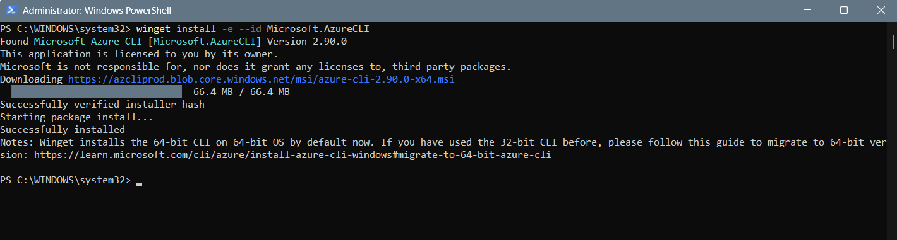
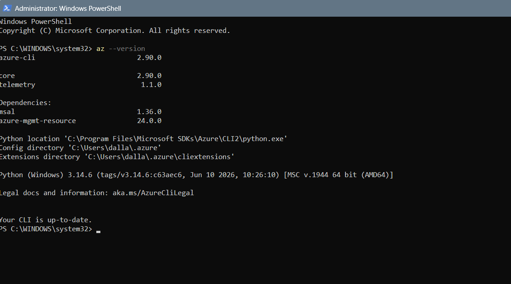
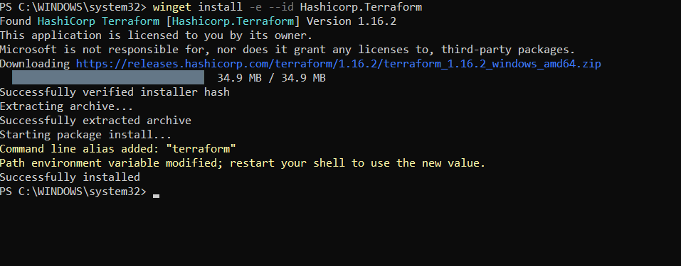
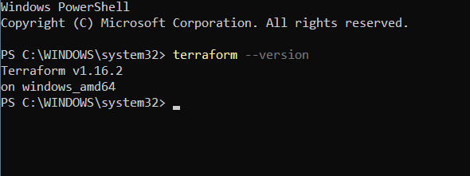

**B. Azure Authentication** - `az login`, selected the correct tenant, confirmed via `az account show`.

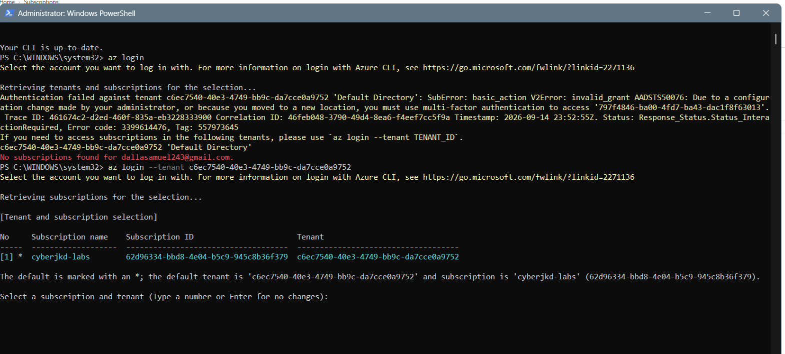
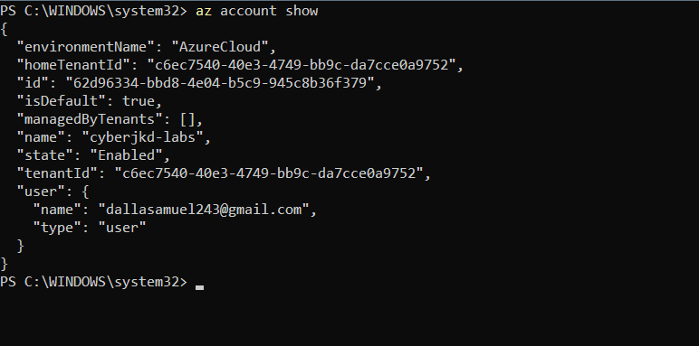

**C. Scaffold the Project** - Created `~/repos/az-ad-vm` and four empty Terraform files (`main.tf`, `variables.tf`, `outputs.tf`, `terraform.tfvars`).

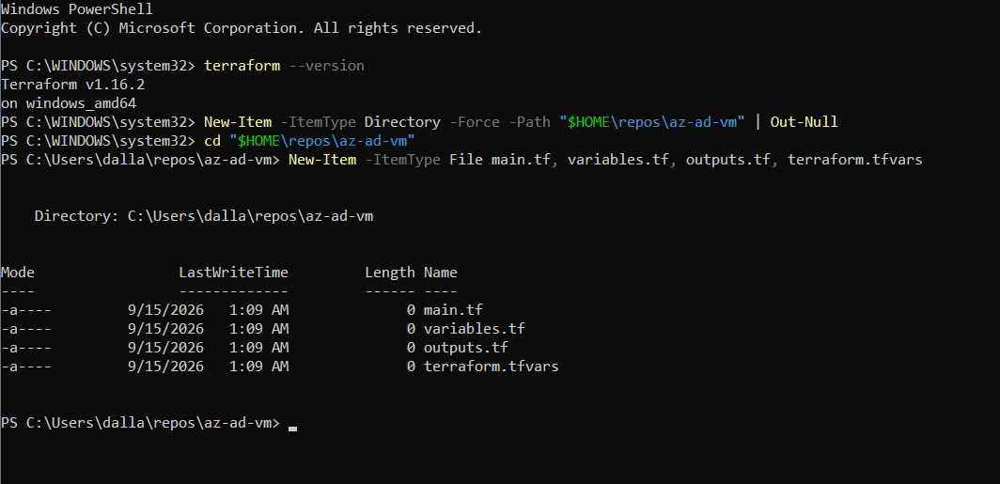

**D. Terraform Configuration** - Populated all four files. `terraform.tfvars` customized with project-specific values (`yourname = "cyberjkd"`, domain `corp.cyberjkd.com`, NetBIOS `CYBERJKD`).

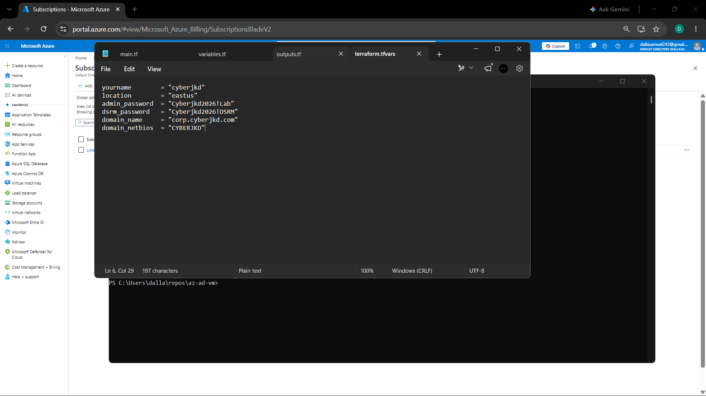
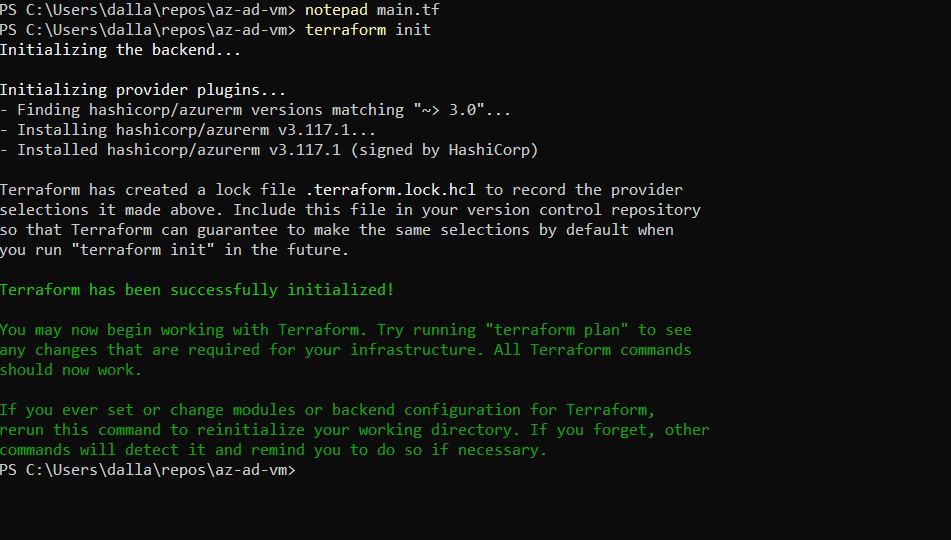

**E. Deploy** - `terraform init` → `terraform plan` → `terraform apply`. Went through multiple size and region iterations before a clean apply (see Troubleshooting Log).

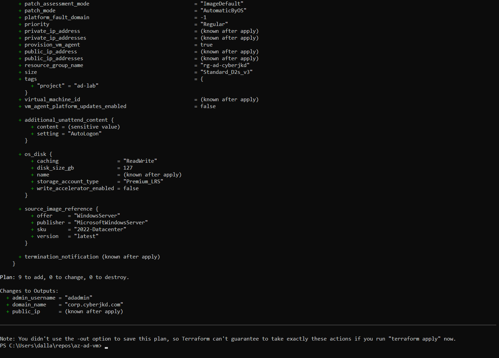

Four real failures happened here before a clean apply - full detail in the Troubleshooting Log below:

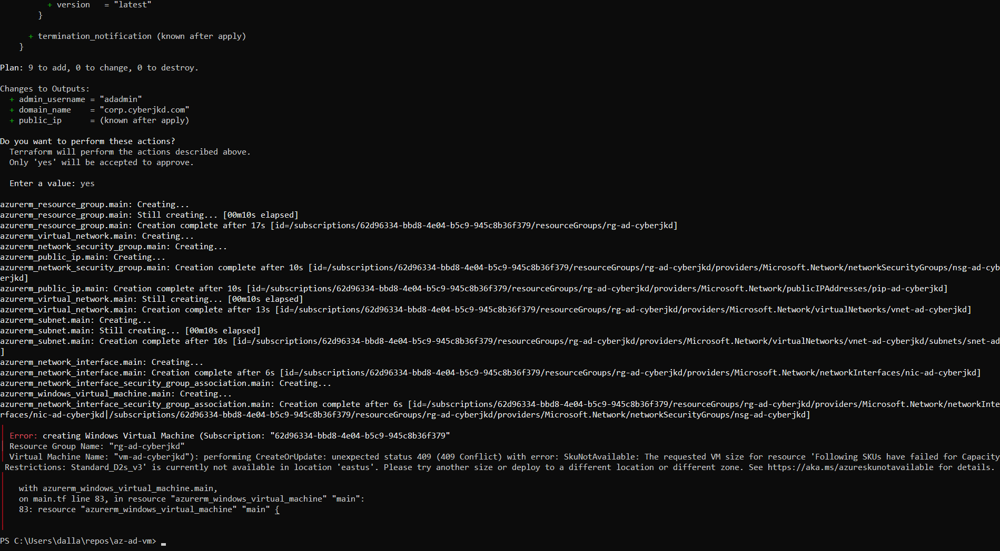
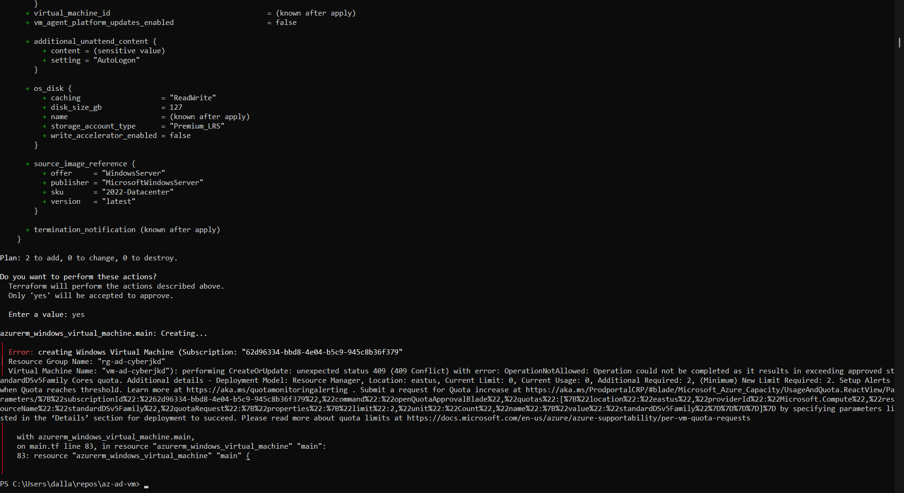
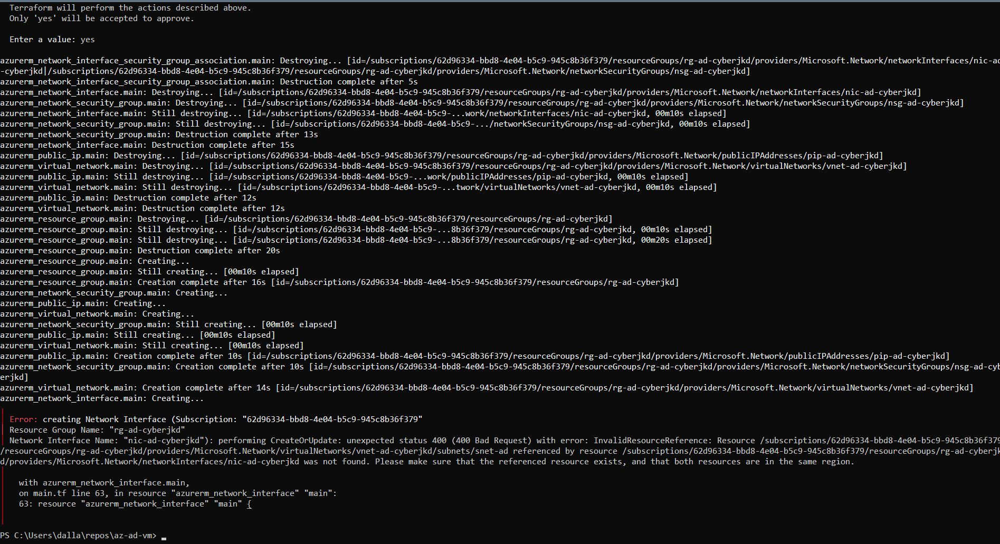
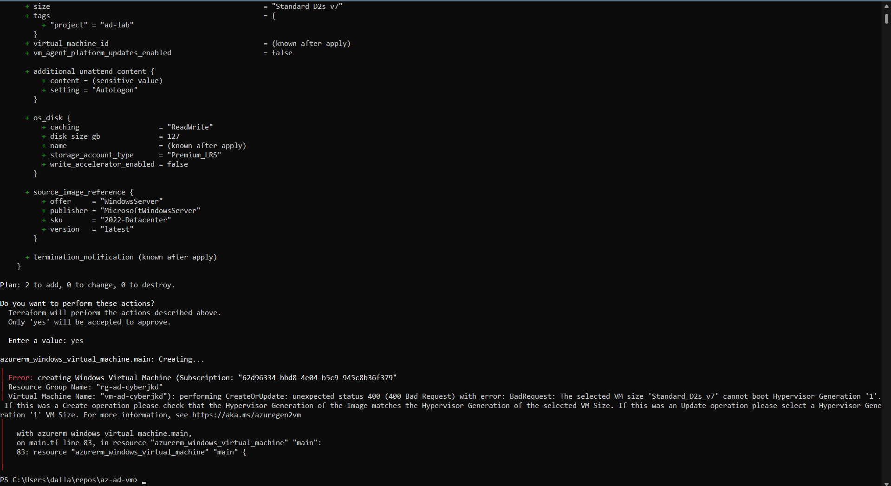

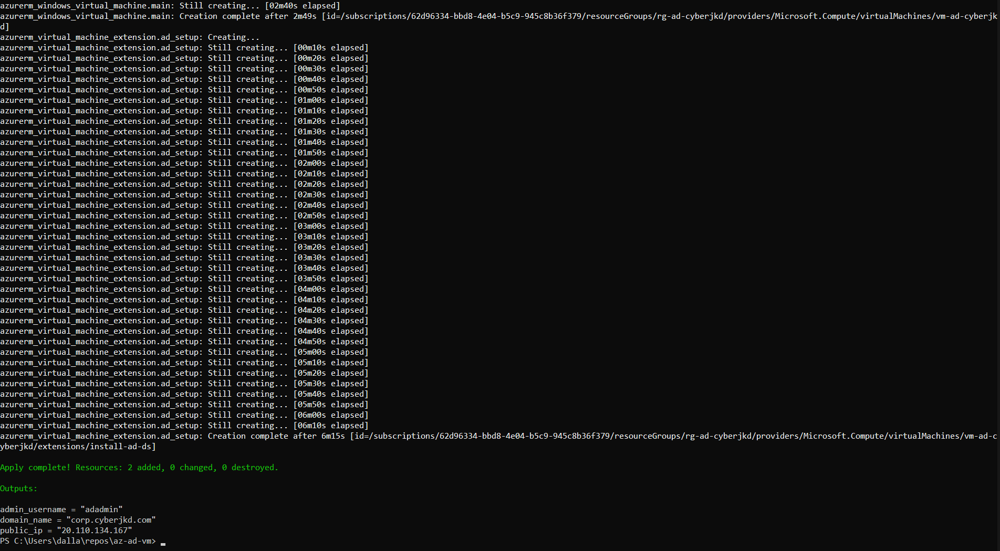

**F. Connect via RDP** - Waited 5–10 minutes post-apply for the automatic AD DS reboot, then connected using `CORP\adadmin` (domain-prefixed credential, not local-account syntax).

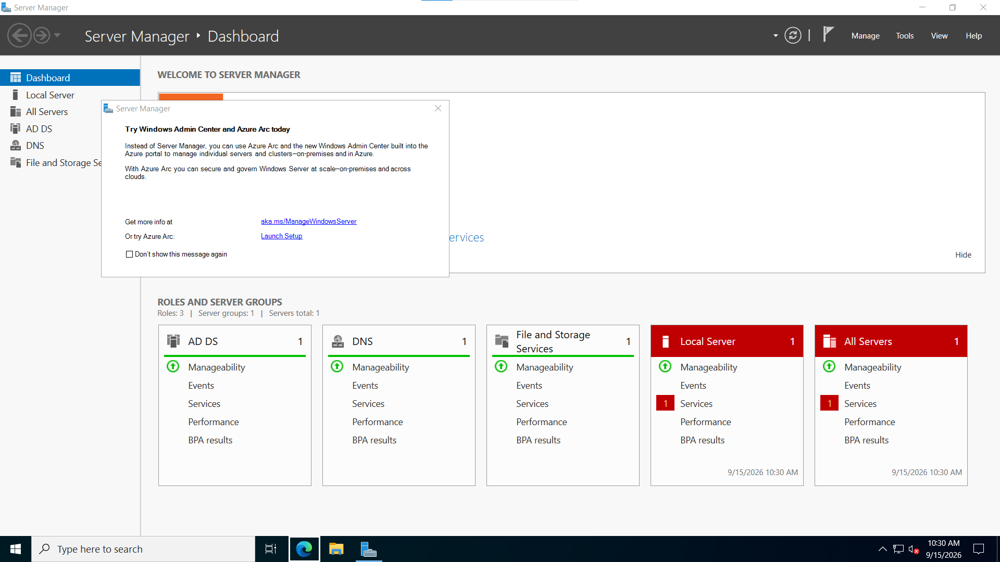

**G. Verify AD DS** - Confirmed via `Get-Service NTDS`, `Get-ADDomain`, `Get-ADDomainController -Filter *`, and `Resolve-DnsName corp.cyberjkd.com` - all passed clean.

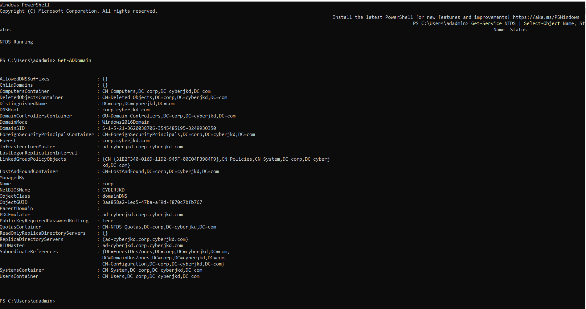
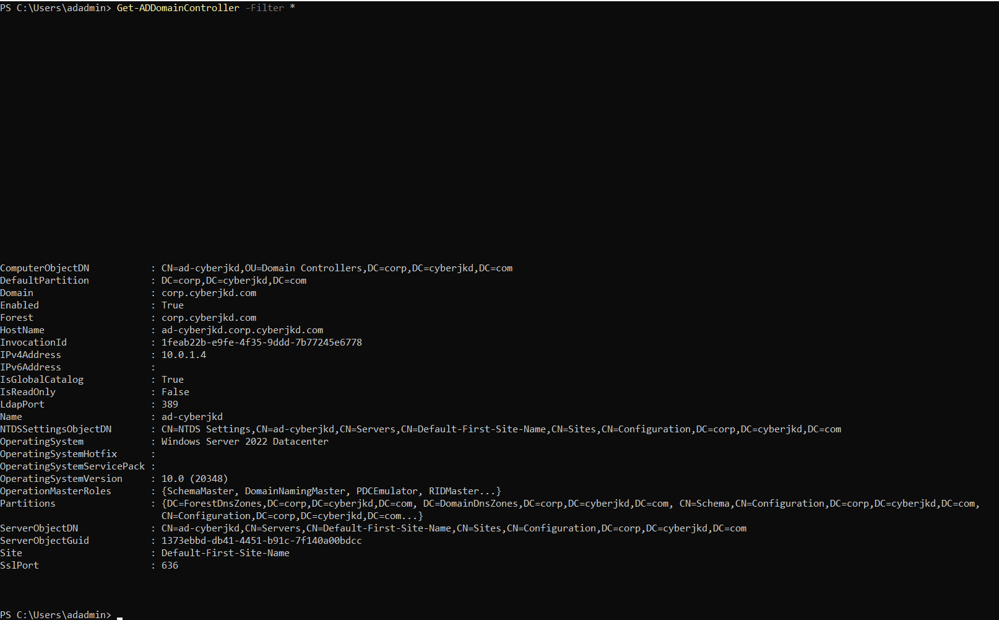
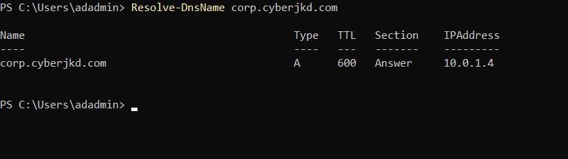

**H. Extend with Real Identity Objects** - Rather than stop at "the service is running," created an Organizational Unit, a test user, and a security group, and added the user to the group - demonstrating the full identity → structure → access chain, not just role installation.

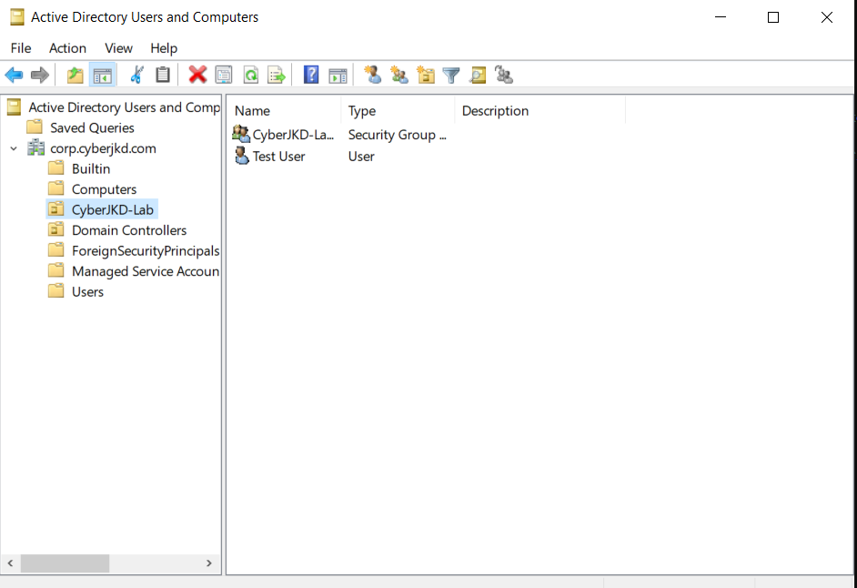

**I. Teardown** - `terraform destroy` to remove all 9 resources and confirm zero ongoing cost via `az resource list`.

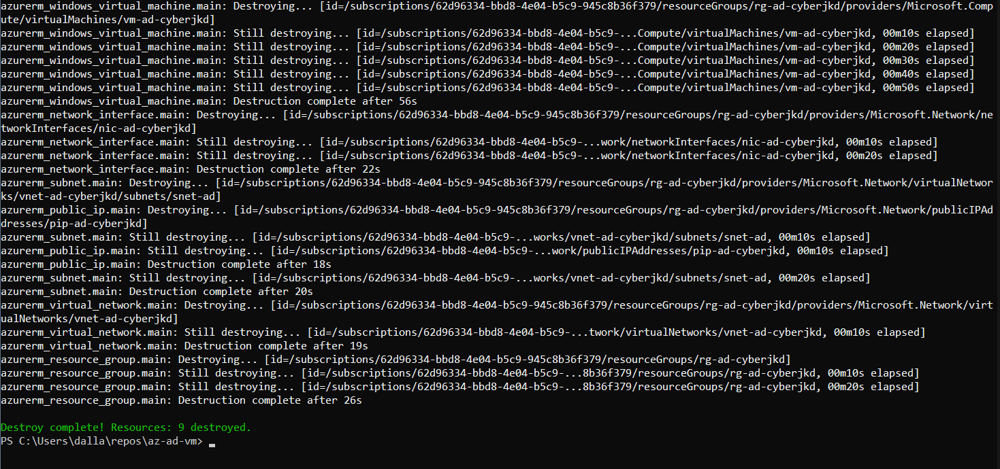
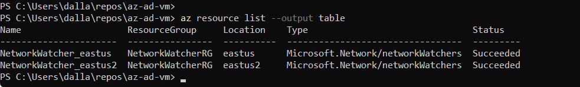

## Terraform Configuration

The actual, working `.tf` files this lab deployed are in [`terraform/`](terraform/) in this same folder - `main.tf`, `variables.tf`, `outputs.tf`, and `terraform.tfvars.example`. Copy the `.example` file to `terraform.tfvars` and fill in your own values; don't retype from the screenshots above, and don't reconstruct from an AI - use these files directly, since they're the exact, tested, single-line-corrected version (see Troubleshooting Log #1 for why that matters).

## Command Reference

```powershell
# Prerequisites
winget install -e --id Microsoft.AzureCLI
winget install -e --id Hashicorp.Terraform
az login --tenant <TENANT_ID>
az account show

# Scaffold
New-Item -ItemType Directory -Force -Path "$HOME\repos\az-ad-vm" | Out-Null
cd "$HOME\repos\az-ad-vm"
New-Item -ItemType File main.tf, variables.tf, outputs.tf, terraform.tfvars

# Deploy
terraform init
terraform plan
terraform apply

# Verify (on the deployed VM, PowerShell as Administrator)
Get-Service NTDS | Select-Object Name, Status
Get-ADDomain
Get-ADDomainController -Filter *
Resolve-DnsName corp.cyberjkd.com

# Extend
New-ADOrganizationalUnit -Name "CyberJKD-Lab" -Path "DC=corp,DC=cyberjkd,DC=com"
New-ADUser -Name "Test User" -SamAccountName "testuser" -Path "OU=CyberJKD-Lab,DC=corp,DC=cyberjkd,DC=com" -AccountPassword (ConvertTo-SecureString "********" -AsPlainText -Force) -Enabled $true
New-ADGroup -Name "CyberJKD-Lab-Users" -GroupScope Global -Path "OU=CyberJKD-Lab,DC=corp,DC=cyberjkd,DC=com"
Add-ADGroupMember -Identity "CyberJKD-Lab-Users" -Members "testuser"

# Teardown
terraform destroy
az resource list --output table
```

## Verification Checklist

- [x] `terraform apply` completes with 0 errors
- [x] `NTDS` service status: `Running`
- [x] `Get-ADDomain` returns full domain object (`corp.cyberjkd.com`, forest `corp.cyberjkd.com`, mode `Windows2016Domain`)
- [x] `Get-ADDomainController -Filter *` shows the DC enabled, holding all Operation Master roles, correct OS version
- [x] `Resolve-DnsName corp.cyberjkd.com` resolves to the DC's own private IP (`10.0.1.4`)
- [x] `CyberJKD-Lab` OU visible in `dsa.msc`, containing `Test User` and `CyberJKD-Lab-Users`
- [x] `terraform destroy` completes cleanly - `Resources: 9 destroyed`
- [x] `az resource list` post-teardown shows only Azure's own auto-created NetworkWatcher resources, nothing billable remaining

## Troubleshooting Log

**1. Multi-line string syntax error in `main.tf`.** Copy-pasting the `AutoLogon` content block and the Custom Script Extension's `commandToExecute` string from the PDF carried over hard line breaks. Terraform requires quoted strings on a single line unless using heredoc syntax. Fixed by rewriting both blocks as true single lines (soft-wrapped in the editor, but one logical line).

**2. MFA authentication failure on `az login`.** First login attempt failed with `AADSTS50076` - the tenant required multi-factor authentication that the initial browser flow didn't complete. Resolved by re-running `az login --tenant <TENANT_ID>` explicitly and completing the MFA challenge fully before closing the browser tab.

**3. `SkuNotAvailable: Standard_D2s_v3` in `eastus`.** The original lab spec's VM size had no capacity in that region at the time of deployment - a regional stock issue, not a configuration error.

**4. Zero quota on `Standard_D2s_v5` and `Standard_B2s`.** Both failed with `OperationNotAllowed` - `Current Limit: 0` for those VM families on this subscription. Ran `az vm list-usage --location eastus --output table` to inspect actual quota across every family rather than guessing sizes one at a time.

**5. Region switch to `eastus2`.** Since total regional vCPU quota was tight in `eastus`, switched `location` to `eastus2` for broader headroom. This required Terraform to destroy and recreate the six already-provisioned network resources, since they were tied to the original region.

**6. Terraform state drift after the region switch.** Mid-apply, resource group and network resources were destroyed and recreated, but the NIC's `subnet_id` reference briefly pointed at a subnet that had just been destroyed - `InvalidResourceReference` / `400 Bad Request`. Resolved with a full `terraform destroy` to clear the drifted state, followed by a single clean `terraform apply` from scratch in `eastus2`.

**7. `SkuNotAvailable: Standard_B2s` in `eastus2` as well.** Even the fallback burstable size had no regional capacity. Rather than guess further, ran `az vm list-skus --location eastus2 --size Standard_D --all --output table` and filtered for `Restrictions: None` to find a size guaranteed deployable - landed on `Standard_D2s_v7`.

**8. Hypervisor Generation mismatch on `Standard_D2s_v7`.** That size only boots Gen2 images, but the lab's default image reference (`2022-Datacenter`) is Gen1. Fixed by switching the `source_image_reference.sku` to `2022-datacenter-g2` - same OS, correct generation.

**9. Azure portal briefly showed "no subscriptions."** After several sign-in prompts across the session, the portal switched to a different, empty tenant directory. The Azure CLI confirmed the real subscription (`cyberjkd-labs`) was active and unaffected throughout - a portal display issue, not an actual account problem. Resolved via the portal's "Switch directories" link.

## What I'd Change for Production

- **NSG rule is wide open.** `source_address_prefix = "*"` allows RDP from any IP. Production would restrict this to a specific management IP range or route RDP through a bastion host instead of exposing port 3389 directly.
- **Secrets live in plaintext in `terraform.tfvars`.** `admin_password` and `dsrm_password` are stored unencrypted in a file that's easy to accidentally commit. Production would pull these from Azure Key Vault via a data source, and `terraform.tfvars` would be gitignored, never committed.
- **No remote state backend.** State was tracked locally on one machine - exactly what caused the drift issue in this lab. Production would use an Azure Storage Account backend with state locking, so state can't be edited by two people (or two terminal sessions) at once.
- **Single domain controller, no redundancy.** One DC is a single point of failure. Production would deploy at least two DCs across availability zones for forest resilience.
- **DSRM password has no recovery path.** It's a plaintext value with no retrieval option post-deployment. Production would store it in Key Vault immediately, not just note it down manually.

## Connection to Roadmap

This lab sits under **Phase 06 - Cloud Tech Techniques (CTT) - Cloud System Admin Accelerator** of the [CyberJKD Roadmap](https://dallasamuel.github.io/CyberJKD-Roadmap), a dedicated track for labs completed through Jhante Charles's CTT community, tracked separately from the personal project phases (01 - 03) and the CYB 405 university coursework. Repo path: `phase-06/cloud-tech-techniques/cloud-system-admin-accelerator/terraform-ad-dc/`.

Not to be confused with Phase 03's **Portfolio Triad I - Infrastructure & Automation (Terraform)**, a larger planned personal project (multi-subnet VNet, least-privilege NSGs, remote state in Azure Blob) that this lab is intentionally scoped narrower than.

Per the same completion-batching approach used for CYB 405, Phase 06 will be added to the live roadmap site once the full Cloud System Admin Accelerator course is complete, not lab-by-lab. This is the first entry in that set - infrastructure, AD DS role installation, and identity object creation (OU, user, group) all from one Terraform configuration, torn down clean with zero lingering cost.


##


🌐 Full roadmap: [dallasamuel.github.io/CyberJKD-Roadmap](https://dallasamuel.github.io/CyberJKD-Roadmap)
 
🔗 All labs: [github.com/DallaSamuel/CyberJKD-Labs](https://github.com/DallaSamuel/CyberJKD-Labs)
 
---
 
*CyberJKD - Becoming dangerous through fundamentals. 🔒*
