# VS Code Home Lab Setup - Git, Extensions & Remote-SSH


| | |
|---|---|
| **Author** | Dalla Samuel (CyberJKD) |
| **Date** | September 18, 2026 |
| **Platform** | Windows 11 (HP EliteBook 835 G8) → Kali Linux VM |
| **Course** | Cloud System Admin Accelerator - How To Automate The VM Deployment - VSCode Guide |
| **Roadmap** | Phase 06 · Cloud Tech Techniques · Cloud System Admin Accelerator |
| **Video Walkthrough** | [VS Code Home Lab Setup](https://youtu.be/K8Qd1uASNPE) |

---

## Objective

Set up Visual Studio Code as the primary editor for home-lab and CyberJKD-Labs work - Git integration, core extensions, and a working Remote-SSH connection into the Kali VM - 
so lab scripting and documentation can happen in one environment instead of juggling a separate SSH terminal and text editor.

## Business Problem

Editing files over a raw SSH session (`nano`/`vim`) works, but it's slow and error-prone for anything beyond a quick edit - no IntelliSense, no syntax highlighting, no easy multi-file search. 
IT and cloud teams standardize on an editor like VS Code with Remote Development extensions specifically so engineers can work directly on remote hosts (servers, VMs, containers) with the full editor experience, without files ever needing to be copied back and forth.

This is the **VSCode Guide** module of Jhante Charles's Cloud System Admin Accelerator, under "How To Automate The VM Deployment" - the same category as the Terraform AD DC lab. 
Where that lab automated *provisioning* a VM, this module sets up the *editor* used to write and maintain that kind of infrastructure code and to work directly on deployed VMs going forward - 
including two real failures hit and resolved along the way, not just a clean install walkthrough.

## Environment

| Component | Value |
|---|---|
| Host machine | HP EliteBook 835 G8, Windows 11, AMD Ryzen 3 PRO 5450U |
| VS Code | Latest (pre-installed) |
| Git | v2.55.0.3 (installed via `winget`) |
| Target VM | Kali Linux (CYB 405 host-only lab network) |
| Kali IP | `192.168.56.102` |
| Kali login | `kali` / `kali` (default) |
| Repo | [github.com/DallaSamuel/CyberJKD-Labs](https://github.com/DallaSamuel/CyberJKD-Labs) |
| Local repo path | `Documents\CyberJKD\CyberJKD-Labs` |

## Key Concepts

- **Remote-SSH (VS Code extension)** - connects a VS Code window directly to a remote machine's file system and shell, so editing happens with full IntelliSense instead of a plain terminal editor
- **Workspace Trust** - VS Code's Restricted Mode blocks certain features until you explicitly trust a folder's authors; cloning a repo directly auto-trusts it
- **SSH host aliases** (`~/.ssh/config`) — named shortcuts (`Host kali`) mapping to an IP + username, so you connect with a name instead of typing the full address every time
- **`http.postBuffer`** - a Git config value controlling how much data Git buffers per HTTP request; too small a default can cause large clones to fail mid-transfer
- **systemd service management** (`systemctl start` / `enable` / `status`) — starting a service for the current session vs. enabling it to persist across reboots

## Architecture

```
Windows 11 Host (HP EliteBook 835 G8)
   │
   ├── VS Code
   │    ├── Extensions: Remote-SSH, PowerShell, YAML, Python, GitLens, Terraform, Docker
   │    ├── Git v2.55.0.3
   │    └── ~/.ssh/config
   │         ├── Host kali → 192.168.56.102 (CYB 405 host-only network)
   │         └── Host ubuntu-hardening → 192.168.1.103 (home-lab network, untouched)
   │
   ├── Local repo: Documents\CyberJKD\CyberJKD-Labs
   │    └── cloned from github.com/DallaSamuel/CyberJKD-Labs
   │
   └── Remote-SSH connection
        └── Kali Linux VM (192.168.56.102)
             └── SSH service (started + enabled via systemctl)
```

## Exercises

**A. Confirm VS Code Installation** - Already installed. Workspace opened in Restricted Mode (no folder trusted yet); Docker extension recommendation prompt appeared on first launch and was accepted.

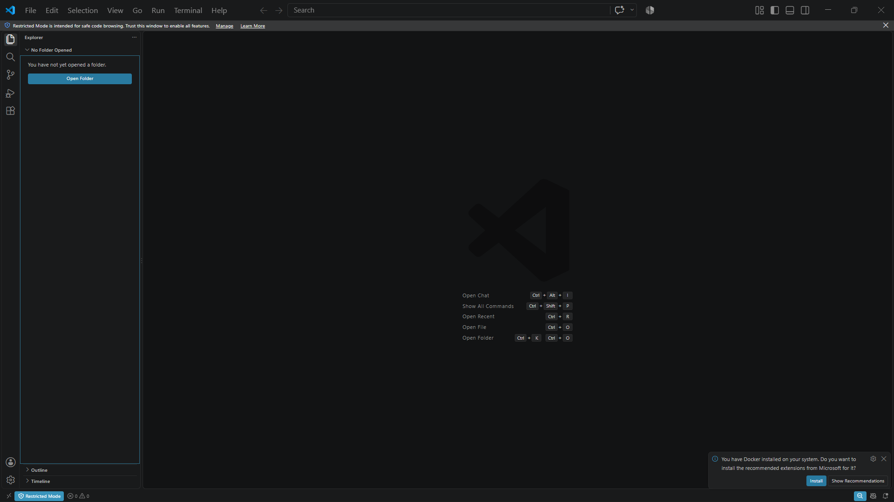

**B. Verify Git** — Ran `git --version` in the integrated terminal (`` Ctrl+` ``); command not recognized, confirming Git wasn't installed.

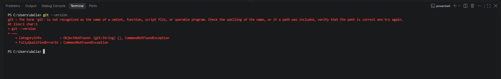

**C. Install Git** - `winget install Git.Git`, version 2.55.0.3, successful install.

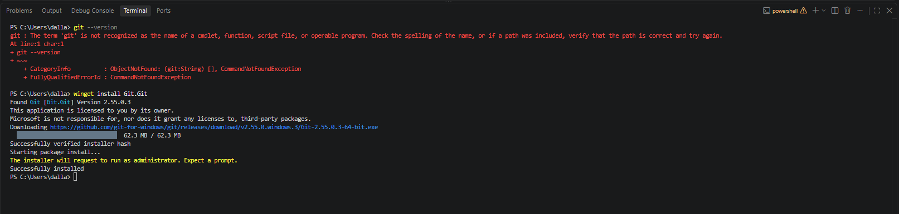

**D. Install Core Extensions** - Installed via terminal in a single batch: `ms-vscode-remote.remote-ssh`, `ms-vscode.powershell`, `redhat.vscode-yaml`, `ms-python.python`, `eamodio.gitlens`, `hashicorp.terraform` (Docker extension installed separately via the earlier prompt).

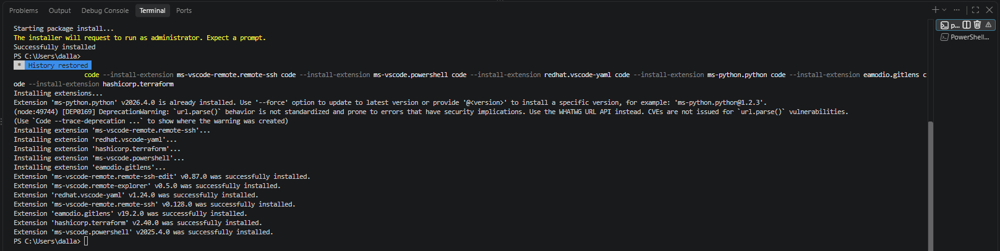
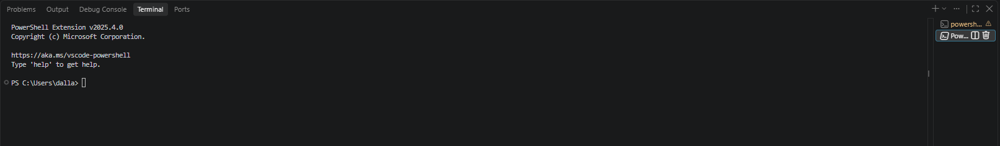

**E. Locate the Repo** - No local clone of CyberJKD-Labs existed yet on this device - confirmed via File Explorer against the `Documents\CyberJKD` folder, which held other CyberJKD project folders but not this repo.

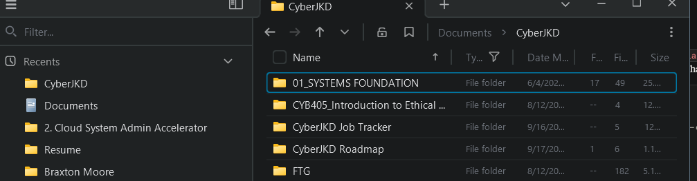

**F. Clone CyberJKD-Labs** - First attempt failed mid-transfer with an RPC/buffer error on a 1249-object repo. Fixed by raising Git's HTTP post-buffer size, then re-ran the clone clean.

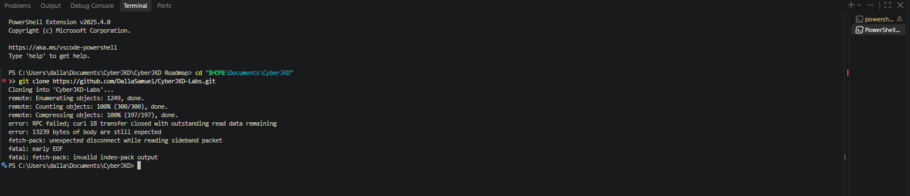
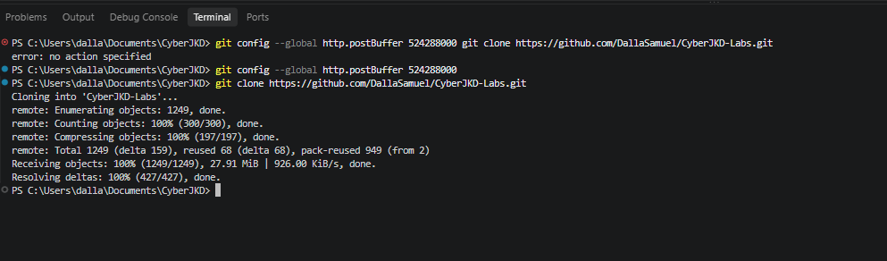

**G. Open and Trust the Repo** - File → Open Folder → `CyberJKD-Labs`. Cloning directly auto-trusted the workspace; Restricted Mode banner did not reappear.

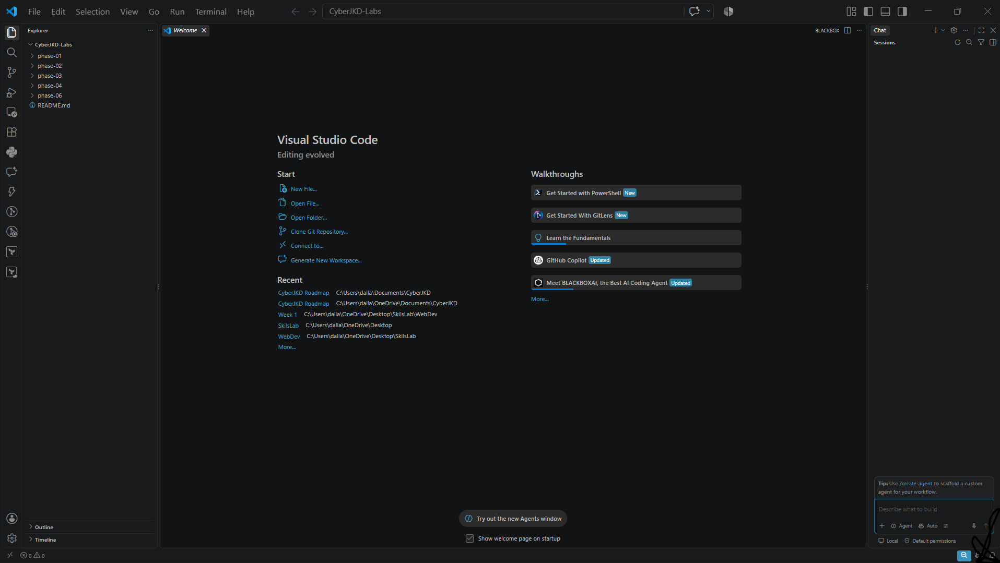

**H. Configure Remote-SSH** - Added `kali` and `ubuntu-hardening` host entries to `~/.ssh/config`. First connection attempt to `kali` used the wrong IP (home-lab range instead of the CYB 405 host-only range) and timed out; corrected to `192.168.56.102`.

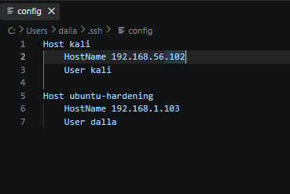
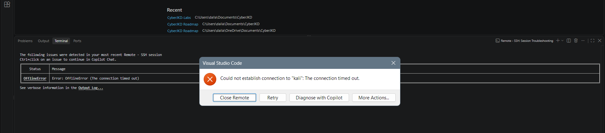

**I. Diagnose and Fix Connection Refused** - After correcting the IP, VS Code returned "Permission denied" with no password prompt - a stale extension state, not a real auth failure. 
Ran a raw `ssh kali@192.168.56.102` directly in the terminal to get the real error: **Connection refused, port 22** - meaning Kali's SSH service wasn't running at all (Kali does not start SSH by default). 
Started and enabled the service directly on the Kali VM, then confirmed the raw SSH connection worked.

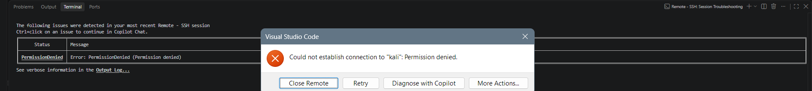
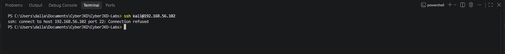
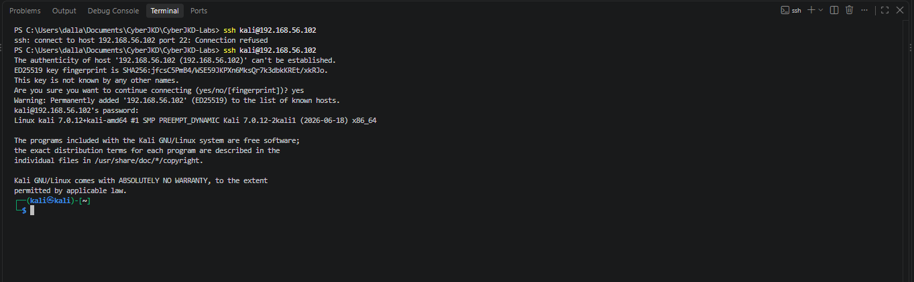

**J. Connect via Remote-SSH** - With the SSH service confirmed running, reconnected through the extension. Status bar shows **SSH: kali** in green - full editor session now running directly on the VM.

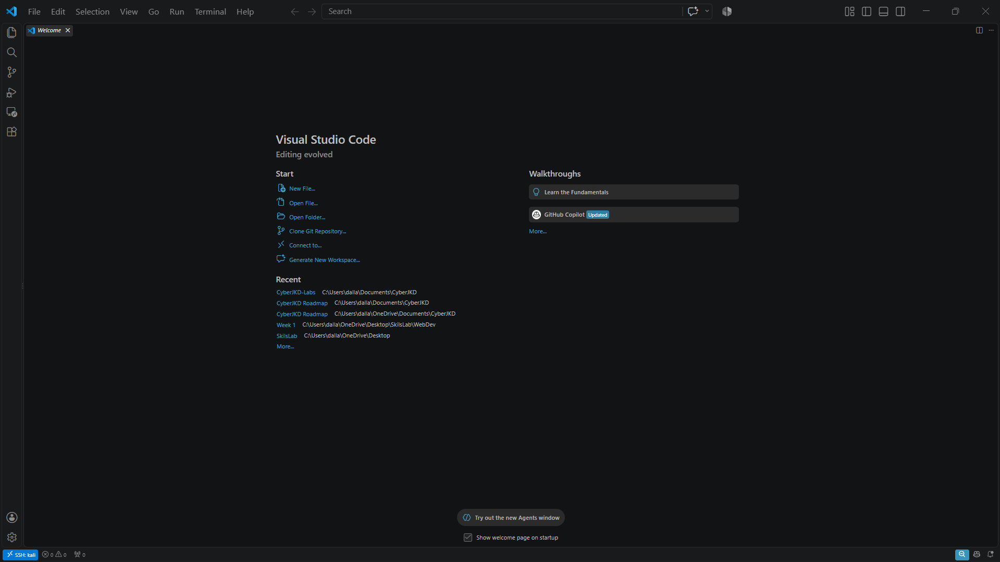

## Command Reference

```powershell
# Verify / install Git
git --version
winget install Git.Git

# Install extensions
code --install-extension ms-vscode-remote.remote-ssh
code --install-extension ms-vscode.powershell
code --install-extension redhat.vscode-yaml
code --install-extension ms-python.python
code --install-extension eamodio.gitlens
code --install-extension hashicorp.terraform

# Fix clone RPC/buffer failure, then clone
git config --global http.postBuffer 524288000
cd "$HOME\Documents\CyberJKD"
git clone https://github.com/DallaSamuel/CyberJKD-Labs.git

# Diagnose the SSH connection directly
ssh kali@192.168.56.102
```

```bash
# On the Kali VM itself — start and persist the SSH service
sudo systemctl start ssh
sudo systemctl enable ssh
sudo systemctl status ssh
```

## Verification Checklist

- [x] `git --version` returns `2.55.0.3`
- [x] All six core extensions + Docker installed and listed in the Extensions panel
- [x] `CyberJKD-Labs` cloned locally with 0 file corruption (1249/1249 objects received)
- [x] Repo opens with Restricted Mode disabled (workspace trusted)
- [x] `~/.ssh/config` contains correct `kali` and `ubuntu-hardening` host entries
- [x] `sudo systemctl status ssh` on Kali shows `active (running)`
- [x] Raw `ssh kali@192.168.56.102` connects and authenticates
- [x] VS Code Remote-SSH status bar shows green **SSH: kali**

## Troubleshooting Log

**1. `git clone` failed mid-transfer - RPC error, early EOF.** Cloning the 1249-object CyberJKD-Labs repo over HTTPS failed partway through with `error: RPC failed; 
curl 18 transfer closed with outstanding read data remaining` and `fatal: early EOF`. This is a known Git-over-HTTPS issue on larger repos where the default buffer size is too small for the transfer. 
Fixed with `git config --global http.postBuffer 524288000` (500 MB buffer), then re-ran the clone clean.

**2. Commands silently combined when pasted.** Running `git config --global http.postBuffer 524288000 git clone https://...` as one pasted block caused PowerShell to treat the clone command as extra arguments to `git config`, 
producing `error: no action specified`. Fixed by running each command on its own line, waiting for the prompt to return between them.

**3. Remote-SSH connection timed out to the wrong network.** Initial SSH config pointed Kali at `192.168.1.102` (the home-lab network range used by other, unrelated VMs). 
Kali was actually running on the CYB 405 host-only lab network at `192.168.56.102`. Fixed by correcting the `HostName` value in `~/.ssh/config`.

**4. "Permission denied" with no password prompt.** After correcting the IP, the Remote-SSH extension returned `Could not establish connection to "kali": Permission denied`
without ever prompting for a password - misleading, since it suggested an authentication problem. Bypassing the extension with a raw `ssh kali@192.168.56.102` in the terminal revealed the real issue.

**5. Raw SSH returned "Connection refused, port 22."** This confirmed the actual root cause: Kali's SSH server wasn't running at all - Kali does not enable or auto-start SSH by default on a fresh install. 
Fixed directly on the Kali VM with `sudo systemctl start ssh` (for the current session) and `sudo systemctl enable ssh` (to persist across reboots). 
Raw SSH then connected and authenticated cleanly, and the Remote-SSH extension connected successfully immediately after.

## What I'd Change for Production

- **Password authentication is still enabled.** Logging in with `kali`/`kali` over SSH works for a lab, but production (or even a serious home lab) should switch to SSH key-based auth and disable password login entirely in `sshd_config`.
- **No single source of truth for VM IPs.** Two different lab networks (home-lab `192.168.1.x` and CYB 405 host-only `192.168.56.x`) caused a wasted troubleshooting step from a stale assumption. A simple inventory file (or DHCP reservations) would prevent that.
- **SSH not enabled by default on the VM image.** Rather than starting the service manually each time a fresh Kali VM is built, this should be baked into a provisioning script or the VM template itself.
- **Default Kali credentials in use.** Fine for an isolated host-only lab network with no external exposure, but should never be left as-is on anything internet-facing.

## Connection to Roadmap

This lab sits under **Phase 06 - Cloud Tech Techniques (CTT)  Cloud System Admin Accelerator** of the [CyberJKD Roadmap](https://dallasamuel.github.io/CyberJKD-Roadmap), the same track as the Terraform AD DC lab, 
specifically the **VSCode Guide** module under "How To Automate The VM Deployment." Repo path: `phase-06/cloud-tech-techniques/cloud-system-admin-accelerator/vscode-guide/`.

Per the same completion-batching approach used elsewhere in Phase 06, this gets added to the live roadmap site once the full Cloud System Admin Accelerator course is complete, not module-by-module. It also directly supports CYB 405 lab execution going forward, 
since Remote-SSH into the Kali VM is now the working setup for that coursework too - though its primary home is this course track, not CYB 405.

---

🌐 Full roadmap: [dallasamuel.github.io/CyberJKD-Roadmap](https://dallasamuel.github.io/CyberJKD-Roadmap)

🔗 All labs: [github.com/DallaSamuel/CyberJKD-Labs](https://github.com/DallaSamuel/CyberJKD-Labs)

---

*CyberJKD - Becoming dangerous through fundamentals. 🔒*
